# AIRI Astrobotany International Research Initiative Program I\_ Microgreens in Microgravity Research Guide

**AIRI**

Astrobotany International Research Initiative

Program I: Microgreens in Microgravity

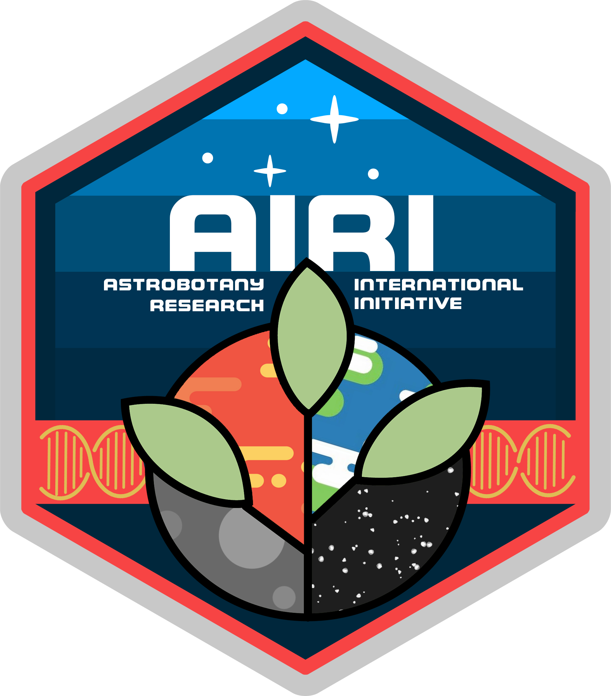

**Research Guide**

**Authors**

Gilbert Cauthorn, MSc.

Sophia Griffith

Rachel Wang

SKG Astrobotany Research and Education Program, Osaka, Japan

Dr Richard Barker. Gilroy Lab, University of Wisconsin Madison, USA

**Reviewers**

Dr Christina Johnson. KSC, Florida.

Lori Waters, MSc. Space Studies Department Research Fellow, University of North Dakota.\

Emily Helton

Joshua Revels

Katherine Johnson NASA IV & V Education Resource Center

### Table of Contents 

**Table of Contents 3**

**AstroBotany Educational Ethos, tools and techniques 4**

Introduction to data sharing with SpaceInvaders (Kids in Data) 5

Edible microgreens on Earth and Low Earth Orbit (LEO) 6

The ideal crop or “Ideotype” 7

The cell biology of “gravitropism” 8

Difficulties for plant development in microgravity 9

**Table 1: AIRI Experimental Course Map 10**

Program Stage I Summary 11

Program Stage II Summary 12

Program Stage III Summary 13

Program Stage IV Summary 15

**Research stage I: Growth of Microgreens in Terrestrial Environments 16**

STAGE I Protocol Leaf Analysis 17

Software assistance for data harvesting and leaf measuring 19

**Research Stage II: Microgreen development and gravitropic response 24**

STAGE II Protocols for root analysis 25

Software to assist with root analysis 28

**Research stage III: Playing with Auxin and growing stem cells 33**

STAGE III Protocols for Auxin experiments and cloning 33

**Research stage IV: Phototropic Response of Microgreens Grown in simulated uG 38**

Stage IV Protocols for microgravity simulators 39

**Tables of Microgreen Growth Rates and example Conditions to use a General Guide 43**

**AIRI course links to Next Generation Science Standards 46**

Stage I: Next Generation Science Standards Support 46

Stage II: Next Generation Science Standards Support 48

Stage IV: Next Generation Science Standards Support 50

### &#x20;

### AstroBotany Educational Ethos, tools and techniques 

The goal of the AIRI program is to create a collaborative international environment in which students, educators, researchers, and citizen scientists are able to contribute to astrobotany research in future space missions. We aim to share methods and data openly to help students and researchers around the world learn from each other's experiences while using the AIRI project-based learning program. It doesn’t matter if you are a professor lecturing in higher education or an informal citizen scientist with a passion for plants or space. We believe in equity in education, so we’ve added tables showing how AIRI can help teachers create authentic project-based research experiences that achieve next generation science standards.

The AIRI program aims to be holistic and inclusive of all people. We are brand agnostic but will recommend specific tools that have enabled successful experiments previously. For example, [Epicollect5](https://five.epicollect.net/) is a citizen science data harvesting tool where people around the world share data. There are other data sharing mechanisms. However, this one has an open source data application programming interface (API) that makes it quicker and easier to share data.

Our goal is to empower citizen scientists to develop novel urban agricultural innovations as part of a new greener revolution on this planet and others. Equity lies at the roots of education.

<figure>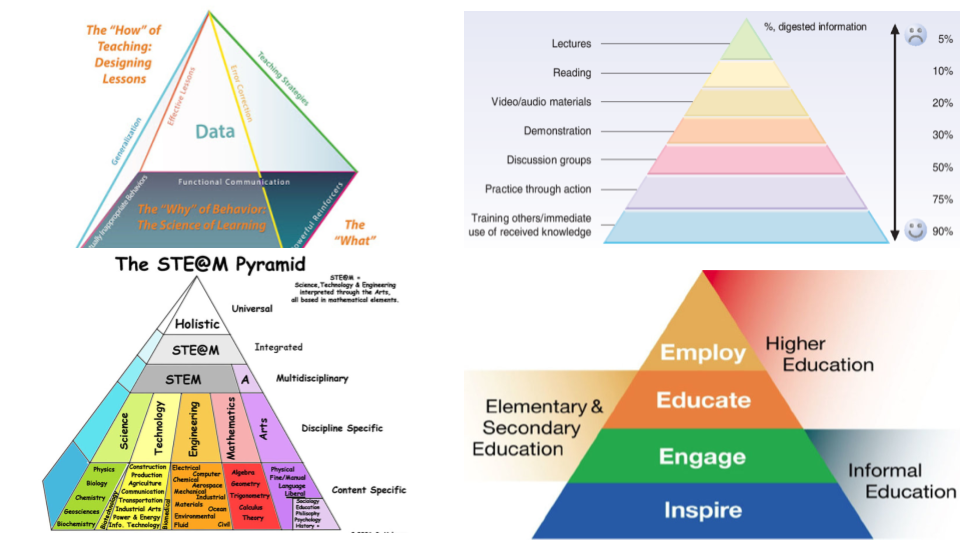<figcaption></figcaption></figure>

**Figure 1:** Education is often considered to be a pyramid scheme, but with an open framework and the embracement of the role of the arts in science communication we can build a more inclusive research community (source google search, note **should create new and improved version/ graphical paradigm**). **No longer pyramid, now symbiotically networked!** :)

### &#x20;

#### **Introduction to data sharing with SpaceInvaders (Kids in Data)** 

The AIRI data literacy program proudly partners with KidsinData to bring an educational[ SpaceInvaders Gaming data experience](https://astrobiology.botany.wisc.edu/education-outreach/kidsindata-science-edtec). Please visit our website, create and name your own Avatar, and then play SpaceInvaders! These data are harvested and incorporated into your very own data journey. Learn about tables, bar charts, scatter plots, and all the data tools we use to understand plants. This will help you understand the data created by a team or in competition with your friends, such as in pursuit of saving Earth from SpaceInvaders.

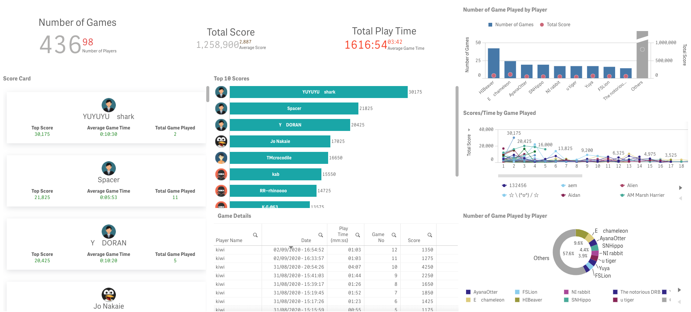

**Figure 2:** The data is presented on a “dashboard.” These graphical user interfaces allow citizens and researchers to access data. This one shows how many people have played the game, total scores, game duration and a range of other meta-data. Source: Dr Richard Barker unpublished data generated by people that have played space invaders and gone on the KidsinData literacy classes.

#### **Edible microgreens on Earth and Low Earth Orbit (LEO)** 

### &#x20;

Future space missions, as well as extended human space habitation, are critically dependent on sustainably and effectively maintaining both the physiological and psychological health of crew members in space. One important factor paramount to mission success is the capability of providing optimal nutritional conditions for crew members while reducing the need for Earth-based resupply. Food packaging, storage, and restocking currently pose significant challenges to extended human presence in space. (To introduce students to Martian exploration, we recommend the “[Kids2Space](https://kids2.space/encyclopedia/)” video program ).

The cultivation of edible produce through the integration of plant-based bioregenerative life support systems provides viable solutions to challenges associated with crew health as well as minimizing the costs associated with resupplying. Growing plants throughout space missions has demonstrated its potential to become a source of fresh produce for space crews, while also contributing to gas and water recycling. In addition, the cultivation of plants on the ISS has shown to mitigate psychological stresses and depression associated with long-duration space habitation.

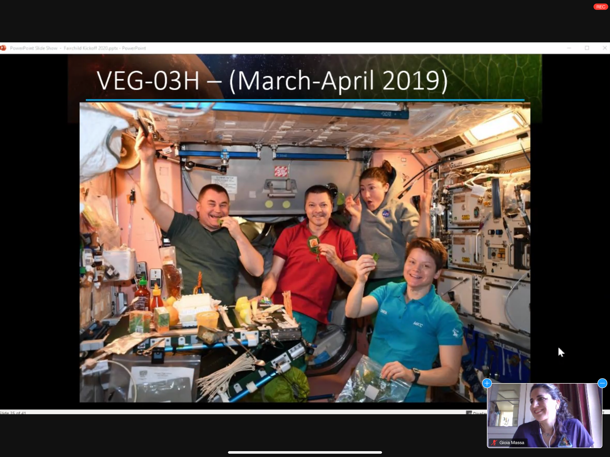

**Figure 2:** Astronauts eat plants on the ISS. They look really happy! Source: Gioia Massa Growing beyond Earth presentation 2020. NASA and FairChild Botanical Gardens.

#### **The ideal crop or “Ideotype”** 

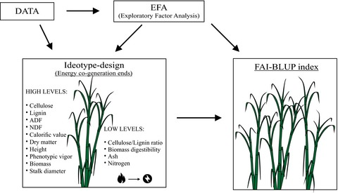

Ideal plants to be grown in space are selected based on the following criteria: crop potential (yield, edible biomass as well as oxygen and water production); ratio of total biomass to edible biomass (harvest index); crop growth efficiency (growth time and space required, nutrient value; and crop horticultural needs (development, energy requirements, water utilization, harvesting, and crop processing). In summary, plants grown in space should require minimal crew attention and preparation time, while producing nutrient dense-yields. Additionally, these plants need to have fast growth cycles while requiring minimal growth space and water intake. 

An ideal crop type that fits this criteria are salad crops. Salad crops are suitable for modular chamber cultivation due to their minimal space requirements. The majority of salad crops have relatively short growth cycles and require minimal horticultural care. In addition, most salad crops can be eaten fresh. This program focuses on the effects of a specific salad speciality crop in microgravity: microgreens.

Microgreens are small (2.5cm-8cm in height), colorful, nutrient-dense crops that are often used to enhance flavor in dishes. Generated from vegetables, legumes, grasses and herb seeds, microgreens typically have short species-specific production cycles lasting between one to three weeks. They are harvested after their cotyledons are expanded and the first set of true leaves have emerged. Studies from the USDA have shown that at equal weights, most microgreens contain about 5-30 times more nutrients than what is found in the mature leaves of the same plants. Due to their high nutrient concentrations, fast growth cycles, minimal water/space, and horticultural requirements, microgreens could be considered as an integral component of a bioregenerative life support system. This enables them to contribute to both the dietary and psychological needs of space crews.

_Arabidopsis thalina_ is a model plant that has been used to investigate how plant morphology changes in response to their environment as they age. Their genomes express themselves during the different developmental stages they go through.

https://www.genetics.org/content/208/4/1337

Practicing[ time-lapse photography ](https://www.youtube.com/watch?v=CxPuEViG-6g\&ab\_channel=RichardBarker)is a good way to learn how fast different species grow.

### &#x20;

#### **The cell biology of “gravitropism”** 

Gravity plays a key role in plant development. Stems grow toward a light source and roots toward a gravity vector. In the absence of light, stems grow in the opposite direction of the gravity vector. These directional growth responses to external stimuli are known as **tropisms**. Growth in the direction of light is called **phototropism**. **Gravitropism** is the growth response related to gravitational force.

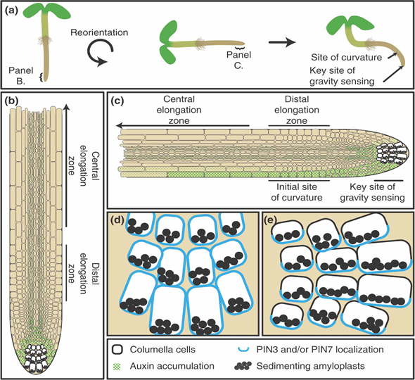

**Figures 4:** (A) Auxin flows in a “reverse fountain” in the root tip. (B) A gravitropic stimuli (90 degree rotation) causes the auxin to accumulate on the new bottom of the root. (C) Asymmetric distribution of the plant hormone auxin causes organs to bend (Source: Strohm et al., (2012) Molecular mechanisms of root gravity sensing and signal transduction. DOI:[10.1002/wdev.14](https://doi.org/10.1002/wdev.14)).

Plants use hormones, affected by light and gravity, to regulate the growth of stems and roots. The hormone **auxin** is integral to both gravitropism and phototropism. The upward growth of stems and downward growth of roots is affected by gravity. Root tips have specialized cells that contain bead-like organelles called **statoliths**. When a root is repositioned on its side, the statoliths accumulate on the lower side of the cells. The accumulation of statoliths triggers feedback mechanisms in the plant that direct auxin to the site where the statoliths are. High concentrations of auxin in root cells inhibit cell elongation. This causes the bottom cells to stop elongating while the top cells continue at a consistent rate, resulting in the root bend and redirecting itself according to the center of gravity.

#### **Difficulties for plant development in microgravity** 

_**We often get asked: How does gravity affect plant development and growth in space?**_

Microgravity affects root growth patterns as well as various elements in plant biology. Not only does gravity affect how roots and stems grow, but it also affects essential biological processes impacting how the plant develops. One of the processes affected is plant gas exchange and mixing. Convection cells, where warmer air rises and cooler air falls, do not occur in microgravity environments. This reduces the amount of air circulation that occurs, which can cause gas accumulation in cells. As plants give off CO2, it stays close to the plant, displacing O2 and causing hypoxic zones in the plant. This can restrict O2 supply which causes local hypoxic zones near the surface of the plant. Development in areas of plants that have high metabolic and respiring rates, such as root tips, are then at risk of being affected. This could potentially negatively impact crop yields and the nutritional density of plants grown in microgravity.

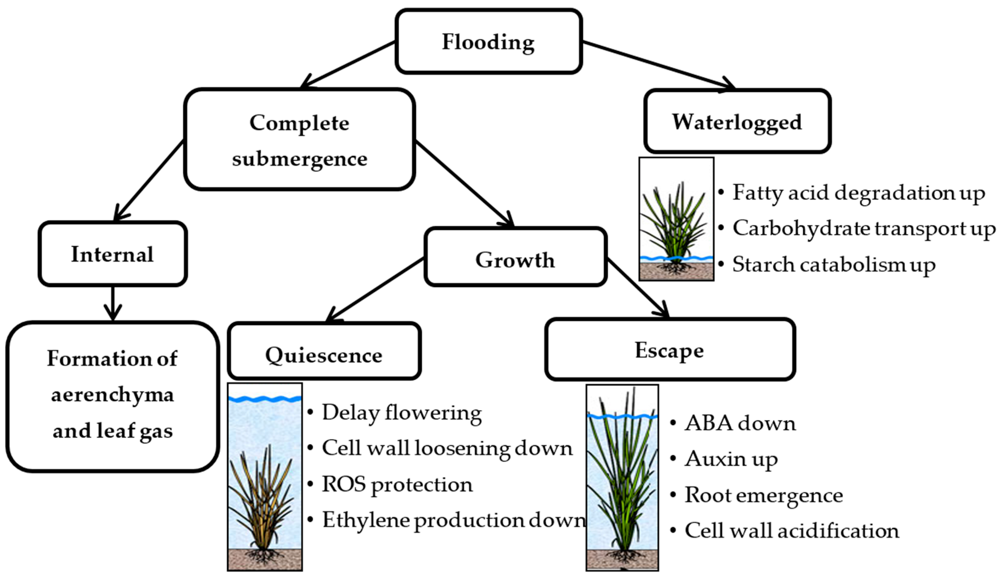 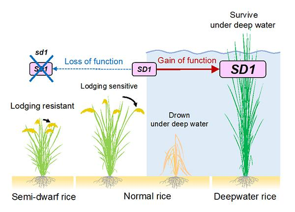

**Figure 5:** How plants respond to microgravity is hard to generalize. It depends on the variety since different growth patterns have evolved and been selected for during crop breeding. Plants size and shapes are determined by environmental signals that are perceived and translated into specific developmental responses. Source: Oladosu et al., (2020) Submergence Tolerance in Rice: Review of Mechanism, Breeding and, Future Prospects. [**https://doi.org/10.3390/su12041632**](https://doi.org/10.3390/su12041632)

_**Our turn to ask you a question: Can you conduct some experiments and share data with us to help us help NASA feed astronauts a healthy diet?**_

### Table 1: AIRI Experimental Course Map 

| **Week**        | **Program Stage**                                                                                           | **Learning Objectives**                                                                                                                                                                                                                                                                                                                      | **Inquiry Topics**                                                                                                                                                                                                                                                                            | **Experimental Activities**                                                                                                                                                                    |
| --------------- | ----------------------------------------------------------------------------------------------------------- | -------------------------------------------------------------------------------------------------------------------------------------------------------------------------------------------------------------------------------------------------------------------------------------------------------------------------------------------- | --------------------------------------------------------------------------------------------------------------------------------------------------------------------------------------------------------------------------------------------------------------------------------------------- | ---------------------------------------------------------------------------------------------------------------------------------------------------------------------------------------------- |
| **Pre-program** | **Astrobiology KidsinData**                                                                                 | 
<strong>-Learn data generation can be fun</strong>

<strong>-Learn people harvest data through the internet</strong>
                                                                                                                                                                                                             | 
<strong>Data generation</strong>

<strong>Data sharing</strong>

<strong>Data harvesting</strong>

<strong>Understanding Data</strong>
                                                                                                                                  | 
<strong>-Play SpaceInvaders</strong>

<strong>-Analyze the game data</strong>

<strong>-Compare your score to your classmates and previous game players</strong>
              |
| **1-2**         | **Research stage I: Growth of Microgreens in Terrestrial Environments**                                     | 
<strong>-Outline ideal growing conditions for microgreens</strong>

<strong>-Identification of growth patterns within growing crop populations</strong>

<strong>-Organization, collection, and analyzation of quantitative and qualitative data points</strong>
                                                            | 
<strong>- Biotic and abiotic factors that affect microgreen development</strong>

<strong>-How can the manipulation of environmental factors affect microgreen biomass?</strong>

<strong>- What limiting factors affect biomass production?</strong>
                        | 
<strong>-Microgreen growth observation in soil</strong>

<strong>- Extensions are able to be carried out using varied media and lighting parameters</strong>
                       |
| **2-3**         | **Research stage II: Microgreen Development and Gravitropic Response**                                      | 
<strong>-Define what “tropisms” are.</strong>

<strong>-Identify what forces affect plant tropisms.</strong>

<strong>-Identify how tropisms affect microgreen development in a controlled environment.</strong>

<strong>- Analyze root architectural growth patterns both quantitatively and qualitatively.</strong>
 | 
<strong>- How has terrestrial life adapted to life on Earth?</strong>

<strong>- How do plants orient themselves to grow in the patterns observed on Earth?</strong>

<strong>- How can tropisms be manipulated to adapt to new environmental conditions?</strong>
           | **-Gravitropic root architectural response observations and analysis.**                                                                                                                        |
| **3-4**         | **Research stage III: Turning microgreens into stem cell cultures & taking cuttings / making plant clones** | 
<strong>-Define Auxin</strong>

<strong>-Define the differ cell types in the root</strong>

<strong>-Define a cell culture</strong>

<strong>-Clone a plant or grow a cell culture</strong>
                                                                                                                            | 
<strong>-How might gravity sensing be different in cell cultures?</strong>

<strong>-How do plants sense gravity on Earth?</strong>
                                                                                                                                               | 
<strong>-clone succulents</strong>

<strong>-take a cutting from a plant, like basil, tomato, chili or something else?</strong>

<strong>-try to make a cell culture</strong>
 |
| **4-6**         | **Research stage VI: Gravitropic Response of Microgreens Grown in simulated Microgravity**                  | 
<strong>- Explain how microgravity can be simulated for plants by changing gravitational orientation.</strong>

<strong>- Identify morphological changes in plants grown in microgravity.</strong>

<strong>-Analyze how root architecture development is affected by simulated microgravity.</strong>
                      | 
<strong>- How would environmental factors associated with microgravity affect areas in plants with meristems?</strong>

<strong>- How can light be utilized effectively to maximize crop yields and/or control developmental rates of microgreens grown in microgravity?</strong>
 | **Microgreen growth experiment trials using CoSE Gravitational Chamber.**                                                                                                                      |

### Stage I: "Kids in data" data literacy space invader games 

### Stage II: " What's your favorite microgreen" 

### &#x20;

### Program Stage III Summary 

**Growth of Microgreens in Terrestrial Environments**

In this stage, participants will grow microgreens in soil in order to collect quantitative and qualitative data on growth patterns. Participants may choose to extend this investigation by comparing selected crops grown hydroponically using a Hamama kit or their own DIY protocol. There are multiple variations possible, such as growth in varied nutrient media as well variants in light quality or quantity. It is important to isolate 1 or 2 factors of choice for analysis and record your methods in your Science Journal to ensure they are reproducible. We recommend using your smartphone to save the primary data, such as photos or numbers using this [EpiCollect5 AIRI MicroGreen Easy Leaf Area](https://five.epicollect.net/project/airi-microgreen-easy-leaf-area) project to help you organize your data collection so it can be shared with other researchers. The introduction to image analysis component requires the researcher to have access to a digital camera or smart device. There are many software tools that analyze images available on laptop or desktop computers. First, we’ll introduce the _Easy Leaf Area_ software, which can be accessed on Android phones, or PC’s running Windows, iOS or Linux. Visit the software [github](https://github.com/heaslon/Easy-Leaf-Area) page to download.

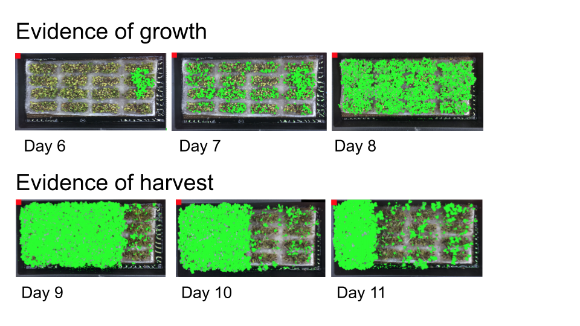

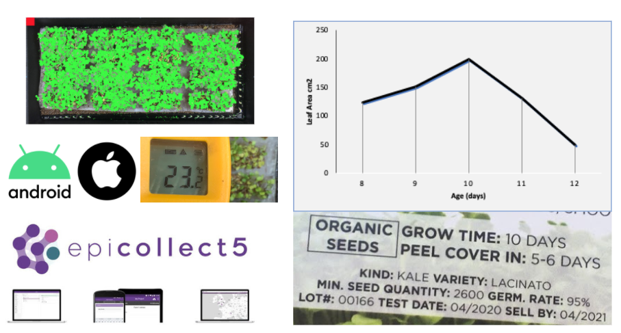

**Figure 5:** Example analysis showing photos taken each day for 6 days starting just before sample harvest and consumption began. Photography was also performed of the subsequent nutrition enhancements of meal time (see twitter and Instagram for microgreen enhance meal time). Source: Dr Richard Barker unpublished citizen science demo data.

### &#x20;

### Program Stage IV Summary 

**Microgreen Development and Gravitropic Response**

This stage will focus on growing microgreens on plant-based agar (or wet filter paper) in order to observe and measure root growth kinetics. After initial root growth has been recorded at 3 time points (such as day 3, 4, & 5 post germination), the gravity vector will rotate 90 degrees in order to observe how roots adapt to this stimuli. [Urban microgreen EpiCollect5](https://five.epicollect.net/project/urban-microgreens) project can help you collect the important meta-data, primary imaging data, and optimise your experimental parameters so your data is comparable and shareable with the research community. Quantitative data will be collected in the form of root mapping utilizing Fiji, SmartRoot and AstroDart (other [software options](https://www.quantitative-plant.org/)). Reach out to Dr. Richard Barker and the astrobotany education team if you’re interested in using _RootNav 2.0,_ random forest machine learning in research programs, or if you’d like to test the new Epicollect5 data sharing app.

<figure>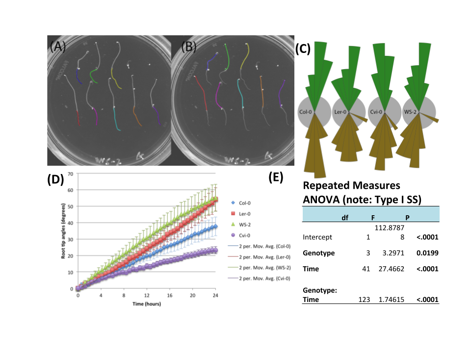<figcaption></figcaption></figure>

**Figure 6: (A)** Root length measurements. **(B)** Hypocol measurements. **(C)** Direction of root or shoot growth for 4 ecotypes of _Arabidopsis thaliana (Col-0, WS, Ler, Cvi)_ displayed as nightingale plots with a bin size of 10. **(D)** Scatter plot showing the gravitropic reorientation _._ Error bars show the standard error. (E) Anoa statistics are used to show differences based on variety and time points. (F) Example photography of Mizuna (or other microgreens) at 3 developmental stages that can be used to generate data like these. Source: Dr Richard Barker unpublished citizen science demo data.

### &#x20;

### Program Stage V Summary 

**(A) Turning microgreens into stem cell cultures & taking cuttings / making plant clones**

One of the greatest tools a researcher has is the strength to ask a well structured question, “[Research gate](https://www.researchgate.net/)” is an excellent social media platform for this. This is real research so remember to write down your thoughts, record the volumes you use and material you need for your experiments. We recommend using the “Google Science Journal” as a digital notebook as it allows you to quicklinks note and sensor measurements to photos and time stamps. Some laboratory protocols start to get more advanced such as investigations into genes and genomes then the ability to save, store and visualize DNA sequence becomes essential. We recommend the [Benchling software](https://www.benchling.com/) as it provides these slightly more advanced molecular biology features and it's nice to keep all protocols in one place. This is an example protocol from a scientist that turns Arabidopsis seedlings into stem cell cultures. Germinate your seeds on a medium that contains the right concentration of Auxin (2,4-D). Paul _et al_ (2002) created a callus induction media using the following recipe (Sterile conditions are essential for this to work). You can adapt this protocol for microgreen species.

**(A) (B)**

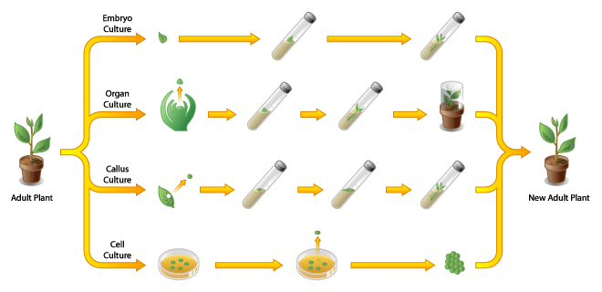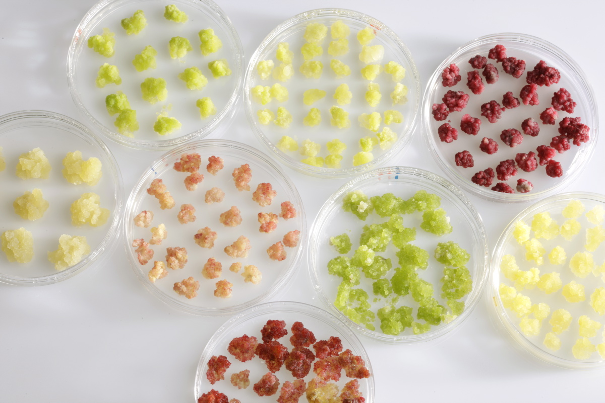

**Figure 7: (A)** Cell Cultures can be growing from any plant and plants can be generated from cell cultures. **(B)** The cell cultures can acquire a range of characteristics depending on the genome they have, the organ they came from and the stimuli they are provided.

**Stage III (B) Advanced systems biology: Auxin movement simulation and modeling lesson**

Understanding how auxin affects plants at a cellular level is difficult and requires computers to model and make simulations. These computer programs are designed to use mathematical models to describe the physical and mechanical characteristics of how cells function. These models can be used to investigate how chemicals might move across membranes to form concentration gradients. This movement is often coordinated by special proteins that sit in cell membranes and are responsible for transporting important signaling hormones. Some transporters are influenced by environmental factors such as light and gravity. The SimuPlant modeling software allows you to explore this fundermal biology at a cellular and molecular scale.

* Read a [summary of the model here](https://www.ebi.ac.uk/biomodels/content/model-of-the-month?year=2013\&month=01) and down the [SimuPlant](https://www.simuplant.org/) modeling software
* Other modeling [tools and spaceflight astrobotany data are available on this website](https://astrobiology.botany.wisc.edu/gilroy-lab-home/astrobiology-course)
* [Another great example of symptoms biology education](https://sites.google.com/systemsbiology.org/gaininginsight/home\_1?authuser=0)

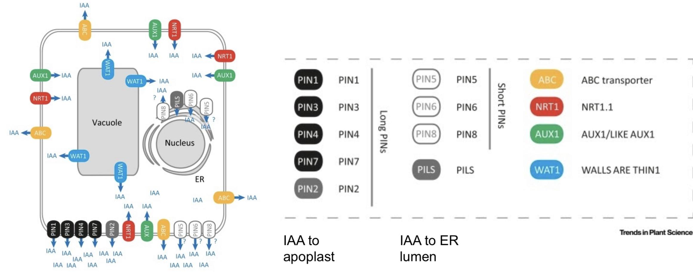

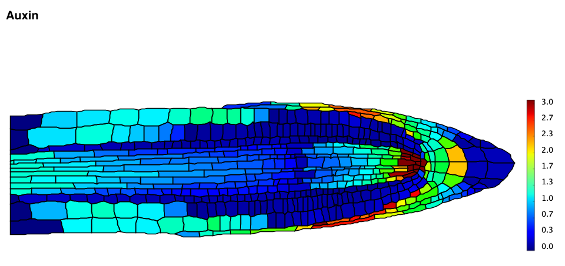

**Figure 8: (A)** Cellular model showing the subcellular location of Auxin transport and signaling components. **(B)** Root tip model illustrating auxin levels predicted by the reverse foundation model of auxin movement in the root and lateral apexes. Here’s a link to a [video of the model in action](https://www.youtube.com/watch?v=emd6tUy1pBo\&ab\_channel=RichardBarker).

### Program Stage VI Summary 

**STAGE IV: Phototropic Response of Microgreens Grown in Simulated Microgravity**

* The forth and most advanced stage of AIRI focuses on the effects that simulated microgravity has on the development of microgreens. This will be achieved through the utilization of the CoSE Gravity Chamber (or any DIY 2D slow rotating vessels you may have).
* More information on 3D clinostats found at at CoSEcloud.com
* More information on how to build your own DIY 2D clinostat found at[ Dr Andrea Henles SpaceBiology website](https://spacebiology.carthage.edu/grade-6-12-educators).
* Qualitative and quantitative data will be collected and analyzed through the utilization of _Easy Leaf_ , _RootNav 2.0 , SmartRoot and AstroDart_ softwares.

<figure>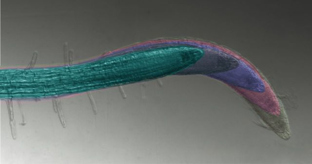<figcaption></figcaption></figure>

<figure>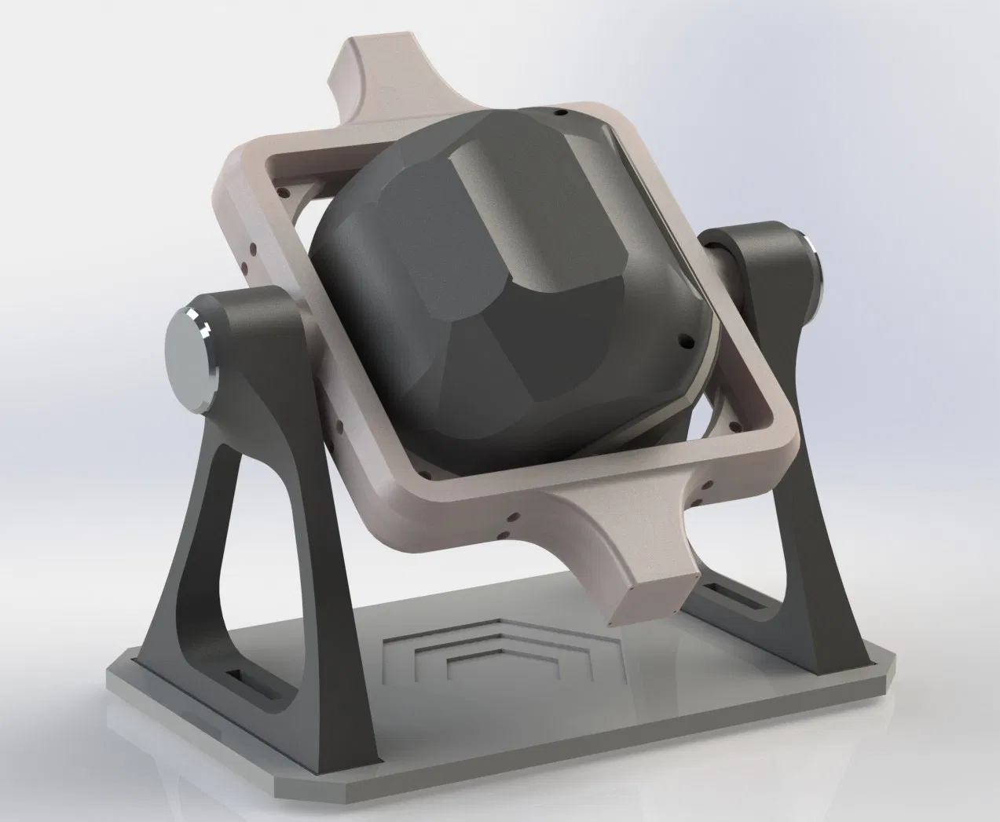<figcaption></figcaption></figure>

**Figure 9:** Special 3D clinostats and random positioning machines can create simulated microgravity. This CoSE Scispinner max can also produce a direction phototropic stimuli. Source: Google images search for multicolored root. Dr Richard Barker and Collaborative Science Environment for the 3D clinosat rendering and photo of the germinating seeds inside it.

### **Stage III: Growth of Microgreens in Terrestrial Environments** 

In this stage, participants focus on growth patterns of microgreens in soil growth media. Key data collections center around growth rates, leaf cover density, and edible biomass. Future space missions will require crews to have access to fresh nutrient dense crops that are able to be grown quickly, easily, and in limited space. This inquiry seeks to highlight microgreen crops that may be utilized in future space mission studies.

**Length of Stage: \~14 Days**

**Supplies:**

* [Hamama kit](https://www.hamama.com/), or
  * Standard “1020 Planting Trays”
  * Standard lab weighing tray,
  * Petri dishes
  * Record your experimental design, in your science journal,
  * Two two seed types need to be grown in parallel for comparison
* Seed quilts/Planting Soil / vermiculite / perlite / and water (volume is crucial)
* Dry Seeds (Any species can be used see supplementary tables for guide on difficulty levels)
* Ambient Temperature Thermometer
* Digital Scale (sensitive to 0.1g)
* Water mister or spray bottle
* Camera / smartphone
* Label or Tape
* Permanent Marker
* Ruler & /or a Printable Color (Red) Scale
* Computer capable of running [Easy Leaf Area Program](https://play.google.com/store/apps/details?id=com.heaslon.EasyLeafArea) (if you have a android device you can get instant measurements &/or save photos for analysis on a computer or for sharing with your fellow researchers)
* Data Collection Spreadsheet Template (Provided or build your own using our Epicollect5 Class full of researchers program or use our [EpiCollect5 AIRI MicroGreen Easy Leaf Area](https://five.epicollect.net/project/airi-microgreen-easy-leaf-area))
* Microgreen Density Calculator [https://jscalc.io/calc/vqHxgaGIt3RncroW](https://jscalc.io/calc/vqHxgaGIt3RncroW)

**Figure 10:** Example of simple microgreen hydroponic and soil media. Source: Photography by Dr Richard Barker and Dr Christina Johnson.

### **STAGE III Protocol Leaf Analysis** 

| 
<strong>STAGE I</strong>

<strong>Preparations to be conducted prior to starting</strong>
                                                                                                                                                                                                                                                                                                                                                                                                                                                                                                                                                                                                                                                                                               |
| --------------------------------------------------------------------------------------------------------------------------------------------------------------------------------------------------------------------------------------------------------------------------------------------------------------------------------------------------------------------------------------------------------------------------------------------------------------------------------------------------------------------------------------------------------------------------------------------------------------------------------------------------------------------------------------------------------------------------------------------------------------------------------------------------- |
| <ul><li>Download and install Easy Leaf Area and Easy Leaf Canopy Free on android devices. Alternatively plants can be imaged with cameras and then the images transferred to a PC or Mac OS for subsequent analysis.</li></ul>
(See Getting Started on Easy Leaf Area section for details).
<ul><li>Print red color scales (These files are included in the Easy Leaf Program file) this makes its easier to measure your greens (alternatively you can add the red square manually later but this can introduce error if the scale is wrong).</li><li>Gather trays depending on the amount of growing groups (Ex: Four groups, two trays each), check they don’t leak.</li><li>Check light intensity, temperature and any timers or time-lapse photography devices you plan to use.</li></ul> |

**(a) (b)**

**Figure 11:** In this example the microgreen tray has been placed on the button rack under white LED’s. This enabled the researcher to place the camera in front and above to perform time lapse photography. (B) Screenshot of the “Google science journal” in use photographing the microgreens and recording the light intensity and background audio levels.

| 
<strong>STAGE III</strong>

<strong>Microgreen Planting Protocol</strong>
                                                                                                                                                                                                                                                                                                                                                                                                                                                                                                                                                                                                                                                                                                                                                                                                                                                                                                                                                                                                                                                                                                                                                                                                                                                                                                                                                                                                                                                                                                                                                                                                                                                                                                                                                                                                                                                                                                                                                                 |
| ----------------------------------------------------------------------------------------------------------------------------------------------------------------------------------------------------------------------------------------------------------------------------------------------------------------------------------------------------------------------------------------------------------------------------------------------------------------------------------------------------------------------------------------------------------------------------------------------------------------------------------------------------------------------------------------------------------------------------------------------------------------------------------------------------------------------------------------------------------------------------------------------------------------------------------------------------------------------------------------------------------------------------------------------------------------------------------------------------------------------------------------------------------------------------------------------------------------------------------------------------------------------------------------------------------------------------------------------------------------------------------------------------------------------------------------------------------------------------------------------------------------------------------------------------------------------------------------------------------------------------------------------------------------------------------------------------------------------------------------------------------------------------------------------------------------------------------------------------------------------------------------------------------------------------------------------------------------------------------------------------------------------------------------------------- |
| <ul><li>
Use the <a href="https://www.hamama.com/">Hamama kit</a> instructions, or
<ul><li>If not using the kit, please precisely record any variations in your protocol using your “Science Journal”.</li><li>Fill a single tray with dry soil and weigh (Record the weight of this tray and use it as a reference for subsequent trays).</li><li>Pick out dry seeds to be used (At least two different seed types).</li><li>Weigh appropriate amount of seeds for selected tray size.</li><li>Utilize<a href="https://jscalc.io/calc/vqHxgaGIt3RncroW"> the microgreen density calculator t</a>o measure ideal seed quantities:</li></ul></li><li>Have participant groups spread their soil evenly in each observational planting tray.</li><li>Add water to growing trays. (Soil should be damp, but not flooded)</li><li>Evenly spread selected seeds throughout specified trays per seed type. (Seeds can also be spread in rows within the trays. If multiple seeds will be represented in single trays, it is important that each row is properly labeled.)</li><li>Gently scattering on the surface of the soil (or growth media). Seeds shouldn’t be covered by soil so don’t plant them deeply. Ideally just a light dusting of soil over the top, put some of the dry soil in a flour sifting sieve and tap the side to get a light dust of soil over the seeds.</li><li>Mist planted seeds with water.</li><li>Make sure to label each tray with the seed type, date planted, and elevation.</li><li>Place near a light source (Windows, or LED lights. Specify light source in data sheet).</li><li>Mist soil daily in order to keep it damp.</li><li>Measure the light intensity above your plant canopy. An easy way to do this is download the “Google Science Journal Application ''. This tool allows you to use your smart device's camera to measure the light intensity. Try to get the device right in the center of the tray. You can even create a map to show the light distribution over your entire canopy.</li></ul> |

(A) (B)

**Figure 12:** (A) Simple 4 tray microgreen hydroponic system under fluorescent lights in the corner of a classroom. This teacher cleverly built it into their skink area to make it easier to wash away the dirt and provide easy access to water. (B) Along with the soil method, this research group built a simple hydroponic system using an airstone, LED headlight and plastic trays to grow mizuna. This system, while basic, provides valuable data regarding biomass and growth rates for microgreen species.

### Software assistance for data harvesting and leaf measuring 

| 
<strong>STAGE I</strong>

<strong>Data Collection Protocol</strong>
                                                                                                                                                                                                                                                                                                                                                                                                                                                                                                                                                                                                                                                                                                                                                                                                                                                                                                                                                                                                                                                                                                                                                                                                                                                                                                                                                                                                                                                                                                                                                                                                                                                                                                                                                                                                                                                                                                                                                                                                                                                                                                                                                                                                                                                                                                                                                                                                                                                                                                                                                                                                                                                                                                                                                        |
| -------------------------------------------------------------------------------------------------------------------------------------------------------------------------------------------------------------------------------------------------------------------------------------------------------------------------------------------------------------------------------------------------------------------------------------------------------------------------------------------------------------------------------------------------------------------------------------------------------------------------------------------------------------------------------------------------------------------------------------------------------------------------------------------------------------------------------------------------------------------------------------------------------------------------------------------------------------------------------------------------------------------------------------------------------------------------------------------------------------------------------------------------------------------------------------------------------------------------------------------------------------------------------------------------------------------------------------------------------------------------------------------------------------------------------------------------------------------------------------------------------------------------------------------------------------------------------------------------------------------------------------------------------------------------------------------------------------------------------------------------------------------------------------------------------------------------------------------------------------------------------------------------------------------------------------------------------------------------------------------------------------------------------------------------------------------------------------------------------------------------------------------------------------------------------------------------------------------------------------------------------------------------------------------------------------------------------------------------------------------------------------------------------------------------------------------------------------------------------------------------------------------------------------------------------------------------------------------------------------------------------------------------------------------------------------------------------------------------------------------------------------------------------------------------------------------------------------- |
| <ul><li><strong>Data is to be recorded on the 4th, 8th, and 12th day after planting.</strong></li><li><strong>All data is to be recorded in the provided spreadsheet template.</strong></li></ul>
<strong>Data Points to be collected:</strong>
<ul><li>Top view photograph of tray with printed red scale</li><li>Height of plants in cm</li><li>Leaf area in cm² (Utilizing EASY LEAF AREA)</li><li>General observations (plant health, coloration)</li><li>Edible biomass (Weight g)</li></ul>
<strong>Photographing Microgreens Protocol:</strong>
<ul><li>Print and glue red square scale onto white cardboard or paper</li><li>Place red scale next to and at the same height microgreen tray</li><li>Photograph the tray at a distance of 45cm from the top of the tray</li><li>Upload and label photographs with Plant Name, Date, and Time</li><li>Do this on the 4th, 8th, and 12th day after planting</li></ul>
<strong>Measuring Height Protocol:</strong>
<ul><li>Place ruler at soil level</li><li>Using a second ruler (this can also be a pencil, firm cardboard) find the highest point of the plant in the microgreen tray.</li><li>Record measurement in cm in the provided data collecting spreadsheet template</li><li>Do this on the 4th, 8th, and 12th day after planting</li></ul>
<strong>General Observations Protocols:</strong>
<ul><li>
The provided general observations template document has sections to record the following measurements:
<ul><li>Ambient temperature at the time of recording</li><li>Elevation</li><li>Date and Time of observations</li></ul></li><li>
In the provided template observations document, participants should record observations regarding regarding all data points collected as well as qualitative records regarding the following points:
<ul><li>Rate of growth</li><li>General plant health</li><li>Growth distribution within a given growing tray</li><li>Plant coloration</li></ul></li><li>Do this on the 4th, 8th, and 12th day after planting</li></ul>
<strong>Edible Biomass Measurement Protocol</strong>
<ul><li>After all observations have been collected on the 12th day after planting, edible biomass measurements are to be recorded in the general observations document for each tray separately.</li><li>Harvest microgreen by removing them from soil media then cutting them at the base of the plant (the point before the roots grow out from)</li><li>Each separate tray harvest is to be measured in grams and recorded in the general observations document.</li></ul>
<strong>Easy Leaf Area Data Protocol summary</strong>
<ul><li>Take photos on the 4th, 8th, and 12th day after planting (or any 3-5 time points)</li><li>Follow the EasyLeafArea Protocol to analyze images</li></ul> |
|                                                                                                                                                                                                                                                                                                                                                                                                                                                                                                                                                                                                                                                                                                                                                                                                                                                                                                                                                                                                                                                                                                                                                                                                                                                                                                                                                                                                                                                                                                                                                                                                                                                                                                                                                                                                                                                                                                                                                                                                                                                                                                                                                                                                                                                                                                                                                                                                                                                                                                                                                                                                                                                                                                                                                                                                                                        |

| 
<strong>STAGE III</strong>

<strong>Easy Leaf Area Protocol</strong>
                                                                                                                                                                                                                                                                                                                                                                                                                                                                                                                                                                                                                                                                                                                                                                                                                                                                                                                                                                                                                                                                                                                                                                                      |
| --------------------------------------------------------------------------------------------------------------------------------------------------------------------------------------------------------------------------------------------------------------------------------------------------------------------------------------------------------------------------------------------------------------------------------------------------------------------------------------------------------------------------------------------------------------------------------------------------------------------------------------------------------------------------------------------------------------------------------------------------------------------------------------------------------------------------------------------------------------------------------------------------------------------------------------------------------------------------------------------------------------------------------------------------------------------------------------------------------------------------------------------------------------------------------------------------------------------------------------------------------------------- |
| 
<strong>WHAT IS EASY LEAF AREA</strong>

Easy leaf area is free, open source, software that rapidly measures leaf area in digital images (photographs or scanner images). Easy leaf area uses the RGB value of each pixel to identify leaf and scale regions in each image

<strong>GETTING STARTED:</strong>
<ul><li>This program analyzes single jpeg or tiff images or batches of images for leaf area.</li><li>Images must have a red scale of known area in the image in the same plane as the leaves for the program to use as a reference scale (This can be added in photoshop or other “Paint” software packages).</li><li>
Download and install Easy Leaf Area on a designated computer or <a href="https://play.google.com/store/apps/details?id=com.heaslon.EasyLeafArea"><strong>Android</strong> </a>device application.
<ul><li>This software runs on android as an app, or can be used with images moved to a PC, linux or MacOS.</li><li><a href="https://github.com/heaslon/Easy-Leaf-Area">https://github.com/heaslon/Easy-Leaf-Area</a></li></ul></li><li>Follow the instruction on their website: <a href="https://github.com/heaslon/Easy-Leaf-Area">https://github.com/heaslon/Easy-Leaf-Area</a></li></ul> |

| 
<strong>Stage III</strong>

<strong>Data Analysis Protocol</strong>
                                                                                                                                                                                                                                                                                                                                                                                                                                                                                                                                                                                                                                                                                                                                                                                                                                                                                                                                                                                                                                                                                                                                                                                                                                                                                                                                                                                                                                                                                                                                                                                                    |
| ---------------------------------------------------------------------------------------------------------------------------------------------------------------------------------------------------------------------------------------------------------------------------------------------------------------------------------------------------------------------------------------------------------------------------------------------------------------------------------------------------------------------------------------------------------------------------------------------------------------------------------------------------------------------------------------------------------------------------------------------------------------------------------------------------------------------------------------------------------------------------------------------------------------------------------------------------------------------------------------------------------------------------------------------------------------------------------------------------------------------------------------------------------------------------------------------------------------------------------------------------------------------------------------------------------------------------------------------------------------------------------------------------------------------------------------------------------------------------------------------------------------------------------------------------------------------------------------------------------------------------------------------------------------------------------- |
| 
<strong>Plant leaf area data</strong>

<strong>Student Data Entry</strong>

<strong>Goal:</strong> Observe a real experimental data matrix and then make your own
<ul><li>Students are given an <a href="https://docs.google.com/spreadsheets/d/1NIJLvMePCzTk8kKfVo_ePQOXW2zHa8bazv1O1rKtkqM/edit?usp=sharing">example </a>spreadsheet</li><li>Students can use these demo data to practice using these analysis tools.</li><li>Eventually the students will enter their own data into their classes shared spreadsheet and then analyse it using these applications.</li></ul>
<strong>Numbers entered into a google spreadsheet, attached link.</strong>

<strong>Goal:</strong> Students make graphs using transitional tools like spreadsheets and “R-shiny” applications. These tools are specifically designed to process data to produce standardized and flexible graphs.
<ul><li>How to make a <a href="http://shiny.chemgrid.org/boxplotr/">Boxplot</a> R-shiny</li><li>Play with data in <a href="https://site.shinyserver.dck.gmw.rug.nl/ggplotgui/">GGPlot</a> R-shiny</li><li>How to make a <a href="https://docs.google.com/document/d/1bueze0FoVhUslthJ6rgQ2Pz9njW5mvefff2N4KlUbac/edit?usp=sharing">bar plot using R-Plotly</a></li></ul>
<strong>Statistics</strong>

<strong>Goal:</strong> Introduction to statistics for teachers and students T-test
<ul><li>This article describes how <a href="https://escholarship.org/uc/item/00d4q8cp">R-shiny statistics app</a>’s can be used in the classroom</li><li>How to do a simple <a href="http://shiny.stat.calpoly.edu/t_Test/">T-test using R-shiny</a> app.</li></ul> |

| 
<strong>Stage III</strong>

<strong>Epicollect data sharing system</strong>
                                                                                                                                                                                                                                                                                                                                                                                                                                                                                                                                                                                                                                                                                                                                                                                                                                                                               |
| --------------------------------------------------------------------------------------------------------------------------------------------------------------------------------------------------------------------------------------------------------------------------------------------------------------------------------------------------------------------------------------------------------------------------------------------------------------------------------------------------------------------------------------------------------------------------------------------------------------------------------------------------------------------------------------------------------------------------------------------------------------------------------------------------------------------------------------------------------------------------------------------------------------------------------------------------------------------- |
| 
<strong>How to share Plant leaf area data</strong>

<strong>Student Data Entry</strong>

<strong>Goal:</strong> Observe a real experimental data matrix and then make your own
<ul><li>Primary data</li><li>
Environmental meta-data
<ul><li>Temp</li><li>Humidity</li><li>Light quality</li><li>Light intensity</li><li>Irrigation system</li></ul></li></ul>
<strong>Numbers entered into a Epicollect5 website or Smart device app attached link.</strong>
<ul><li><a href="https://five.epicollect.net/project/urban-microgreens">https://five.epicollect.net/project/urban-microgreens</a></li><li>You can also download the Epicollect5 app onto your smart device and then search for the “Urban microgreens” project.</li></ul>
<strong>Data analysis</strong>

<strong>Goal:</strong> Introduction to data visualization using DRB astrobiology app’s…. Coming soon (need the app to be finalized)
<ul><li>XXX</li></ul> |

### &#x20;

### **Research Stage IV: Microgreen development and gravitropic response** 

The second stage of this program focuses on observing gravity sensing mechanisms in microgreen root systems. This is an important concept to understand as it relates to how a critical element of plant biology develops. Data collection will focus on root directional growth and overall spread. Data is to be collected through the utilization of RootNav or SmartRoot software. Although this stage focuses on gravitropism, there is an extension available that expands on gravitropic and phototropic responses as well. EpiCollect5 Data collection templates are available for extensions and AstroBotany data viz assistance coming soon.

**Length of Stage: \~14 Days**

**Supplies:**

* [100 x 15 mm square dish](https://www.amazon.com/UPlama-Integrid-Transfer-Pipettes-Projects/dp/B07ZQYBQFV/ref=sr\_1\_6?dchild=1\&keywords=100+x+15mm+square+dish\&qid=1604348348\&sr=8-6) (4 per observation group), if this isn’t possible the clear boxes full of brownies at the supermarket can also work well.
* Plant grow Media (Use one of these two options and note in data sheet)
  * **Option 1: the Easy Filter paper and Water**
  * **Option 2: the Simple Agar Media**
* Selected Microgreen seeds (Mizuna is a suggested choice for first time observations but other options can be found online such[ as on this AstroBotany website](https://astrobiology.botany.wisc.edu/gilroy-lab-home/microgreen-diversity)
* Computer with RootNav/SmartRoot installed
* 70-100% Ethanol
* Microcentrifuge Tubes (or small plastic containers/cups) if you don't have a centrifuge you either convert a salad spinner or even [make one from string and cardboard](https://www.youtube.com/watch?v=isMYGtCFljc).
* Filter paper
* Micropore Medical Tape (or electrical tape on 4 sides)

### **STAGE IV: Protocols for root analysis** 

| 
<strong>STAGE II</strong>

<strong>Growth Media Preparation Protocol</strong>
                                                                                                                                                                                                                                                                                                                                                                                                                                                                                                                                                                                                                                                                                                                                            |
| ------------------------------------------------------------------------------------------------------------------------------------------------------------------------------------------------------------------------------------------------------------------------------------------------------------------------------------------------------------------------------------------------------------------------------------------------------------------------------------------------------------------------------------------------------------------------------------------------------------------------------------------------------------------------------------------------------------------------------------------------------------------------------------------------------------------------------------ |
| 
<strong>Option 1: the Easy Filter paper and Water</strong>
<ul><li>Just add water to blue filter paper</li></ul>
<strong>Option 2: the Simple Agar Media</strong>
<ul><li>Measure 100ml of distilled water and 2g of agar/phytogel/phytagel</li><li>Bring the water to a boil and add agar powder while stirring</li><li>Remove heat after 5 minutes.</li><li>Autoclave the bottles for 30 minutes. (if autoclave isn’t available then pressure cookers work well)</li><li>Let rest/cool for another 15 minutes.</li><li>Pour out onto dishes (in the lab we use 50ml falcon tubes to measure 30ml of media per square petri)</li><li>Let plates set for 20 minutes (Tap side of the plate to make sure it’s set).</li><li>Put lids back on plates and store in a cold room (4c refrigerator)<strong>.</strong></li></ul> |

| 
<strong>STAGE II</strong>

<strong>Simple Sterilization Protocol</strong>
                                                                                                                                                                                                                                                                                                                                                                                                                                                                                                                                                                                                                                                                                                                                                                                                                                                                                                                                                                                                                                                                                                                                                                                                                                                                                                                                                                                  |
| ---------------------------------------------------------------------------------------------------------------------------------------------------------------------------------------------------------------------------------------------------------------------------------------------------------------------------------------------------------------------------------------------------------------------------------------------------------------------------------------------------------------------------------------------------------------------------------------------------------------------------------------------------------------------------------------------------------------------------------------------------------------------------------------------------------------------------------------------------------------------------------------------------------------------------------------------------------------------------------------------------------------------------------------------------------------------------------------------------------------------------------------------------------------------------------------------------------------------------------------------------------------------------------------------------------------------------------------------------------------------------------------------------------------------------------------------------------------------- |
| 
This seed sterilization technique is good for quickly sterilizing seed batches before putting them in a petri dish to grow. Keep in mind that although sterilization is best practice, the quality of the actual seeds play a big role in susceptibility to contamination.

<strong>Purpose</strong>: to reduce contamination during experiments

<strong>Seed Ethanol Method</strong>:

<strong>Materials needed</strong>: 70% ethanol, microcentrifuge tubes, pipettes, filter paper
<ul><li>Carefully decant seeds into “microcentrifuge” or other small tubes.</li><li>Submerge seeds in 70-100% ethanol solution..</li><li>Let the seeds sit in ethanol for about 1-2 minutes, ideally shake or “buz” on a lab vortex.</li><li>Let the seeds settle to the bottom of the tube and either use the pipette to remove as much ethanol as you can, but not the seeds or pour out the ethanol.</li><li>If contamination is a persistent issue repeat this ethanol rinse.</li><li>Remove the seeds by sucking up the ethanol and seed solution.</li><li>Dispense the seeds and ethanol onto filter paper so they are ready to sow.</li></ul>
<strong>Simple Ethanol rinse Sterilization Protocol for Petri Dishes:</strong>
<ul><li>Fill petri dish with ethanol</li><li>Close the lid shack it about, pour away the alcohol; let ethanol evaporate off (ideally in a flow hood).</li><li>Keep closed until it is time to add media</li></ul> |

| 
<strong>STAGE IV</strong>

<strong>Preparations to be conducted prior to starting</strong>
                                                                                                                                                                                                                                                                                                                                                                                                                                                                     |
| -------------------------------------------------------------------------------------------------------------------------------------------------------------------------------------------------------------------------------------------------------------------------------------------------------------------------------------------------------------------------------------------------------------------------------------------------------------------------------------------------------------------------------------------------------------------------- |
| <ul><li>For MaxOS Download Fiji &#x26; Smartroot. Install Fiji and then the SmartRoot addon.</li><li>For Windows OS Download and install RootNav on designated devices</li></ul>
(Requires a computer with a window operating system.

See Getting Started on RootNav/SmartRoot section for details)
<ul><li>Select microgreen seeds to be utilized</li><li>Decide which growth media to be utilized (simple v. complex)</li><li>
Decide what experimental variable of interest is going to be?
<ul><li>Such as genotype or light color</li></ul></li></ul> |

| 
<strong>STAGE IV</strong>

<strong>Microgreen Seeding Protocol</strong>
                                                                                                                                                                                                                                                                                                                                                                                                                                                                                                                                                                                                                                                                                                                                                                                                                                                                                                                                                                   |
| ----------------------------------------------------------------------------------------------------------------------------------------------------------------------------------------------------------------------------------------------------------------------------------------------------------------------------------------------------------------------------------------------------------------------------------------------------------------------------------------------------------------------------------------------------------------------------------------------------------------------------------------------------------------------------------------------------------------------------------------------------------------------------------------------------------------------------------------------------------------------------------------------------------------------------------------------------------------------------------------------------------------------------------------------------- |
| <ul><li>Pour a moderate amount of agar in selected plates. (If possible, keep the temperature of media under 40°C to minimize condensation)</li><li>Place lids on plates upside down and let sit for an 30min</li></ul>
After the media has settled, turn the lids over and close the plates.
<ul><li>Wipe condensation off with a sterile paper towel if needed</li><li>Sterilize tweezers with ethanol</li><li>Place six seeds in a straight line horizontally across each plate’s midway line. Make sure seeds are evenly spaced. (If plates have gridlines, utilize them for seed placement.</li><li>Gently press seed into the agar making sure the seed is embedded.</li></ul>
(Do not crush seeds. Use minimal pressure)
<ul><li>Cover plates with lids and seal with micropore medical tape.</li><li>Stand plates against a wall vertically</li><li>Place light source above plates (1-2 feet).</li><li>Record light intensity using the Google Science Journal application</li><li>Record day and time of seeding plates</li></ul> |

| 
<strong>STAGE IV</strong>

<strong>Observational and Data Collection Protocol</strong>
                                                                                                                                                                                                                                                                                                                                                                                                                                                                                                                                                                                                                                                                                                                                                                                                                                                                                                                                                                                                                                                                                                                                             |
| ---------------------------------------------------------------------------------------------------------------------------------------------------------------------------------------------------------------------------------------------------------------------------------------------------------------------------------------------------------------------------------------------------------------------------------------------------------------------------------------------------------------------------------------------------------------------------------------------------------------------------------------------------------------------------------------------------------------------------------------------------------------------------------------------------------------------------------------------------------------------------------------------------------------------------------------------------------------------------------------------------------------------------------------------------------------------------------------------------------------------------------------------------------------------------------------------------------------------------------------------- |
| 
<strong>Observation</strong>
<ul><li>
Everyday record notes regarding seedling development in observation log:
<ul><li>How many seedlings have germinated?</li><li>Root growth patterns</li><li>Stem/leaf color and health</li><li>When the roots have emerged, root length</li><li>The emergence of cotyledons (first leaves)</li><li>Note any unusual root/stem growth patterns such as directional waving, skewing, curling or looping. Germination speed and totally rates of germination success can vary between specimens or treatments.</li><li>Epicollect5 questions coming soon</li></ul></li></ul>
<strong>Photograph Analysis Protocol</strong>
<ul><li>Photograph all control and experimental plates at the same time everyday</li><li>
Make sure that each photograph is saved with proper metadata which includes:
<ul><li>Plant Type</li><li>Control or Experimental Group</li><li>Plate Number</li><li>Data and Time of Photograph</li></ul></li><li>Photographs are to be taken from the same distance and in the same resolution. (Preferably 300dpi)</li><li>Once completed, follow the included directions to upload and analyze root architectural patterns using RootNav or Smart Root.</li></ul> |

### Software to assist with Root Analysis 

| 
<strong>STAGE IV</strong>

<strong>ImageJ / Smart Root analysis</strong>
                                                                                                                                                                                                                                                                                                                                                                                                                                                                                                                                                                                                                                       |
| -------------------------------------------------------------------------------------------------------------------------------------------------------------------------------------------------------------------------------------------------------------------------------------------------------------------------------------------------------------------------------------------------------------------------------------------------------------------------------------------------------------------------------------------------------------------------------------------------------------------------------------------------------------------------------------------------------------------------- |
| 
<strong>Goal: To create a folder of RSML files and a spreadsheet of root measurements</strong>

Note: Best for MacOS and time series data
<ul><li>Install Fiji</li><li>Install SmartRoot</li><li>Open Fiji</li><li>Open SmartRoot</li></ul><ul><li>Open images</li></ul><ul><li>Make use you have a light background (Sometimes the image colors need to be inverted).</li><li>Follow the SmartRoot instruction to measure the primary root.</li><li>Then measure the lateral roots.</li><li>The software automatically save the RSML files as you measure. At the end of your analysis you can export as .txt file / spreadsheet.</li></ul><ul><li>A range of characteristics can quickly be plotted</li></ul> |

| 
<strong>Stage IV</strong>

<strong>Getting Started on RootNav</strong>
                                                                                                                                                                                                                                                                                                                                                                                                                                                                                                                                                                                                                                                                                                                                                                                                                                                                                                                                                                                                                                                                                                                                                                                                                                                                                                                                                                                                                                                                                                                                                                           |
| ------------------------------------------------------------------------------------------------------------------------------------------------------------------------------------------------------------------------------------------------------------------------------------------------------------------------------------------------------------------------------------------------------------------------------------------------------------------------------------------------------------------------------------------------------------------------------------------------------------------------------------------------------------------------------------------------------------------------------------------------------------------------------------------------------------------------------------------------------------------------------------------------------------------------------------------------------------------------------------------------------------------------------------------------------------------------------------------------------------------------------------------------------------------------------------------------------------------------------------------------------------------------------------------------------------------------------------------------------------------------------------------------------------------------------------------------------------------------------------------------------------------------------------------------------------------------------------------------------------------------------------------------------------ |
| 
<strong>Goal: To create a folder of RSML files and a spreadsheet of root measurements</strong>

Note: Best for Window’s OS and a single time point
<ul><li>RootNav is a software used by astrobotany researchers to analyze root length and curvature for gravitropic assays (experiments that simulate components of microgravity). This invaluable tool provides a way to quantify data taken from these experiments.</li><li>The RootNavViewer Portal allows researchers to explore databases of root system architecture (<a href="https://github.com/Chagrilled/RootNavPortal">Software still under development here</a>).</li><li>RootNav2 is a new software that requires a very specific type of image acquisition. New protocol coming soon...</li></ul>
<strong>Installation:</strong>
<ul><li>Go to GitHub using this link:</li></ul>
<a href="https://github.com/dr-richard-barker/image-analysis-software-and-R-codes">https://github.com/dr-richard-barker/image-analysis-software-and-R-codes</a>
<ul><li>Click the green button to “clone or download”. Click download ZIP.</li><li>Save the ZIP folder to a location of your choosing on your computer (ie. desktop).</li><li>Once the ZIP file is downloaded, click on the folder. Click onto the RootNav folder and click to extract all files.</li><li>After the extraction is complete, click on the RootNav application to open the software.</li><li>If you don’t have a window’s computer you can use one of these free cloud computer.</li></ul>
<a href="https://www.onworks.net/software/app-rootnav">https://www.onworks.net/software/app-rootnav</a>
 |

| 
<strong>Stage IV</strong>

<strong>AstroDart data visualization</strong>
                                                                                                                                                                                                                                                                                                                                                                                                                                                                                                                                                                                                                                                                                                                                                                                                                                            |
| ------------------------------------------------------------------------------------------------------------------------------------------------------------------------------------------------------------------------------------------------------------------------------------------------------------------------------------------------------------------------------------------------------------------------------------------------------------------------------------------------------------------------------------------------------------------------------------------------------------------------------------------------------------------------------------------------------------------------------------------------------------------------------------------------------------------------------------------------------------------------------------------------------------------------------- |
| <ul><li>Here’s an example of the <a href="https://plantmodelling.shinyapps.io/archidart/">ArchDart R-shiny</a> package, this software allows you to vizulize modelled root system roots quickly and easily.</li><li>RSML data can be imported into this application and view easily but does require some experience with R-studio.</li><li>First down Anaconda and the latest version of R (or you can run it in the <a href="https://learning.cyverse.org/projects/vice/en/latest/user_guide/quick-rstudio.html">CyVerse cloud</a>).</li><li>
Then run the following lines of R code.
<ul><li>install_github("archiDART/archiDART", force = TRUE)</li><li>install.packages("shiny")</li><li>library(archiDART)</li><li>library(shiny)</li><li>shiny::runGitHub("archidart/astrodart", "astrodart")</li></ul></li></ul>
<strong>AstroDart Shiny is designed to make plots of the data from the RSML files.</strong>
 |

| 
<strong>Stage II</strong>

<strong>Data Analysis Protocol</strong>
                                                                                                                                                                                                                                                                                                                                                                                                                                                                                                                                                                                                                                                                                                                                                                                                                                                                                                                                                                                                                                                                                                                                                                                                                                                                                                                                                                                                                                                                                                                                                                                                                                                                                                                                                                                                                                                                                                                                                |
| ----------------------------------------------------------------------------------------------------------------------------------------------------------------------------------------------------------------------------------------------------------------------------------------------------------------------------------------------------------------------------------------------------------------------------------------------------------------------------------------------------------------------------------------------------------------------------------------------------------------------------------------------------------------------------------------------------------------------------------------------------------------------------------------------------------------------------------------------------------------------------------------------------------------------------------------------------------------------------------------------------------------------------------------------------------------------------------------------------------------------------------------------------------------------------------------------------------------------------------------------------------------------------------------------------------------------------------------------------------------------------------------------------------------------------------------------------------------------------------------------------------------------------------------------------------------------------------------------------------------------------------------------------------------------------------------------------------------------------------------------------------------------------------------------------------------------------------------------------------------------------------------------------------------------------------------------------------------------------------------------------------------------------- |
| 
<strong>Plant Root System Architecture data</strong>

<strong>RootSystem analysis, </strong><em><strong>“turning pictures into numbers then into graphs”</strong></em>

<strong>Goal:</strong> Turn photos of roots into numbers for analysis
<ul><li>Images of the plant's root system growing on vertical petri dishes can be analyzed by the student researchers using RootNav in the class room (More detailed protocol below).</li><li>These data can be exported and analyzed using the methods above.</li></ul>
<strong>Student Data Entry</strong>

<strong>Goal:</strong> Observe a real experimental data matrix and then make your own
<ul><li>Students are given a <a href="https://docs.google.com/spreadsheets/d/1NIJLvMePCzTk8kKfVo_ePQOXW2zHa8bazv1O1rKtkqM/edit?usp=sharing">example </a>spreadsheet</li><li>Students can use these demo data to practice using these analysis tools.</li><li>Eventually the students will enter their own data into their classes shared spreadsheet and then analyse it using these applications.</li></ul>
<strong>Numbers entered into a google spreadsheet, attached link.</strong>

<strong>Goal:</strong> Student makes graphs using R-shiny applications.
<ul><li>How to make a <a href="http://shiny.chemgrid.org/boxplotr/">Boxplot</a> R-shiny</li><li>Play with data in <a href="https://site.shinyserver.dck.gmw.rug.nl/ggplotgui/">GGPlot</a> R-shiny</li><li>How to make a <a href="https://docs.google.com/document/d/1bueze0FoVhUslthJ6rgQ2Pz9njW5mvefff2N4KlUbac/edit?usp=sharing">bar plot using R-Plotly</a></li></ul>
<strong>Statistics</strong>

<strong>Goal:</strong> Introduction to statistics for teachers and students T-test
<ul><li>This article describes how <a href="https://escholarship.org/uc/item/00d4q8cp">R-shiny statistics app</a>’s can be used in the classroom</li><li>How to do a simply <a href="http://shiny.stat.calpoly.edu/t_Test/">T-test using R-shiny</a> app.</li></ul> |

| 
<strong>STAGE IV</strong>

<strong>Summary and Application Discussion</strong>
                                                                                                                                                                                                                                                                                                                                                                                                                                                |
| ----------------------------------------------------------------------------------------------------------------------------------------------------------------------------------------------------------------------------------------------------------------------------------------------------------------------------------------------------------------------------------------------------------------------------------------------------------------------------------------------------------------------------------------- |
| 
<strong>Follow Up Inquiry:</strong>
<ul><li>Based on the observations made during this study, what conclusions can be made about the conditions that determine the direction of root growth in plants?</li><li>What direction do roots grow in? Why?</li><li>How would this change in an environment absent of, or that has reduced gravity?</li></ul>
<strong>Expansion:</strong>
<ul><li>Based on these observations, what directions do plants grow towards? (stems, leaves)</li><li>How can this idea be tested?</li></ul> |

### **Research stage III: Auxin experimentation and Plant Cloning** 

Auxin movement is important for gravity and light perception and response in plants. Auxin is also an important tool in agriculture being used to both clone and kill plants. Many pioneering studies of plants in orbit have been achieved using plant stem cell cultures. Growing stem cells and cloning plants is easy. Understanding how auxin affects plants at a cellular cell is difficult and requires computers to model and make simulations.

**Length of Stage: \~ 7 Days**

**Supplies:**

* Computers for modeling software
* Auxin powder (lots of brands Bonide, MiracleGro "FastRoot to choose from and compare against each other in experiments)
* Plant you want to clone (Tomatoes, chili’s, lavender, rose, what ever you want or pre-cut kitchen Rosemary from the supermarket can work)

### &#x20;

### STAGE III Protocols for Auxin experiments and cloning 

| 
<strong>STAGE V</strong>

<strong>Simple plant cloning protocol</strong>
                                                                                                                                                                                                                                                                                                                                                                                                                         |
| ------------------------------------------------------------------------------------------------------------------------------------------------------------------------------------------------------------------------------------------------------------------------------------------------------------------------------------------------------------------------------------------------------------------------------------------------------------------------------------------------------------ |
| 

<ul><li>There are many protocols for taking cuttings.</li><li>The most important thing is to compare a few different variations (such as different light environments or different age) and record what happens in your Science Journal.</li><li>
What variables?
<ul><li>Age of the plant</li><li>Species</li><li>Size of canopy left intact</li><li>
Method of auxin application
<ul><li>Powder</li><li>Liquid solution</li><li>Brand</li><li>Concentration</li></ul></li></ul></li></ul> |

| 
<strong>STAGE V</strong>

<strong>Advance plant cell culture cloning protocol</strong>
                                                                                                                                                                                                                                                                                                                                                                                                                                                                                                                                                                                                                                                                                                                                                                                                                                                                                                                                                                                                                                                                                                                                                                                                                                                     |
| ------------------------------------------------------------------------------------------------------------------------------------------------------------------------------------------------------------------------------------------------------------------------------------------------------------------------------------------------------------------------------------------------------------------------------------------------------------------------------------------------------------------------------------------------------------------------------------------------------------------------------------------------------------------------------------------------------------------------------------------------------------------------------------------------------------------------------------------------------------------------------------------------------------------------------------------------------------------------------------------------------------------------------------------------------------------------------------------------------------------------------------------------------------------------------------------------------------------------------------------------------------------------------------------------------------------------------------------------------ |
| 

This is a real scientific protocol, so there are a lot of variations to this protocol on the internet and in various labs it has been adapted for different purposes. The amount of hormones varies depending on the type of plant you are using. Write down your steps in your Science Journal so your methods are reproducible.

Making a media of 1 L
<ul><li>1Liter of water,</li><li>4.4g MS salts,</li><li>30g sucrose,</li><li>1ml MS vitamins,</li><li>300 ul 2,4-D (Auxin)</li></ul>
Mix ingredients with 1L with 1L H20 then adjust the pH to 5.72
<ul><li>Alter pH by adding drops of potassium hydroxide</li></ul>
Final concentration = 1.0% agar (10g in 1L )

<strong>Example:</strong> 5g of agar in a 500mL bottle.

Autoclave for 30 min at 123C (or cook in a pressure cooker for ~35min)

Check your agar is dissolved (if not cook for longer, might be a batch effect).

After autoclaving, allow to cool to ~45C
<ul><li>
Add 100 ul kinetin
<ul><li>667 ul 1M NaOH (to prepare 1M NaOH: Add 1.99g NaOH in 50 mL H2O)</li><li>2,4-D (1mg/mL) (2,4-Dichlorophenoxy acetic acid = Auxin!)</li></ul></li></ul>
Preparing Auxin stocks
<ul><li>
Dissolve 400mg 2,4-D in 400mL 70% methanol (may also use ethanol)
<ul><li>Must be stored at -20C</li></ul></li></ul> |

Software to perform root auxin flow modeling

| 
<strong>STAGE V</strong>

<strong>Preparations to be conducted prior to starting modeling</strong>
                                                                                                                                                                                                                                             |
| ---------------------------------------------------------------------------------------------------------------------------------------------------------------------------------------------------------------------------------------------------------------------------------------------------------------------------------------------------------- |
| <ul><li>Introduce root tissue and gravity perception to the class</li><li>
Read at least the abstract of this paper by Band et al.,
<ul><li>https://www.ncbi.nlm.nih.gov/pmc/articles/PMC4001398/</li></ul></li><li>
For MaxOS and Windows OS Download and install the SimuRoot software.
<ul><li>https://www.simuplant.org/</li></ul></li></ul> |

| 
<strong>STAGE V</strong>

<strong>Observational and Data Collection Protocol</strong>
                                                                                                                                                                                                                                                                                                                                                                                     |
| ------------------------------------------------------------------------------------------------------------------------------------------------------------------------------------------------------------------------------------------------------------------------------------------------------------------------------------------------------------------------------------------------------------------------------------------------------------------------------------- |
| 
<strong>Observation</strong>
<ul><li>Record notes on the Auxin distribution in the different modeles you create</li><li>Change the model specification</li><li>Save the time lapse videos of the simulated visualizations</li><li>Save the simulated output data</li><li>Save the simulation parameters</li><li>Make a slideshow and report discussing your models predictions.</li><li>More information about the model can be found here</li></ul><h3 id="fokig9f9lcuj"></h3> |

| 
<strong>STAGE V</strong>

<strong>Cloning / cuttings protocol</strong>
                                                                                                                                                                                                                                                                                                                                                                                                                                                                                                                                                                              |
| --------------------------------------------------------------------------------------------------------------------------------------------------------------------------------------------------------------------------------------------------------------------------------------------------------------------------------------------------------------------------------------------------------------------------------------------------------------------------------------------------------------------------------------------------------------------------------------------------------------------------------------------------------------- |
| <ul><li>Pour a moderate amount of agar in selected plates (use rockwool, perlite or soil).</li><li>Cut small shoot of plant</li><li>
Dip wound in Auxin powder
<ul><li>Product link….</li></ul></li><li>Gently press stem into the media making sure the stem is embedded.</li></ul>
(Do not crush seeds. Use minimal pressure)
<ul><li>Cover plates with lids and seal with micropore medical tape.</li><li>Store plants in your growth environment (Blue light help some species establish roots better).</li><li>Don’t let them dry out.</li><li>After they’ve made roots move the new plants into a soil pots or hydroponics and enjoy.</li></ul> |

| 
<strong>STAGE V</strong>

<strong>Summary and Application Discussion</strong>
                                                                                                                                                                                                                                                                                                                                                                                                                                                                                                                       |
| --------------------------------------------------------------------------------------------------------------------------------------------------------------------------------------------------------------------------------------------------------------------------------------------------------------------------------------------------------------------------------------------------------------------------------------------------------------------------------------------------------------------------------------------------------------------------------------------------------------- |
| 
<strong>Follow Up Inquiry:</strong>
<ul><li>Based on the observations made during this study, what conclusions can be made about the movement of auxin in root tips of plants?</li><li>
Do you think this will influence roots growth?
<ul><li>Justify your previous answer?</li></ul></li><li>How would this change in the environment such as the absence of gravity effect auxin distribution in the root?</li></ul>
<strong>Expansion:</strong>
<ul><li>Based on these observations, what directions do plants grow towards? (stems, leaves)</li><li>How can this idea be tested?</li></ul> |

### Research stage VI: Microgreens Gravitropism assays 

**Experimental Variable**

* **Gravitropic stimuli:** On the 4th day of observations, (half of the total amount of plates seeded) rotate 90 degrees.
* Take photos every 15min for 6 hours.
* From the 5th day until the 14th day, record the differences between the growth patterns of the roots in both plate types. (Control, Experimental)

### esearch stage VII: Phototropic Response of Microgreens Grown in simulated uG 

The fourth stage of this program focuses on the effects that microgravity has on both the physiology and the genetic expression of plant biology. As was outlined in stage II, plant biology is rudementally dependent on gravity as it directs both the directional growth of shoots and roots. Specialized cells in plants used organelles called statoliths to direct the directional growth of plants by directing changes in the gravity vector and thus causing or limiting cellular elongation due to fluctuations in the growth hormone, auxin.

On Earth, it is challenging to achieve a prolonged state of microgravity. However, it is possible to “confuse” plants into developing as if they were in actual microgravity. One way to achieve this is by having a consistent change in the gravity vector. When in microgravity, statoliths continue to detect changes in gravity. However, in microgravity it becomes less obvious where it is up or down. This particular stressor in microgravity can be simulated in plants through the use of specialized devices known as “clinostats”. These devices continually rotate the organism so it never experiences a gravity vector. In this section, participants will conduct an experimental cycle using a selected microgreen, grown in a specialized clinostat that simulates the effects of microgravity on a single axis.

**Length of Stage: \~ 7 Days**

**Supplies:**

* CoSE Gravity Chamber
* USB keyboard
* USB Mouse
* Monitor with HDMI input
* 90 x 20 mm plastic petri dish dish (two per observation group)
* Plant grow Media
* Phytagel / Gelrite / Agar / Gelatin
* Linsmaier Skoog (LS) salts
* Selected Microgreen seeds (Mizuna is a suggested choice for first time observations)
* 70% Ethanol
* Pipettes
* Toothpicks
* Microcentrifuge Tubes (or small plastic containers/cups)
* Filter paper
* Micropore Medical Tape

**Advanced automated image analysis in the cloud**

**Goal:** Reduce human induced variability and analysis more variables

* Access to the CoSE Gravity Chamber, SciSpinner Max or images of comparable quality (8MP PiCam) allows automated analysis by RootNav2 in the CyVerse cloud discovery environment.
* Images of the roots are converted from JPG to RSML files by RootNav2/SmartRoot.
* These data can then be visualized using the ArchiDart R-shiny application.
* The advanced researchers will then perform deeper analysis using comtomized R-codes developed in R-studio.

### Stage V Protocols for microgravity simulators 

| 
<strong>STAGE VI</strong>

<strong>Preparations to be conducted prior to starting</strong>
                                                                                                                                                                                                                                |
| ------------------------------------------------------------------------------------------------------------------------------------------------------------------------------------------------------------------------------------------------------------------------------------------------------------------------------------- |
| <ul><li>Download and install RootNav/SmartRoot on designated devices</li></ul>
(See Getting Started on RootNav section for details)
<ul><li>Select microgreen seeds to be utilized</li><li>Decide which growth media to be utilized</li><li>Sterilize dishes and prepare with a layer of media about .5cm in thickness</li></ul> |

| **Microgreen Microgravity Simulation: CoSE Gravity Chamber Protocol**                                                                                                                                                                                                                                                                                                                                                                                                                                                                                                                                                                                                                                                                                                                                                                                                                                                                                                                                                                                                                                                                                                                                                                                                                                                                                                                                                                                                                                                                                                                                                                                                                                                                                                                                                                                                                                                                                                                                                                                                                                                                                                                                                                                                                                                                                                                                                                                                                                                                                                                                                                                                                                                                                                                                                                                   |
| ------------------------------------------------------------------------------------------------------------------------------------------------------------------------------------------------------------------------------------------------------------------------------------------------------------------------------------------------------------------------------------------------------------------------------------------------------------------------------------------------------------------------------------------------------------------------------------------------------------------------------------------------------------------------------------------------------------------------------------------------------------------------------------------------------------------------------------------------------------------------------------------------------------------------------------------------------------------------------------------------------------------------------------------------------------------------------------------------------------------------------------------------------------------------------------------------------------------------------------------------------------------------------------------------------------------------------------------------------------------------------------------------------------------------------------------------------------------------------------------------------------------------------------------------------------------------------------------------------------------------------------------------------------------------------------------------------------------------------------------------------------------------------------------------------------------------------------------------------------------------------------------------------------------------------------------------------------------------------------------------------------------------------------------------------------------------------------------------------------------------------------------------------------------------------------------------------------------------------------------------------------------------------------------------------------------------------------------------------------------------------------------------------------------------------------------------------------------------------------------------------------------------------------------------------------------------------------------------------------------------------------------------------------------------------------------------------------------------------------------------------------------------------------------------------------------------------------------------------- |
| 
<strong>Option 2: (Advanced Arabidopsis Spaceflight Media):</strong>
<ul><li>Measure out 2.36g LS salts into a container of 1L of deionized water &#x26; stir until ts dissolved into solution.</li><li>Measure 10g phytagel, 5 g into 2 different bottles.</li><li>Pour the mixed solution into the bottles, 500 mL each.</li><li>Autoclave the bottles for 30 minutes (Kitchen pressure cookers).</li><li>Let rest/cool for another 15 minutes.</li><li>Pour out onto dishes.</li><li>Let plates set for 20 minutes.</li><li>
Tap the side of the plate to make sure it’s set.
<ul><li>Put lids back on plates and store in a cold room or go straight to sow seeds.</li></ul></li><li>Sterilizes seeds, dishes, and toothpicks (2x) following the standard sterilization protocol provided in this guide.</li><li>Select microgreen seeds to be tested.</li><li>After sterilization, use a toothpick to set a row of 4 to 6 seeds along the center of the plate.</li><li>Gently press on the seeds down into the media, making sure they adhere to the media without crushing the seeds.</li><li>Attach a piece of filter paper to the inside of the lid so as to cover the entire surface area. (any color will work, however, black is the best for photo imaging.</li><li>After placing the lid on the plate, seal the perimeter of the plate with a single layer of micropore tape.</li><li>Place the sealed plate on the gravitational chamber’s specimen stage. The lid should be facing the stage, media should be facing out towards the camera.</li><li>Close the gravitational chamber firmly.</li><li>
Plug in the USB keyboard, mouse and HDMI cable from the device to a monitor
<ul><li>or control with VNC software.</li></ul></li><li>Once booted up, open the “CoSE software” application</li><li>
Under the “Lighting Tab”set the brightness to 50%, Red 50%, Green 50%, Blue 50% then click “confirm”
<ul><li>This setting will determine the color and brightness of your experiment. Make adjustments as needed but make sure to note specifications in metadata.</li></ul></li><li>Under the “Motion” tab, select “clinostat”.</li><li>Make sure the RPM rate is set at 5 RPM</li><li>Click “confirm”</li><li>Close the chamber and set it on a stable surface</li><li>Have the experimental cycle run for 5-7 days</li><li>
A control study can be conducted in two ways
<ul><li>Repeat the trial without running the clinostat rotational stressor</li><li>A second way can be run simultaneously. Prepare a plate with seeds then stand vertically under an LED light source. (Try to match the lighting conditions of the chamber as much as possible, note the control conditions in data sheet)</li></ul></li><li>Photograph (using the CoSE camera) or a different camera everyday.</li></ul> |

| 
<strong>Stage VI</strong>

<strong>Data Collection Protocol</strong>
                                                                                                                                                                                                                                                                                                                                                                                                                                                                                                                                                                                                                                                                                                                                                                                                                                                                                                                                                                                                                                                                                                                                                                                                                                                                                                                                                                                                                                                                                                                                                                                                                                                                                                                                                                                                                                                                                                                                                                                                                                                                                                                                                                                                                                                      |
| ------------------------------------------------------------------------------------------------------------------------------------------------------------------------------------------------------------------------------------------------------------------------------------------------------------------------------------------------------------------------------------------------------------------------------------------------------------------------------------------------------------------------------------------------------------------------------------------------------------------------------------------------------------------------------------------------------------------------------------------------------------------------------------------------------------------------------------------------------------------------------------------------------------------------------------------------------------------------------------------------------------------------------------------------------------------------------------------------------------------------------------------------------------------------------------------------------------------------------------------------------------------------------------------------------------------------------------------------------------------------------------------------------------------------------------------------------------------------------------------------------------------------------------------------------------------------------------------------------------------------------------------------------------------------------------------------------------------------------------------------------------------------------------------------------------------------------------------------------------------------------------------------------------------------------------------------------------------------------------------------------------------------------------------------------------------------------------------------------------------------------------------------------------------------------------------------------------------------------------------------------------------------------------------------------------------------------------- |
| <ul><li>
Make sure to photograph experimental and control specimens daily.
<ul><li>If using the built in CoSE camera, make sure photos are either scheduled or manually taken at the same time.</li><li>Sample should be facing the same orientation every time.</li><li>
If photos are taken using a different capturing method it is important to keep all conditions constant.
<ul><li>Lighting</li><li>Distance</li><li>Angle</li></ul></li><li>
Take note of the following data points in data log/included spreadsheet
<ul><li>Date and Time of observation</li><li>Local elevation</li><li>Day roots emerge</li><li>Day stem emerges</li><li>Total average length of specimens per plate</li><li>Stem and leaf coloration</li><li>Stem directional growth</li><li>
Root health
<ul><li>Roots should be white. Any sign of coloration (brown or yellow) or cumbling roots are signs of root health deterioration.</li></ul></li></ul></li><li>
Photo analysis should focus on:
<ul><li>Root architectural patterns</li><li>Coloration variance</li><li>Morphological variation due to gravitational stressor/light variation</li></ul></li></ul></li></ul>
<strong>Experimental Conditions to be Explored</strong>

For experimental data to be significant, it needs to be based on repetitive trials. For this reason, once a trial is completed, it should be repeated 2-4 more times.
<ul><li>To conserve time, specimens could be grown outside of the chamber until roots begin to emerge. Once roots have emerged, an experimental trial can be run in as little as three days. Stagger seeding you plates so that once a trial is complete, the following one can commence at relatively the same point in development.</li><li>
Significant experimental variables to replicate
<ul><li>Lighting Color Variation (EX: Growing specimens under red light instead of white light)</li><li>Growing Specimens under no light</li><li>Varying gravitropic stresser (alternate days active)</li><li>Changing the RPMs to see when the plant can/can't perceive gravity.</li><li>Measure the presentation time (Barker et al., 2016 Methods in molecular biology chapter. Link coming soon).</li></ul></li><li>All experimental protocols should be logged in lab sheet/log</li></ul> |

| **STAGE VI Summary and Application Discussion**                                                                                                                                                                                                                                                                                                                                                                                                                                                                                                                                                                                                                                                                                                                                                                                                                                                                                                                                                                                                                                                                                                                                                                                                                                                                                                                                                                                                                                                                                                                                                                                                                                                                                                                                                                                                                                                                                                                                                                                                                                                                                                                                                                                                                                                                                                                                                                                              |
| -------------------------------------------------------------------------------------------------------------------------------------------------------------------------------------------------------------------------------------------------------------------------------------------------------------------------------------------------------------------------------------------------------------------------------------------------------------------------------------------------------------------------------------------------------------------------------------------------------------------------------------------------------------------------------------------------------------------------------------------------------------------------------------------------------------------------------------------------------------------------------------------------------------------------------------------------------------------------------------------------------------------------------------------------------------------------------------------------------------------------------------------------------------------------------------------------------------------------------------------------------------------------------------------------------------------------------------------------------------------------------------------------------------------------------------------------------------------------------------------------------------------------------------------------------------------------------------------------------------------------------------------------------------------------------------------------------------------------------------------------------------------------------------------------------------------------------------------------------------------------------------------------------------------------------------------------------------------------------------------------------------------------------------------------------------------------------------------------------------------------------------------------------------------------------------------------------------------------------------------------------------------------------------------------------------------------------------------------------------------------------------------------------------------------------------------- |
| 
<strong>The impacts of gravity on plant development</strong>
<ul><li>Based on the prior investigations; what are possible developmental/engineering challenges to growing microgreens in microgravity.</li><li>How can the morphological differences observed affect essential processes in microgreen development? (EX: nutrient intake, gas exchange)</li></ul>
<strong>Experimental Design</strong>
<ul><li>Negative phototropism: Roots utilize a mechanism called negative phototropism to orient root growth away from light sources.</li><li>How can lighting parameters be used to affect the direction of root growth within the gravity chamber?</li></ul>
<strong>2D clinostat Methods Barker et al., methods in plant biology</strong>

<strong>Stage V.</strong> <strong>Measure Sensitivity to Gravity Using a 2D Clinostat</strong>

<ol><li>Pour molten 1% agar containing ½ LS salts into petri plates in a laminar flow cabinet and allow it to harden.</li><li>Submerge Arabidopsis (or microgreen) seeds for 15 min in 70% ethanol to surface sterilize them.</li><li>Sow seeds horizontally on the agarose gel and seal plates (Note 2).</li><li>Store the plates at 4oC for 3 days in darkness provided by wrapping the plates in aluminum foil.</li><li>Place plates vertically in the controlled environment (CE) for 4 days.</li><li>Remove plates from the CE and scan the plates to create 600dpi JPEG images (Note 3).</li><li>Leave the plates vertical for 1 hour in darkness.</li><li>Gravitationally stimulate the seedlings by rotating the plates 90 degrees, and incubate in darkness for 10, 20 or 30min (Note 4).</li><li>Rotate the plates in the clinostat at 1 revolution per minute (RPM) for 4 hours.</li><li>Remove from the clinostat then scan again.</li><li>Align the pre- &#x26; post-rotation scans next to each other using Adobe Photoshop or similar software.</li><li>Measure the angle of initial root tip curvature developed after transfer to the clinostat (Note 5, figure 1) (using RootNav or Smart Root).</li><li>For each gravistimulation time, quantify and plot the average angle of curvature with associated variance, fit the corresponding data with L and H model curves as defined in Perbal <em>et al</em>., (2002) [8], and use these models to calculate the presentation time (L model) and the sensitivity score (H model).</li></ol> |

### &#x20;

### **Tables of Microgreen Growth Rates and example Conditions to use a General Guide** 

Intro paragraph above this explaining the difficulty levels and common issues. This is another place where students could do some authentic problem solving.

**Common Microgreen Growing Difficulty: Entry Level**

| **Plant Name**                                                         | **Preferred Media** | **Seeding Rate** | **Pre-Soak** | **Germination Time** | **Estimated Time To Harvest** |
| ---------------------------------------------------------------------- | ------------------- | ---------------- | ------------ | -------------------- | ----------------------------- |
| **Arugula**                                                            | Hydroponic          | 28g              | No           | 2-3 Days             | 8-12 Days                     |
| **Broccoli**                                                           | Hydroponic          | 28g              | No           | 2-3 Days             | 8-12 Days                     |
| **Brussels Sprouts**                                                   | Hydroponic          | 28g              | No           | 1-2 Days             | 8-10 Days                     |
| **Buckwheat**                                                          | Soil                | 36g              | Yes          | 1-3 Days             | 6-12 Days                     |
| **Bok Choy/Pak Choi**                                                  | Hydroponic          | 28g              | No           | 1-2 Days             | 8-12 Days                     |
| **Cabbage (Golden Acre, Chinese, Red Acre, Red Rock Mammoth, Kogane)** | Hydroponic          | 28g              | No           | 1-3 Days             | 6-12 Days                     |
| **Chia**                                                               | Hydroponic          | 28g              | No           | 2-3 Days             | 8-12 Days                     |
| **Endive**                                                             | Hydroponic          | 28g              | No           | 2-3 Days             | 8-15 Days                     |
| **Kale**                                                               | Hydroponic          | 28g              | No           | 2-4 Days             | 10-12 Days                    |
| **Kohlrabi**                                                           | Hydroponic          | 28g              | No           | 2-5 Days             | 8-12 Days                     |
| **Lettuce (varied)**                                                   | Hydroponic          | 28g              | No           | 2-3 Days             | 10-12 Days                    |
| **Mustard: Red Streaks Mizuna**                                        | Hydroponic          | 28g              | No           | 1-3 Days             | 8-12 Days                     |
| **Mustard: Mibuna**                                                    | Hydroponic          | 28g              | No           | 2-3 Days             | 8-10 Days                     |
| **Mustard: Mizuna, Osaka, Feathered Red, Yellow**                      | Hydroponic          | 28g              | No           | 1-3 Days             | 8-12 Days                     |
| **Red Clover**                                                         | Hydroponic          | 28g              | No           | 1-2 Days             | 8-10 Days                     |
| **Wheatgrass**                                                         | Soil or Hydro       | 28g              | No           | 2-3 Days             | 8-12 Days                     |

**Common Microgreen Growing Difficulty: Intermediate**

| **Plant Name**                                                            | **Preferred Media** | **Seeding Rate** | **Pre-Soak** | **Germination Time** | **Estimated Time To Harvest** |
| ------------------------------------------------------------------------- | ------------------- | ---------------- | ------------ | -------------------- | ----------------------------- |
| **Celery Leaf**                                                           | Hydroponic          | 21g              | No           | 10-14 Days           | 6 Days                        |
| **Fennel (Microherb)**                                                    | Hydroponic          | 28g              | No           | 3-4 Days             | 12+ Days                      |
| 
<strong>Japanese Spinach</strong>

<strong>(Tat Soi)</strong>
 | Hydroponic          | 56g              | No           | 2-3 Days             | 8-12 Days                     |
| **Leek (can be slow at germinating)**                                     | Hydroponic          | 28g              | No           | 3-12 Days            | 12 Days                       |
| **Sorrel**                                                                | Hydroponic          | 28g              | No           | 1-2 Days             | 10-12 Days                    |

**Common Microgreen Growing Difficulty: Advanced**

| **Plant Name** | **Preferred Media** | **Seeding Rate** | **Pre-Soak** | **Germination Time** | **Estimated Time To Harvest** |
| -------------- | ------------------- | ---------------- | ------------ | -------------------- | ----------------------------- |
| **Amaranth**   | Hydroponic          | 28g              | No           | 2-3 Days             | 8-12 Days                     |
| **Basil**      | Hydroponic          | 28g              | No           | 3-4 Days             | 8-12 Days                     |
| **Beets**      | Hydroponic          | 34g              | Yes          | 3-4 Days             | 8-12 Days                     |
| **Chard**      | Hydroponic          | 56g              | Yes          | 2-5 Days             | 8-12 Days                     |
| **Chives**     | Soil                | 56g              | No           | 7-14 Days            | 21+ Days                      |
| **Cilantro**   | Soil or Hydroponic  | 56g              | No           | 7-14 Days            | 21-28 Days                    |
| **Cress**      | Hydroponic          | 28g              | No           | 3-4 Days             | 8-12 Days                     |

### AIRI course links to Next Generation Science Standards 

| <h3 id="ma3e2ut5k8ut"><strong>Stage I: Next Generation Science Standards Support</strong></h3>                                                                                                                                                                                                                                                                                                                                                                                                                                                                                                                                                                                                                                                                                                                                                                                                                                                                                                                                                                                                                                                                                                                                                                                                                                                                                                                                                                                                                                                                                                                                                                                                                                                                                                                                                                                                                                                                                                                                                                                                                                                                                                                                                                                                                                                                                                                                                                                                                                                                                                                                                                                                                                                                                                                                                                                                                                                                                                                                                                                                                                                                                                                                                                                                                                                                                                                          |
| ----------------------------------------------------------------------------------------------------------------------------------------------------------------------------------------------------------------------------------------------------------------------------------------------------------------------------------------------------------------------------------------------------------------------------------------------------------------------------------------------------------------------------------------------------------------------------------------------------------------------------------------------------------------------------------------------------------------------------------------------------------------------------------------------------------------------------------------------------------------------------------------------------------------------------------------------------------------------------------------------------------------------------------------------------------------------------------------------------------------------------------------------------------------------------------------------------------------------------------------------------------------------------------------------------------------------------------------------------------------------------------------------------------------------------------------------------------------------------------------------------------------------------------------------------------------------------------------------------------------------------------------------------------------------------------------------------------------------------------------------------------------------------------------------------------------------------------------------------------------------------------------------------------------------------------------------------------------------------------------------------------------------------------------------------------------------------------------------------------------------------------------------------------------------------------------------------------------------------------------------------------------------------------------------------------------------------------------------------------------------------------------------------------------------------------------------------------------------------------------------------------------------------------------------------------------------------------------------------------------------------------------------------------------------------------------------------------------------------------------------------------------------------------------------------------------------------------------------------------------------------------------------------------------------------------------------------------------------------------------------------------------------------------------------------------------------------------------------------------------------------------------------------------------------------------------------------------------------------------------------------------------------------------------------------------------------------------------------------------------------------------------------------------------------- |
| 
<strong>Elementary Standards:</strong>
<ul><li>
<strong>K-LS1-1.</strong>
<ul><li>
<strong>Use observations to describe patterns of what plants and animals (including humans) need to survive.</strong>
<ul><li>[Clarification Statement: Examples of patterns could include that animals need to take in food but plants do not; the different kinds of food needed by different types of animals; the requirement of plants to have light; and, that all living things need water.]</li></ul></li></ul></li><li>
<strong>2-LS4-1.</strong>
<ul><li>
<strong>Make observations of plants and animals to compare the diversity of life in different habitats.</strong>
<ul><li>[Clarification Statement:Emphasis is on the diversity of living things in each of a variety of different habitats.] [Assessment Boundary: Assessment does not include specific animal and plant names in specific habitats.</li></ul></li></ul></li><li>
<strong>3-LS3-2.</strong>
<ul><li>
<strong>Use evidence to support the explanation that traits can be influenced by the environment.</strong>
<ul><li>[Clarification Statement: Examples of the environment affecting a trait could include normally tall plants grown with insufficient water are stunted; and, a pet dog that is given too much food and little exercise may become overweight.]</li></ul></li></ul></li><li>
<strong>4-LS1-1.</strong>
<ul><li>
<strong>Construct an argument that plants and animals have internal and external structures that function to support survival, growth, behavior, and reproduction.</strong>
<ul><li>[Clarification Statement: Examples of structures could include thorns, stems, roots, colored petals, heart, stomach, lung, brain, and skin.] [Assessment Boundary: Assessment is limited to macroscopic structures within plant and animal systems.]</li></ul></li></ul></li><li>
<strong>5-LS1-1.</strong>
<ul><li>
<strong>Support an argument that plants get the materials they need for growth chiefly from air and water.</strong>
<ul><li>[Clarification Statement: Emphasis is on the idea that plant matter comes mostly from air and water, not from the soil.]</li></ul></li></ul></li><li>
<strong>3-5-ETS1-3.</strong>
<ul><li><strong>Plan and carry out fair tests in which variables are controlled and failure points are considered to identify aspects of a model or prototype that can be improved.</strong></li></ul></li><li>
<strong>2-LS2-1.</strong>
<ul><li><strong>Plan and conduct an investigation to determine if plants need sunlight and water to grow.</strong></li></ul></li><li>
<strong>1-LS1-1.</strong>
<ul><li>
<strong>Use materials to design a solution to a human problem by mimicking how plants and/or animals use their external parts to help them survive, grow, and meet their needs.*</strong>
<ul><li>[Clarification Statement: Examples of human problems that can be solved by mimicking plant or animal solutions could include designing clothing or equipment to protect bicyclists by mimicking turtle shells, acorn shells, and animal scales; stabilizing structures by mimicking animal tails and roots on plants; keeping out intruders by mimicking thorns on branches and animal quills; and, detecting intruders by mimicking eyes and ears.]</li></ul></li></ul></li></ul> |
| 
<strong>Middle/Junior High Standards:</strong>
<ul><li>
<strong>MS-LS2-5.</strong>
<ul><li>
<strong>Evaluate competing design solutions for maintaining biodiversity and ecosystem services. *</strong>
<ul><li><strong>[Clarification Statement: Examples of ecosystem services could include water purification, nutrient recycling, and prevention of soil erosion. Examples of design solution constraints could include scientific, economic, and social considerations.]</strong></li></ul></li></ul></li><li>
<strong>MS-LS1-5.</strong>
<ul><li>
<strong>Construct a scientific explanation based on evidence for how environmental and genetic factors influence the growth of organisms</strong>
<ul><li>[Clarification Statement: Examples of local environmental conditions could include availability of food, light, space, and water. Examples of genetic factors could include large breed cattle and species of grass affecting growth of organisms. Examples of evidence could include drought decreasing plant growth, fertilizer increasing plant growth, different varieties of plant seeds growing at different rates in different conditions, and fish growing larger in large ponds than they do in small ponds.] [Assessment Boundary: Assessment does not include genetic mechanisms, gene regulation, or biochemical processes.</li></ul></li></ul></li><li>
<strong>MS-LS1-6.</strong>
<ul><li>
<strong>Construct a scientific explanation based on evidence for the role of photosynthesis in the cycling of matter and flow of energy into and out of organisms.</strong>
<ul><li>[Clarification Statement: Emphasis is on tracing movement of matter and flow of energy.] [Assessment Boundary: Assessment does not include the biochemical mechanisms of photosynthesis.]</li></ul></li></ul></li><li>
<strong>MS-LS1-8.</strong>
<ul><li>
<strong>Gather and synthesize information that sensory receptors respond to stimuli by sending messages to the brain for immediate behavior or storage as memories.</strong>
<ul><li>[Assessment Boundary: Assessment does not include mechanisms for the transmission of this information.]</li><li>*Note* in this example it is a plant sensing changes in its environment as opposed to animal ‘stimulus-response’</li></ul></li></ul></li></ul>                                                                                                                                                                                                                                                                                                                                                                                                                                                                                                                                                                                                                                                                                                                                                                                                                                                                                                                                                                                                                                            |
| 
<strong>Senior/High Standards:</strong>
<ul><li>
<strong>HS-LS1-3.</strong>
<ul><li>
<strong>Plan and conduct an investigation to provide evidence that feedback mechanisms maintain homeostasis.</strong>
<ul><li>[Clarification Statement: Examples of investigations could include heart rate response to exercise, stomate response to moisture and temperature, and root development in response to water levels.] [Assessment Boundary: Assessment does not include the cellular processes involved in the feedback mechanism.]</li></ul></li></ul></li><li>
<strong>HS-LS2-4.</strong>
<ul><li>
Use mathematical representations to support claims for the cycling of matter and flow of energy among organisms in an ecosystem.
<ul><li>[Clarification Statement: Emphasis is on using a mathematical model of stored energy in biomass to describe the transfer of energy from one trophic level to another and that matter and energy are conserved as matter cycles and energy flows through ecosystems. Emphasis is on atoms and molecules such as carbon, oxygen, hydrogen and nitrogen being conserved as they move through an ecosystem.] [Assessment Boundary: Assessment is limited to proportional reasoning to describe the cycling of matter and flow of energy.]</li></ul></li></ul></li><li>
<strong>HS-LS1-5.</strong>
<ul><li>
<strong>Use a model to illustrate how photosynthesis transforms light energy into stored chemical energy.</strong>
<ul><li>[Clarification Statement: Emphasis is on illustrating inputs and outputs of matter and the transfer and transformation of energy in photosynthesis by plants and other photosynthesizing organisms. Examples of models could include diagrams, chemical equations, and conceptual models.] [Assessment Boundary: Assessment does not include specific biochemical steps.]</li></ul></li></ul></li></ul>                                                                                                                                                                                                                                                                                                                                                                                                                                                                                                                                                                                                                                                                                                                                                                                                                                                                                                                                                                                                                                                                                                                                                                                                                                                                                                                                                                                                                                                                                           |

| <h3 id="id-6el98aqp3q0l"><strong>Stage II: Next Generation Science Standards Support</strong></h3>                                                                                                                                                                                                                                                                                                                                                                                                                                                                                                                                                                                                                                                                                                                                                                                                                                                                                                                                                                                                                                                                                                                                                                                                                                                                                                                                                                                                                                                                                                                                                                                                                                                                                                                                                                                                                                                                                                                                                                                                                                                                                                                                                                                                                                                                                                                                                                                                                                                                                                                                                                                                                                                                                                                                                                                                                                                                                                                                                                                                                                                                                                                      |
| ----------------------------------------------------------------------------------------------------------------------------------------------------------------------------------------------------------------------------------------------------------------------------------------------------------------------------------------------------------------------------------------------------------------------------------------------------------------------------------------------------------------------------------------------------------------------------------------------------------------------------------------------------------------------------------------------------------------------------------------------------------------------------------------------------------------------------------------------------------------------------------------------------------------------------------------------------------------------------------------------------------------------------------------------------------------------------------------------------------------------------------------------------------------------------------------------------------------------------------------------------------------------------------------------------------------------------------------------------------------------------------------------------------------------------------------------------------------------------------------------------------------------------------------------------------------------------------------------------------------------------------------------------------------------------------------------------------------------------------------------------------------------------------------------------------------------------------------------------------------------------------------------------------------------------------------------------------------------------------------------------------------------------------------------------------------------------------------------------------------------------------------------------------------------------------------------------------------------------------------------------------------------------------------------------------------------------------------------------------------------------------------------------------------------------------------------------------------------------------------------------------------------------------------------------------------------------------------------------------------------------------------------------------------------------------------------------------------------------------------------------------------------------------------------------------------------------------------------------------------------------------------------------------------------------------------------------------------------------------------------------------------------------------------------------------------------------------------------------------------------------------------------------------------------------------------------------------------------- |
| 
<strong>Elementary Standards:</strong>
<ul><li>
<strong>3-LS3-2.</strong>
<ul><li>
<strong>Use evidence to support the explanation that traits can be influenced by the environment.</strong>
<ul><li>[Clarification Statement: Examples of the environment affecting a trait could include normally tall plants grown with insufficient water are stunted; and, a pet dog that is given too much food and little exercise may become overweight.]</li></ul></li></ul></li><li>
<strong>5-PS2-1.</strong>
<ul><li>
<strong>Support an argument that the gravitational force exerted by Earth on objects is directed down.</strong>
<ul><li>[Clarification Statement: “Down” is a local description of the direction that points toward the center of the spherical Earth.] [Assessment Boundary: Assessment does not include mathematical representation of gravitational force.]</li></ul></li></ul></li><li>
<strong>3-5-ETS1-3.</strong>
<ul><li><strong>Plan and carry out fair tests in which variables are controlled and failure points are considered to identify aspects of a model or prototype that can be improved.</strong></li></ul></li><li>
<strong>1-LS1-1.</strong>
<ul><li>
<strong>Use materials to design a solution to a human problem by mimicking how plants and/or animals use their external parts to help them survive, grow, and meet their needs.*</strong>
<ul><li>[Clarification Statement: Examples of human problems that can be solved by mimicking plant or animal solutions could include designing clothing or equipment to protect bicyclists by mimicking turtle shells, acorn shells, and animal scales; stabilizing structures by mimicking animal tails and roots on plants; keeping out intruders by mimicking thorns on branches and animal quills; and, detecting intruders by mimicking eyes and ears.]</li></ul></li></ul></li><li>
<strong>4-LS1-1.</strong>
<ul><li>
<strong>Construct an argument that plants and animals have internal and external structures that function to support survival, growth, behavior, and reproduction.</strong>
<ul><li>[Clarification Statement: Examples of structures could include thorns, stems, roots, colored petals, heart, stomach, lung, brain, and skin.] [Assessment Boundary: Assessment is limited to macroscopic structures within plant and animal systems.]</li></ul></li></ul></li><li>
<strong>5-PS2-1.</strong>
<ul><li>
<strong>Support an argument that the gravitational force exerted by Earth on objects is directed down.</strong>
<ul><li>[Clarification Statement: “Down” is a local description of the direction that points toward the center of the spherical Earth.] [Assessment Boundary: Assessment does not include mathematical representation of gravitational force.]</li></ul></li></ul></li><li>
<strong>5-LS1-1.</strong>
<ul><li>
<strong>Support an argument that plants get the materials they need for growth chiefly from air and water.</strong>
<ul><li>[Clarification Statement: Emphasis is on the idea that plant matter comes mostly from air and water, not from the soil.]</li></ul></li></ul></li></ul> |
| 
<strong>Middle/Junior High Standards:</strong>
<ul><li>
<strong>MS-LS1-5.</strong>
<ul><li>
<strong>Construct a scientific explanation based on evidence for how environmental and genetic factors influence the growth of organisms</strong>
<ul><li>[Clarification Statement: Examples of local environmental conditions could include availability of food, light, space, and water. Examples of genetic factors could include large breed cattle and species of grass affecting growth of organisms. Examples of evidence could include drought decreasing plant growth, fertilizer increasing plant growth, different varieties of plant seeds growing at different rates in different conditions, and fish growing larger in large ponds than they do in small ponds.] [Assessment Boundary: Assessment does not include genetic mechanisms, gene regulation, or biochemical processes.</li></ul></li></ul></li><li>
<strong>MS-LS2-4.</strong>
<ul><li>
<strong>Construct an argument supported by empirical evidence that changes to physical or biological components of an ecosystem affect populations.</strong>
<ul><li>[Clarification Statement: Emphasis is on recognizing patterns in data and making warranted inferences about changes in populations, and on evaluating empirical evidence supporting arguments about changes to ecosystems.]</li></ul></li></ul></li><li>
<strong>MS-ETS1-1.</strong>
<ul><li><strong>Define the criteria and constraints of a design problem with sufficient precision to ensure a successful solution, taking into account relevant scientific principles and potential impacts on people and the natural environment that may limit possible solutions.</strong></li></ul></li></ul>                                                                                                                                                                                                                                                                                                                                                                                                                                                                                                                                                                                                                                                                                                                                                                                                                                                                                                                                                                                                                                                                                                                                                                                                                                                                                                                                                                                                                                               |
| 
<strong>Senior/High Standards:</strong>
<ul><li>
<strong>HS-LS1-3.</strong>
<ul><li>
<strong>Plan and conduct an investigation to provide evidence that feedback mechanisms maintain homeostasis.</strong>
<ul><li>[Clarification Statement: Examples of investigations could include heart rate response to exercise, stomate response to moisture and temperature, and root development in response to water levels.] [Assessment Boundary: Assessment does not include the cellular processes involved in the feedback mechanism.]</li></ul></li></ul></li><li>
<strong>HS-LS2-6.</strong>
<ul><li>
<strong>Evaluate claims, evidence, and reasoning that the complex interactions in ecosystems maintain relatively consistent numbers and types of organisms in stable conditions, but changing conditions may result in a new ecosystem.</strong>
<ul><li>[Clarification Statement: Examples of changes in ecosystem conditions could include modest biological or physical changes, such as moderate hunting or a seasonal flood; and extreme changes, such as volcanic eruption or sea level rise.]</li></ul></li></ul></li><li>
<strong>HS-LS3-3.</strong>
<ul><li>
<strong>Apply concepts of statistics and probability to explain the variation and distribution of expressed traits in a population.</strong>
<ul><li>[Clarification Statement: Emphasis is on the use of mathematics to describe the probability of traits as it relates to genetic and environmental factors in the expression of traits.] [Assessment Boundary: Assessment does not include Hardy-Weinberg calculations.]</li></ul></li></ul></li></ul>                                                                                                                                                                                                                                                                                                                                                                                                                                                                                                                                                                                                                                                                                                                                                                                                                                                                                                                                                                                                                                                                                                                                                                                                                                                                                                                                                                                                                                                                                                                                              |

| <h3 id="id-1mi8tbnvuvl0"><strong>Stage III: Next Generation Science Standards Support</strong></h3>                                                                                                                                                                                                                                                                                                                                                                                                                                                                                                                                                                                                                                                                                                                                                                                                                                                                                                                                                                                                                                                                                                                                                                                                                                                                                                                                                                                                                                                                                                                                                                                                                                                                                                                                                                                                                                                                                                                                                                                                                                                                                                                                                                                                                                                                                                                                                                                                                                                                                                                                                                                                                                                                                                                                                                                                                                             |
| ----------------------------------------------------------------------------------------------------------------------------------------------------------------------------------------------------------------------------------------------------------------------------------------------------------------------------------------------------------------------------------------------------------------------------------------------------------------------------------------------------------------------------------------------------------------------------------------------------------------------------------------------------------------------------------------------------------------------------------------------------------------------------------------------------------------------------------------------------------------------------------------------------------------------------------------------------------------------------------------------------------------------------------------------------------------------------------------------------------------------------------------------------------------------------------------------------------------------------------------------------------------------------------------------------------------------------------------------------------------------------------------------------------------------------------------------------------------------------------------------------------------------------------------------------------------------------------------------------------------------------------------------------------------------------------------------------------------------------------------------------------------------------------------------------------------------------------------------------------------------------------------------------------------------------------------------------------------------------------------------------------------------------------------------------------------------------------------------------------------------------------------------------------------------------------------------------------------------------------------------------------------------------------------------------------------------------------------------------------------------------------------------------------------------------------------------------------------------------------------------------------------------------------------------------------------------------------------------------------------------------------------------------------------------------------------------------------------------------------------------------------------------------------------------------------------------------------------------------------------------------------------------------------------------------------------------- |
| 
<strong>Senior/High Standards:</strong>
<ul><li>
<strong>HS-LS1-3.</strong>
<ul><li>
<strong>Plan and conduct an investigation to provide evidence that feedback mechanisms maintain homeostasis.</strong>
<ul><li><strong>[Clarification Statement: Examples of investigations could include heart rate response to exercise, stomate response to moisture and temperature, and root development in response to water levels.] [Assessment Boundary: Assessment does not include the cellular processes involved in the feedback mechanism.]</strong></li></ul></li></ul></li><li>
<strong>HS-LS2-6.</strong>
<ul><li>
<strong>Evaluate claims, evidence, and reasoning that the complex interactions in ecosystems maintain relatively consistent numbers and types of organisms in stable conditions, but changing conditions may result in a new ecosystem.</strong>
<ul><li>[Clarification Statement: Examples of changes in ecosystem conditions could include modest biological or physical changes, such as moderate hunting or a seasonal flood; and extreme changes, such as volcanic eruption or sea level rise.]</li></ul></li></ul></li><li>
<strong>HS-LS3-3.</strong>
<ul><li>
<strong>Apply concepts of statistics and probability to explain the variation and distribution of expressed traits in a population.</strong>
<ul><li>[Clarification Statement: Emphasis is on the use of mathematics to describe the probability of traits as it relates to genetic and environmental factors in the expression of traits.] [Assessment Boundary: Assessment does not include Hardy-Weinberg calculations.]</li></ul></li></ul></li><li>
<strong>HS-LS4-4.</strong>
<ul><li>
<strong>Construct an explanation based on evidence for how natural selection leads to adaptation of populations.</strong>
<ul><li>[Clarification Statement: Emphasis is on using data to provide evidence for how specific biotic and abiotic differences in ecosystems (such as ranges of seasonal temperature, long-term climate change, acidity, light, geographic barriers, or evolution of other organisms) contribute to a change in gene frequency over time, leading to adaptation of populations.]</li></ul></li></ul></li><li>
<strong>HS-LS4-5.</strong>
<ul><li>
<strong>Evaluate the evidence supporting claims that changes in environmental conditions may result in (1) increases in the number of individuals of some species, (2) the emergence of new species over time, and (3) the extinction of other species.</strong>
<ul><li>[Clarification Statement: Emphasis is on determining cause and effect relationships for how changes to the environment such as deforestation, fishing, application of fertilizers, drought, flood, and the rate of change of the environment affect distribution or disappearance of traits in species.]</li></ul></li></ul></li></ul> |

| <h3 id="wu3akhruequs"><strong>Stage IV: Next Generation Science Standards Support</strong></h3>                                                                                                                                                                                                                                                                                                                                                                                                                                                                                                                                                                                                                                                                                                                                                                                                                                                                                                                                                                                                                                                                                                                                                                                                                                                                                                                                                                                                                                                                                                                                                                                                                                                                                                                                                                                                                                                                                                                                                                                                                                                                                                                                                                                                                                                                                                                                                                                                                                                                                                                                                                                                                                                                                                                                                                                                                                                 |
| ----------------------------------------------------------------------------------------------------------------------------------------------------------------------------------------------------------------------------------------------------------------------------------------------------------------------------------------------------------------------------------------------------------------------------------------------------------------------------------------------------------------------------------------------------------------------------------------------------------------------------------------------------------------------------------------------------------------------------------------------------------------------------------------------------------------------------------------------------------------------------------------------------------------------------------------------------------------------------------------------------------------------------------------------------------------------------------------------------------------------------------------------------------------------------------------------------------------------------------------------------------------------------------------------------------------------------------------------------------------------------------------------------------------------------------------------------------------------------------------------------------------------------------------------------------------------------------------------------------------------------------------------------------------------------------------------------------------------------------------------------------------------------------------------------------------------------------------------------------------------------------------------------------------------------------------------------------------------------------------------------------------------------------------------------------------------------------------------------------------------------------------------------------------------------------------------------------------------------------------------------------------------------------------------------------------------------------------------------------------------------------------------------------------------------------------------------------------------------------------------------------------------------------------------------------------------------------------------------------------------------------------------------------------------------------------------------------------------------------------------------------------------------------------------------------------------------------------------------------------------------------------------------------------------------------------------- |
| 
<strong>Elementary Standards:</strong>
<ul><li>
<strong>3-LS3-2.</strong>
<ul><li>
<strong>Use evidence to support the explanation that traits can be influenced by the environment.</strong>
<ul><li>[Clarification Statement: Examples of the environment affecting a trait could include normally tall plants grown with insufficient water are stunted; and, a pet dog that is given too much food and little exercise may become overweight.]</li></ul></li></ul></li><li>
<strong>5-PS2-1.</strong>
<ul><li>
<strong>Support an argument that the gravitational force exerted by Earth on objects is directed down.</strong>
<ul><li>[Clarification Statement: “Down” is a local description of the direction that points toward the center of the spherical Earth.] [Assessment Boundary: Assessment does not include mathematical representation of gravitational force.]</li></ul></li></ul></li><li>
<strong>3-5-ETS1-3.</strong>
<ul><li><strong>Plan and carry out fair tests in which variables are controlled and failure points are considered to identify aspects of a model or prototype that can be improved.</strong></li></ul></li><li>
<strong>2-LS4-1.</strong>
<ul><li>
<strong>Make observations of plants and animals to compare the diversity of life in different habitats.</strong>
<ul><li>[Clarification Statement: Emphasis is on the diversity of living things in each of a variety of different habitats.] [Assessment Boundary: Assessment does not include specific animal and plant names in specific habitats.]</li></ul></li></ul></li><li>
<strong>4-LS1-1.</strong>
<ul><li>
<strong>Construct an argument that plants and animals have internal and external structures that function to support survival, growth, behavior, and reproduction.</strong>
<ul><li>[Clarification Statement: Examples of structures could include thorns, stems, roots, colored petals, heart, stomach, lung, brain, and skin.] [Assessment Boundary: Assessment is limited to macroscopic structures within plant and animal systems.]</li></ul></li></ul></li><li>
<strong>5-LS1-1.</strong>
<ul><li>
<strong>Support an argument that plants get the materials they need for growth chiefly from air and water.</strong>
<ul><li>[Clarification Statement: Emphasis is on the idea that plant matter comes mostly from air and water, not from the soil.]</li></ul></li></ul></li></ul>                                                                                                                                                                                                                                                                                                                                                                                                                                                                  |
| 
<strong>Middle/Junior High Standards:</strong>
<ul><li>
<strong>MS-LS1-5.</strong>
<ul><li>
<strong>Construct a scientific explanation based on evidence for how environmental and genetic factors influence the growth of organisms</strong>
<ul><li>[Clarification Statement: Examples of local environmental conditions could include availability of food, light, space, and water. Examples of genetic factors could include large breed cattle and species of grass affecting growth of organisms. Examples of evidence could include drought decreasing plant growth, fertilizer increasing plant growth, different varieties of plant seeds growing at different rates in different conditions, and fish growing larger in large ponds than they do in small ponds.] [Assessment Boundary: Assessment does not include genetic mechanisms, gene regulation, or biochemical processes.</li></ul></li></ul></li><li>
<strong>MS-LS2-4.</strong>
<ul><li>
<strong>Construct an argument supported by empirical evidence that changes to physical or biological components of an ecosystem affect populations.</strong>
<ul><li>[Clarification Statement: Emphasis is on recognizing patterns in data and making warranted inferences about changes in populations, and on evaluating empirical evidence supporting arguments about changes to ecosystems.]</li></ul></li></ul></li><li>
<strong>MS-ETS1-1.</strong>
<ul><li><strong>Define the criteria and constraints of a design problem with sufficient precision to ensure a successful solution, taking into account relevant scientific principles and potential impacts on people and the natural environment that may limit possible solutions.</strong></li></ul></li></ul>                                                                                                                                                                                                                                                                                                                                                                                                                                                                                                                                                                                                                                                                                                                                                                                                                                                                                                                                                                                                                                                                                                                                                                       |
| 
<strong>Senior/High Standards:</strong>
<ul><li>
<strong>HS-LS1-3.</strong>
<ul><li>
<strong>Plan and conduct an investigation to provide evidence that feedback mechanisms maintain homeostasis.</strong>
<ul><li><strong>[Clarification Statement: Examples of investigations could include heart rate response to exercise, stomate response to moisture and temperature, and root development in response to water levels.] [Assessment Boundary: Assessment does not include the cellular processes involved in the feedback mechanism.]</strong></li></ul></li></ul></li><li>
<strong>HS-LS2-6.</strong>
<ul><li>
<strong>Evaluate claims, evidence, and reasoning that the complex interactions in ecosystems maintain relatively consistent numbers and types of organisms in stable conditions, but changing conditions may result in a new ecosystem.</strong>
<ul><li>[Clarification Statement: Examples of changes in ecosystem conditions could include modest biological or physical changes, such as moderate hunting or a seasonal flood; and extreme changes, such as volcanic eruption or sea level rise.]</li></ul></li></ul></li><li>
<strong>HS-LS3-3.</strong>
<ul><li>
<strong>Apply concepts of statistics and probability to explain the variation and distribution of expressed traits in a population.</strong>
<ul><li>[Clarification Statement: Emphasis is on the use of mathematics to describe the probability of traits as it relates to genetic and environmental factors in the expression of traits.] [Assessment Boundary: Assessment does not include Hardy-Weinberg calculations.]</li></ul></li></ul></li><li>
<strong>HS-LS4-4.</strong>
<ul><li>
<strong>Construct an explanation based on evidence for how natural selection leads to adaptation of populations.</strong>
<ul><li>[Clarification Statement: Emphasis is on using data to provide evidence for how specific biotic and abiotic differences in ecosystems (such as ranges of seasonal temperature, long-term climate change, acidity, light, geographic barriers, or evolution of other organisms) contribute to a change in gene frequency over time, leading to adaptation of populations.]</li></ul></li></ul></li><li>
<strong>HS-LS4-5.</strong>
<ul><li>
<strong>Evaluate the evidence supporting claims that changes in environmental conditions may result in (1) increases in the number of individuals of some species, (2) the emergence of new species over time, and (3) the extinction of other species.</strong>
<ul><li>[Clarification Statement: Emphasis is on determining cause and effect relationships for how changes to the environment such as deforestation, fishing, application of fertilizers, drought, flood, and the rate of change of the environment affect distribution or disappearance of traits in species.]</li></ul></li></ul></li></ul> |
