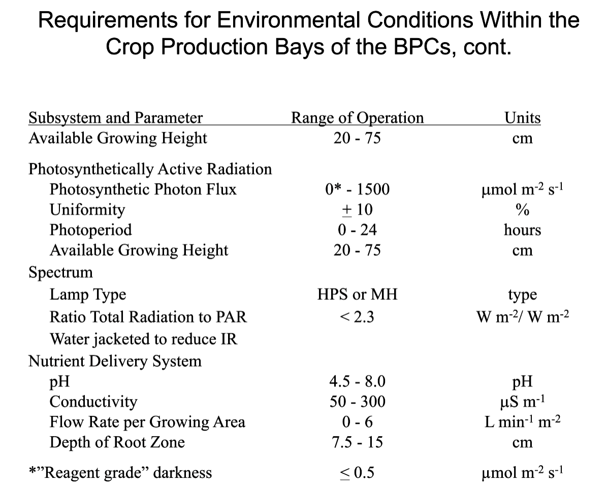

# Bio-Plex Lesson's learnt...

[Link to the interactive app for viewing KSC challenge list.](https://gilroy-qlik.botany.wisc.edu/a/qps/logout?targetUri=https://gilroy-qlik.botany.wisc.edu/a/sense/app/4edb288e-85ce-4146-b3f3-6a3fb6f9ac30/sheet/036ef1a4-2b79-4c44-ac5a-43398fb6b7e4/state/analysis)

<figure><figcaption></figcaption></figure>



More information canbe found here: [https://ag.arizona.edu/lunargreenhouse/](https://ag.arizona.edu/lunargreenhouse/)

More information can be found here: [https://www.researchgate.net/publication/234239599\_Crop\_production\_data\_for\_bioregenerative\_life\_support\_Observations\_from\_testing\_at\_NASA's\_Kennedy\_Space\_Center](https://www.researchgate.net/publication/234239599\_Crop\_production\_data\_for\_bioregenerative\_life\_support\_Observations\_from\_testing\_at\_NASA's\_Kennedy\_Space\_Center)

<figure><figcaption></figcaption></figure>

<figure><figcaption></figcaption></figure>

<figure><figcaption></figcaption></figure>

<figure><figcaption></figcaption></figure>

<figure><figcaption></figcaption></figure>

<figure><figcaption></figcaption></figure>

<figure><figcaption></figcaption></figure>

<figure><figcaption></figcaption></figure>

<figure><figcaption></figcaption></figure>

<figure><figcaption></figcaption></figure>

<figure><figcaption></figcaption></figure>

<figure><figcaption></figcaption></figure>

<figure><figcaption></figcaption></figure>

<figure><figcaption></figcaption></figure>

<figure><figcaption></figcaption></figure>

<figure><figcaption></figcaption></figure>

<figure><figcaption></figcaption></figure>

<figure><figcaption></figcaption></figure>

<figure><figcaption></figcaption></figure>

<figure><figcaption></figcaption></figure>

<figure><figcaption></figcaption></figure>

<figure><figcaption></figcaption></figure>

<figure><figcaption></figcaption></figure>

<figure><figcaption></figcaption></figure>

<figure><figcaption></figcaption></figure>

<figure><figcaption></figcaption></figure>

<figure><figcaption></figcaption></figure>

<figure><figcaption></figcaption></figure>

<figure><figcaption></figcaption></figure>

<figure><figcaption></figcaption></figure>

<figure><figcaption></figcaption></figure>

<figure><figcaption></figcaption></figure>
