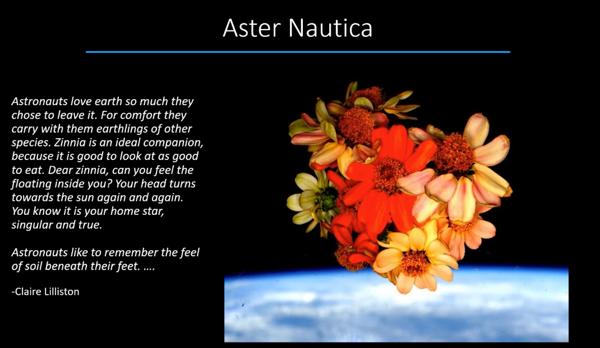

# Bruce

<figure><figcaption></figcaption></figure>

\

<figure><figcaption></figcaption></figure>

<figure><figcaption></figcaption></figure>

<figure><figcaption></figcaption></figure>

<figure><figcaption>
Space suits need to be low presure to work
</figcaption></figure>

<figure><figcaption>
In blood this is "decompressino sickness"
</figcaption></figure>

<figure><figcaption></figcaption></figure>

<figure><figcaption></figcaption></figure>

<figure><figcaption></figcaption></figure>

<figure><figcaption></figcaption></figure>

<figure><figcaption></figcaption></figure>

<figure><figcaption></figcaption></figure>

<figure><figcaption></figcaption></figure>

<figure><figcaption></figcaption></figure>

<figure><figcaption>
These are like the pressures similar to what NASA is planning for the roof.
</figcaption></figure>

<figure><figcaption>
layors of salt in stone and high radiatio
</figcaption></figure>

<figure><figcaption></figcaption></figure>

<figure><figcaption></figcaption></figure>

<figure><figcaption></figcaption></figure>

<figure><figcaption></figcaption></figure>

<figure><figcaption></figcaption></figure>

Salty water

<figure><figcaption>
Algae, allow for 'water monkeys"
</figcaption></figure>

<figure><figcaption>
Flamingos!
</figcaption></figure>

<figure><figcaption></figcaption></figure>

<figure><figcaption>
Date palm plantation
</figcaption></figure>

<figure><figcaption>
Halophite next to date inttionally added 
</figcaption></figure>

<figure><figcaption></figcaption></figure>

<figure><figcaption></figcaption></figure>

<figure><figcaption>
New green house. with 
</figcaption></figure>

<figure><figcaption></figcaption></figure>

<figure><figcaption></figcaption></figure>

<figure><figcaption></figcaption></figure>

<figure><figcaption>
they have to clean out the salts regularly. they have to shade the the plants regularlay. 
</figcaption></figure>

<figure><figcaption></figcaption></figure>

<figure><figcaption></figcaption></figure>

<figure><figcaption></figcaption></figure>

<figure><figcaption></figcaption></figure>

<figure><figcaption></figcaption></figure>

<figure><figcaption></figcaption></figure>

<figure><figcaption></figcaption></figure>

<figure><figcaption></figcaption></figure>

<figure><figcaption></figcaption></figure>

<figure><figcaption></figcaption></figure>
