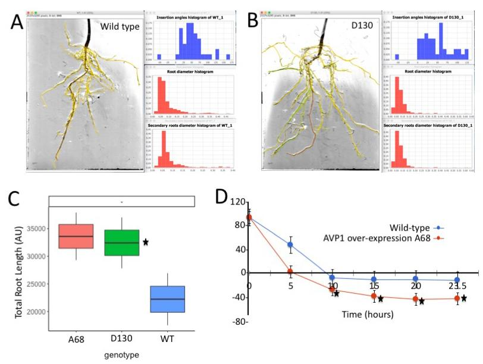
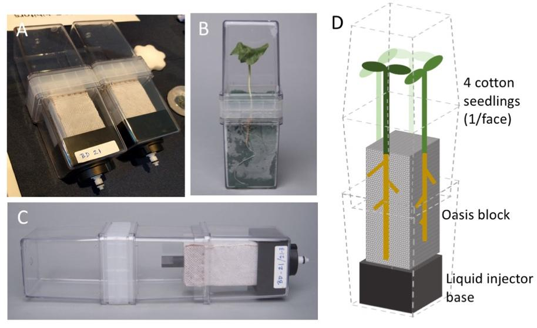
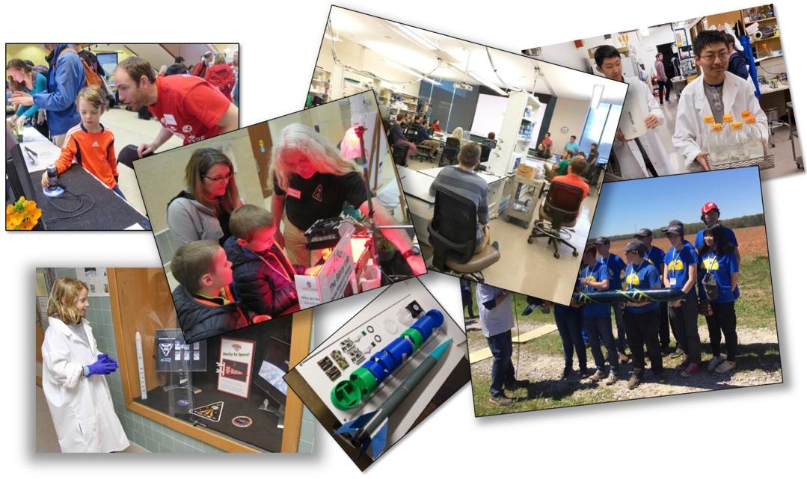

# TICTOC CASIS cotton proposal

**Targeting the Roots of Cotton Sustainability (TICTOC)**

**PI: Simon Gilroy        CoI: Sarah Swanson**

**Department of Botany, University of Wisconsin-Madison**

**Table of contents**

| **Section**                                        | **Page** |
| -------------------------------------------------- | -------- |
| **I: BACKGROUND AND OVERVIEW**                     | **1**    |
| **II: DETAILED PROJECT PLAN**                      | **2**    |
| **III: IMPACT AND FEASIBILITY OF PROJECT SUCCESS** | **5**    |
| **IV: STEM AND EDUCATIONAL OUTREACH COMPONENT**    | **6**    |
|                                                    |          |
|                                                    |          |
| **VII: REFERENCES**                                | **14**   |

**I: BACKGROUND AND OVERVIEW**

**Abstract**

Roots play a central role in a host of plant functions that are critical to cotton yields, stress resilience and impact on the environment, including: water uptake, nutrient usage, and soil carbon sequestration. The ISS National Laboratory provides a unique opportunity for us to be able to ask what are the drivers for cotton root system development and function in the absence of the confounding influence of gravity? Cotton plants that over-express the _AVP1_ gene show increased salt and drought resistance with more than a 20% increased fiber yield under stressful conditions that normally severely limit cotton productivity. These stress-resistant features have been tentatively linked to a root system that can explore a wider and deeper volume of soil for water and nutrients. Such exploration patterns are inextricably linked to gravity, which directs the growth of the main and lateral roots. In the absence of gravity-related patterning on the ISS, we will be able to assess the degree to which root system architecture plays into stress resilience, water use efficiency, and carbon sequestration during the critical phase of seedling establishment. We propose to compare flight and ground controls of water stressed and well-watered cotton seedlings of both the AVP1 over-expressor and wild type plants. An array of analyses, including: stable isotope monitoring of water use efficiency, cell wall analysis, and monitoring of patterns of gene expression will allow a comprehensive characterization of how these factors play in to traits important for seedling establishment.

**Introduction**

Cotton (_Gossypium_ spp.) is well recognized as a thirsty and hungry crop. Thus, high yields of cotton are associated with high nutrient demand and often intensive irrigation to sustain productivity. Although water usage is a key factor in cotton production, almost 60% of cotton crop around the world is grown in regions with limiting water supply (24) and water stress leads to significant losses in cotton production each year (38). Yet, despite the central role of water stress in limits on cotton production and intensive research in this area, the physiological traits and molecular underpinnings of cotton’s response to limited water availability remain poorly understood.

**Engineering Stress Resilience**

Over-expression of _AVP1_, the gene encoding the vacuolar H+ pumping pyrophospahatase (45) has been shown to lead to more resilient plants when subjected to salt, and importantly for this study, drought stress (32). Thus, AVP1 over-expressing plants (Arabidopsis, rice, lettuce, tomato, bent grass and cotton) when tested under greenhouse and field conditions show sustained growth under drought and salt stress in addition to increased nutrient use efficiency (e.g., (25; 30-32; 50; 51). Increasing AVP1 levels in rice led to a 50% increased seed yield (50) and _AVP1_ over-expressing cotton showed a 20% increase in yield under dry field conditions (32).

Several hypotheses have been put forward as to how a single gene can have such a dramatic effect on plant productivity during stress. One idea is that the vacuolar H+ pumping pyrophosphatase contributes to the electrochemical gradient at the vacuolar membrane (45) and so activation of this system could enhance ion uptake and protect the plant from the osmotic stresses that drought triggers. This pump also plays a role in sugar movement through the plant’s vasculature (21) affecting source-sink relationships and resource allocation within the plant. However, we and others (e.g., (50) have noted that AVP1 over-expressing plants also have a modified root system architecture that explores different regions of the soil to wild-type plants from the seedling stage onwards (Figure 1A-C).

Thus, AVP1 lines tend to develop a more extensive root system capable of mining a more expansive volume of soil, providing a further potential element in the stress resistance of these plants. Indeed, restricting the expansion of the root zone has long been known to limit cotton plant growth and yield (4). One element driving the shape of the root system is gravity. Gravitropism regulates the angle that each root grows relative to the gravity vector such that some roots grow out laterally, whereas some drive deeply into the soil. These root angles (the so-called gravitropic set point angle of the organ (9)) are determined through a combination of genetics and environmental

 .png>)

interactions (e.g., (28; 29; 44). A deeper, more extensive root system is expected to not only improve drought tolerance but also to interact with the long-term carbon cycle, e.g., locking more root-based carbon deeper into the soil, contributing to carbon sequestration and mitigation of rising atmospheric CO2 levels (11; 20; 26; 39).

Our preliminary analysis of the AVP1 over-expression lines compared to wild-type plants shows the over-expressing lines exhibit more rapid initial gravitropic response kinetics (i.e., they reorient downwards more quickly) and overshoot the vertical (Figure 1D), suggesting an increased gravitropic sensitivity. Thus, there appears to be a critical role for gravitropic orientation in these plants that plays out as altered patterns of exploration of the soil and so to altered stress resilience. Indeed, interactions between AVP1 and gravitropic response are already hinted at in the literature with, for example, AVP1 gene expression being altered in the _lazy1_ maize mutant that itself shows reduced gravity sensitivity (10). Divorcing such gravity-driven morphogenesis that is developing over many days from other effects on plant growth is not readily approachable with ground-based experimentation; the ubiquitous background of 1 x gravity means that gravity-driven development is intrinsic to plants growing on Earth. Removing this this all-pervasive signal to reveal the underlying genetic elements of root system development requires long-term growth without gravity, an environment currently only available on the ISS.

**II: DETAILED PROJECT PLAN**

**FLIGHT EXPERIMENT**

**Overview of Experiment Design:**

We therefore propose to compare the gene expression patterns (using the technique of RNAseq), cell wall composition (using glycomic profiling) and the water use efficiency (using stable isotope fractionation) in wild-type and our already available &#x41;_&#x56;P1_ over-expression line of cotton (A68) grown on the ISS, with comparison to paired control plants grown on Earth. We plan to compare well-watered (300 mL water) to water restricted (100 mL water) seedlings. This design allows us to use 3 independent APEX growth chambers (see below) for each condition (3x wild type well-watered, 3x water stressed; 3x A68 well-watered, 3x water stressed) for the total of 12 APEX chambers that will fit within the Veggie hardware that we plan to use (also see below). In combination with images of plant development taken as the cotton grows on orbit and on the ground, these gene expression, cell wall composition and water use efficiency measurements will allow us to define how root system development interacts with gravity to contribute to stress resilience in cotton seedlings. This knowledge will contribute to our fundamental understanding of stress response in cotton, providing a step towards rational engineering or breeding of improved cotton varieties for commercial use. All data and analyses will be made publicly available through outlets aimed at the research community, the general public, and vehicles targeted at enabling discovery by citizen scientists.

**Hardware:** We propose to use the APEX growth chamber and the Vegetable Production System (Veggie) hardware to grow cotton through the seedling stage on the ISS. The Veggie provides LED lighting in excess of 200 µmol/m2/s (27) which is sufficient to support cotton seedling growth (e.g., (52). In addition, the Veggie runs at the station ambient temperature of 22-24˚C (27), which is within the acceptable range for cotton germination and growth (22).

The APEX growth chamber uses two modified Magenta plant tissue culture boxes stacked end-to-end with a standard commercial coupler, making a single, easily sterilizable growth chamber (Figure 2A,B). The bottom magenta box has been modified with a liquid injection port, and a mount for a wicking block of Oasis floral foam. The foam core is covered with a layer of medical gauze onto which seeds are attached. The gauze and foam act as a wicking surface to deliver water to seeds (Figure 2).

<figure><figcaption></figcaption></figure>

**Launch Configuration:** The whole chamber is launched dry, with seeds in place but not yet watered and so not germinating. Once installed on orbit in the Veggie, the astronaut activates the system by injecting water through the bottom port. The wicking action of the medical gauze and the Oasis foam draw this liquid up to the seeds that then hydrate and germinate. This setup has the important advantage of having a very flexible timing for the initiation of on orbit growth. The seeds remain _in situ_ but un-germinated until activated by the liquid injection, reducing the need for the late access to stowage for the launch that is required for many biological payloads. In addition, we have tested the seed viability of our cotton lines stored as dry seed under the conditions needed for the APEX growth chamber. Even after more than 6 months in storage, the seeds maintain germination capacity and exhibit vigor of subsequent seedling growth similar to fresh seed. Such capability for longer term storage prior to initiating the experiment provides a greatly increased capacity to deal with potential delays in launch, berthing or unloading into the ISS.

**Modifications for Cotton:** The APEX growth chambers have been developed by NASA for work with the grass Brachypodium for the APEX-06 experiment (due to launch on CRS-14). However, for use with cotton we have had to slightly modify the hardware: (1) increasing the size of the Oasis foam block that provides a reservoir of water for the experiment and (2) developing an extender that allows us to increase the chamber size to accommodate the significantly larger cotton seedlings we will be working with (Figure 2C, D). Importantly, for rapid deployment of this modification for flight, we are using parts already flight approved.

One further operational issue we have addressed is that the seed coat of the cotton tends to adhere to the expanding seed leaves as the cotton germinates. In the field, forces such as wind help remove the seed coat but in the protected environment of a growth chamber, the seed coat often remains attached and disrupts normal leaf growth. This effect is likely to be exacerbated in microgravity. Therefore, we manually remove the seed coat, leaving an intact embryo that we can mount in the hardware. The coat removal does not affect seed viability but greatly increases the suitability of the setup for a flight experiment.

**On-orbit data collection:** The APEX growth chamber walls are transparent and so a crew member will be able to photograph the developing root and shoot systems using the standard SLR camera already on the ISS. These images will provide the record of the development of the root system architecture without the directing force of gravity that is one critical element of the proposed research.

**On-orbit sample collection:** Harvest of the cotton seedlings would occur after 2-3 weeks of growth. The astronaut would simply open the chamber, remove the seedlings, and fix them in RNAlater using Kennedy Fixation Tubes (KFTs (37) which would then be frozen for long-term storage. These seedlings will be relatively large at this point (\~20 cm tall) but we have tested that the whole seedling will fit within the form factor of the KFT, making it feasible to use one KFT per plant. The crew operations would be straight-forward at this point, with harvest only requiring the astronaut to remove the plants from the growth chamber and to insert the entire sample into a KFT using forceps. Once in RNAlater, the samples would be held at room temperature for 12 hours to ensure complete permeation and fixation. Finally, the astronaut would place the KFTs in the MELFI, where they would be held at \~-80˚C until return to Earth. This approach of using RNAlater along with the KFT is regularly used for fixing and storing plant materials on the ISS; once in the -80, the samples are stable for at least one year. In addition, the astronaut will sample the air in the ISS (approximately 100 mL of air will be sufficient) for analysis of water use efficiency calculations (see below).

**Sample return:** The samples need to be maintained frozen throughout the return process but here the protocols are also already well developed. Samples would are using a Double Cold Bag (14) conditioned to freezing temperatures. After splashdown and transfer to a freezer, the samples remain stable for many months.

**Ground-based controls:** In order to define changes occurring due to the spaceflight environment, we will run a parallel ground-based analysis. This control will consist of an identical experimental set up to the flight experiment but run in an ISS Environmental Simulator (ISSES), a chamber at Kennedy Space Center that can be programmed with the environmental conditions of the station at the time the flight experiment is being conducted. The flexibility in timing of the initiation of the experiment afforded by the APEX growth chambers means we can set up these ground samples at the same time as the flight experiment but conduct the ground control when the ISSES and a ground Veggie unit is available.

**POST-FLIGHT SAMPLE ANALYSES**

**RNAseq and QPCR:** For RNAseq, we will use the approach we have successfully applied to several spaceflight experiments (BRICs -17, -19 and APEX-05). RNA will be extracted from the samples and after rRNA reduction, will be used for library construction and Illumina–based sequencing at the Biotechnology Center of the University of Wisconsin-Madison. The Biotech Center performs RNAseq on a for-fee basis and we have used them for all the successful RNAseq we have performed on flight samples. Briefly, we plan to use 100 bp single end reads and process the raw data through the TUXEDO pipeline (48), aligning to the G.raimondii\_221\_v2.1.gene.gff (33) reference genome annotation. We will use 3 normalization approaches to define statistically significant differential transcript abundance: DESeq (2), EdgeR (43) and Cuffdiff 2.1.1 (48), applying the Benjamini and Hotchburg (3) method for multiple testing correction (q=0.05) and a false discovery rate of 0.05. We will then use the consensus between the 3 normalization approaches to define a high confidence list of differentially abundant transcripts between spaceflight samples and ground controls.

We will validate the RNAseq by analyzing a subset (approx. ten) of the genes showing differential transcript levels by QPCR analysis from the flight/ground control RNA samples, prioritizing transcripts with a relationship to cell wall biogenesis to help inform our cell wall analysis data (see below). For such QPCR analyses we will use the _UBQ10_ gene as the internal reference (8) and the comparative threshold cycle (Ct) method (6) to calculate changes in expression levels. Once validated, all sequencing data will be made publicly available by deposition into NASA’s GeneLab Data Repository. We routinely perform QPCR on samples from RNAlater fixed tissues, and have extensive experience with RNAseq from these kinds of samples and so we do not foresee significant issues with applying this technology to the proposed cotton samples.

**Cell Wall Composition:** Alterations in cell wall composition are a major theme of spaceflight-induced events in plants (e.g., (17; 23). We will therefore also analyze cell wall composition in our samples. We plan to use the RNAlater compatible glycome profiling approach that was pioneered for spaceflight samples by the Blancaflor lab at the Noble Foundation and that is now in use by other spaceflight labs (e.g. (17). Briefly, the alcohol insoluble cell wall fractions from samples are alkaline extracted, neutralized, lyophilized and then run against an ELISA-based glycome analysis employing a comprehensive suite of plant cell wall glycan directed monoclonal antibodies available through the University of Georgia Complex Carbohydrate Research Center’s Carbosource Services (34-36). The output of these analyses is a quantitative profile of cell wall polymer components, allowing us to correlate transcriptional profiles to potential cell wall structural changes. This analysis will allow us to ask whether cell wall synthesis pathways defined e.g. through the Kyoto Encyclopedia of Genes and Genomes database (18) that are altered at the transcriptional level play out as changes in cell wall structure at the cell wall compositional level.

**Water use efficiency**: Due to the different ways that carbon isotopes from CO2 partition during photosynthesis it is possible to calculate water use efficiency from the carbohydrate (wall materials) deposited during growth, provided that the isotopic mixtures of the air around the plants is known (12; 46). By sampling the cabin air and analyzing its carbon isotope composition, coupled with isotopic analysis of the insoluble components of the plants returned to Earth, we will be able to calculate the plant’s ‘intrinsic water use efficiency’, i.e. the ratio of net carbon assimilation to stomatal conductance. This factor is used as a measure of the trend in the balance between internal regulation of carbon uptake and water loss of plants (46). This relatively simple measure provides a means to ask how water use efficiency is altered in the cotton grown in space versus the ground controls and how this is altered in the AVP1 over-expression lines. We predict that the elevated water use efficiency in the over-expression lines on the ground will be negated in cotton grown on the ISS because it is in part determined by the gravity-driven differences in root system architectures of the plants growing under 1 x gravity.

**III: IMPACT AND FEASIBILITY OF PROJECT SUCCESS**

1. **Economic Impact**

The 2016 US cotton crop was valued at $5.67 billion (7), but the larger cotton-related economic activity linked to this crop is estimated to be in excess of 20 times this dollar amount (15). Worldwide cotton accounts for approximately 40% of all fiber sold, with approximately 350 million people involved from farming to shipping, and with the US accounting for 27% of all cotton exports for 2015/16 (16). Considering the extent of cotton’s impact on the US and worldwide, improving yields under drought conditions has the potential to generate a large economic impact. Stress resilience in cotton is becoming increasingly relevant as climate change is predicted to lead to more extreme weather events, where unpredictable rainfall is likely to become a norm (19). Increasing use of irrigation to support crop productivity will exacerbate both cotton’s significant impact on agricultural fresh water usage and on potential issues with irrigation-linked degradation of croplands over time (5; 49).

1. **Innovation**

This work addresses novel questions not only related to cotton growth and development but also to defining the molecular mechanisms needed to engineer increased stress tolerance in this crop. Discoveries resulting from the proposed research will produce new knowledge, with the potential to inform target traits for cotton breeding and engineering on Earth. In addition, our data will contribute a highly novel insight into how plants respond to the spaceflight environment with a species that is an economically important model for plant science on Earth but that has not been grown in space. For example, cell wall biology is intensively studied in ground-based cotton research (e.g., (1; 13; 40) and cell wall modifications are amongst some of the most widespread reported changes in spaceflight (e.g., (17; 23). Leveraging this extensive current understanding of cotton to dissect spaceflight factors presents a powerful opportunity opened up by this project and one that will contribute to maintaining the US preeminence in plant spaceflight research. In addition, these insights will support future economic benefits from applying this knowledge to improve cotton in an agricultural setting.

1. **Benefit to Humankind and Social Impact**

Cotton provides an important economic driver for many countries and supports many millions of farmers and workers. The crop itself is highly susceptible to drought stress, therefore defining traits that can improve water use efficiency and promote seedling establishment even under stressful conditions will have a major impact on a key crop worldwide. Results from this research should help catalyze breeding and engineering efforts on Earth to target the interactions of root biology, stress resilience and the potential for below-ground carbon sequestration which has increasing relevance to approaches to mitigate atmospheric CO2 rise.

**IV: STEM AND EDUCATIONAL OUTREACH COMPONENT**

_**IV.a. Undergraduate Curriculum: Astrobotanical Engineering at UW-Madison**_

The Gilroy lab mentors approximately 10 independent study students working for credit on various plant molecular and engineering projects related to space biology. This interdisciplinary approach has also allowed us to also establish a space biology-related practical lab course called Botany 575: AstroBotanical Engineering at UW-Madison, in which an additional 15+ plant biology and engineering students collaborate to develop plant space biology-related hardware. The students are posed a space biology-related problem and then biologists and engineers partner to design and implement a solution. Indeed, the improvements for the APEX growth chamber specifically for cotton seedling growth sprang directly from the work of the undergraduates in this class.

We also engage the biology-focused students enrolled in this class in a deeper data mining experience with RNAseq data using the TOAST database (47) developed by the Gilroy Lab under NASA GeneLab Innovation grant NNX17AD52G. This research environment allows rapid comparisons between plant transcriptomics datasets within the Qlik environment (41). We will import the Cotton data generated from this project into this data exploration environment and then engage the undergraduates in mining of the datasets. This experience helps build a cohort of students well versed in the bioinformatics and ‘big data’ approaches that are critical for the coming generation of scientists to master. For example, we have an undergraduate, Jon Lombardino, who is already engaged in exploring the transcriptomics of wall enzyme responses in the model plant Arabidopsis to spaceflight and incorporating analysis of this cotton data would be a very logical extension of his current project. The postdoc to be employed on the grant will be intimately involved in this aspect of the work and one of the criteria for selecting this researcher will be how likely they will be able to develop mentoring relationships to support the students on the project. Critically, the TOAST environment does not require extensive training in bioinformatics and is accessible by non-specialists, opening up the possibility for citizen scientist exploration of this cotton data.

We also collaborate closely with Travis Tangen at the Wisconsin Institutes of Discovery to provide outreach opportunities for all these students. Indeed, being trained in effective outreach and then presenting plant spaceflight work to the general public is an integral component of the Astrobotanical Engineering class.

_**V.b. Undergraduate Curriculum: Carthage College Astrobiology**_

We are also working with Dr. Andrea Henle of Carthage College (a four-year private liberal arts college located in Kenosha, Wisconsin) to support her newly designed undergraduate course in Astrobiology. In addition to our helping as guest lecturers, Dr. Henle will be deploying 3D-printed time-lapse imaging units developed in the Gilroy lab as part of a practical plant space-biology experiment for her students. We will be providing Arabidopsis mutants for these experiments selected by an analysis of GeneLab data using TOAST; Dr. Henle’s students will construct the imaging units and perform the experiments. We plan to deploy the cotton data in this context to allow these students to draw inferences and then potentially test them using the model plant Arabidopsis.

_**V.c. Outreach – High school.**_

We have also been able to extend the model of drawing in collaborators through our spaceflight work to engage high school students in the research enterprise. Thus, we collaborate extensively with the Madison West High School Rocketry Club (\~30 students of all ages) and have been developing payloads with them based around plant responses to gravity where we rapidly prototype the experiment hardware from rocket payload to imaging stations using 3D printing for collecting growth data. These students are currently flying Arabidopsis mutants in the touch and gravity perception machinery developed from analysis of our ISS experiment BRIC-19. As this program has developed, the high school students have gained new research-related skills, have been introduced to the rigors of experimental design and analysis, with the students learning molecular techniques such as QPCR to test their ideas. Critically, this work has immersed these students in the process of using gene-level data to drive hypothesis generation and testing and the initial cohorts of these students are now moving on to college and perhaps a future career in STEM. We have already been discussing the possibility of extending their rocketry payloads beyond Arabidopsis and will be designing a cotton plant payload allied to the proposed research to allow them to follow cotton responses to the stresses of launch with the molecular precision outlined in the previous sections of this proposal.

_**Outreach – General public**:_

We have established an outreach program linked to our NASA research. For example, in the last year we have presented or hosted hands-on activities related to this research at venues ranging from Madison’s Garden Expo (the gardening show that caters to in excess of 20,000 people from across the MidWest), to UW-Madison's Science Expeditions and Science Saturdays (several hundred families and K-12 students) to SoundWaves, a public forum where science and music are intermingled (\~150 members of the general public). The PI and CoI are deeply involved in delivering these outreach events and we plan to maintain and extend this effort for the proposed grant, supporting 4 or 5 major local outreach opportunities and many other smaller local events each year.

We also regularly provide local news and radio interviews and online outreach such as through the Morgridge Institute’s Blue Sky Science videos and interviews with Wisconsin Public Radio. We also try to extend the reach of our NASA funded research as broadly as possible outside of Madison and Wisconsin. For example, Skyping with high school students in the U.K. to discuss the ISS and NASA’s plant science programs and we have instigated a collaborative program with Sir Isaac Newton College in the UK where these students are using a 3D printed imaging station we have developed to perform remote analysis of plant (Arabidopsis) responses as part of our current NASA-funded flight research. Expanding these studies to cotton would add an exciting new dimension to this effort.

We also increase the reach of these efforts with the PI and CoI providing social media content, including a WordPress flight blog, a Facebook page and an Instagram site. We plan to use all these avenues to promote the cotton project and engage as large a community as possible in the work. We also maintain a student-run outreach website focused on astrobotany (42) that provides background and information for a more general audience on the science of plant biology in space. The cotton sustainability challenge will fit well into this format and so astrobotany.com will provide a further entry point for this work targeted to the general public, school students, teachers and undergraduates. We plan to maintain this vigorous level of outreach effort incorporating the cotton challenge as the latest flight opportunity we discuss and promote.

 .png>)

**VII: REFERENCES**

1\. Abidi N, Cabrales L, Haigler CH. 2014. Changes in the cell wall and cellulose content of developing cotton fibers investigated by FTIR spectroscopy. _Carbohydr Polym_ 100:9-16

2\. Anders S, Huber W. 2010. Differential expression analysis for sequence count data. _Genome Biol_ 11:R106

3\. Benjamini Y, Hochberg Y. 1995. Controlling the False Discovery Rate - a Practical and Powerful Approach to Multiple Testing. _J Roy Stat Soc B Met_ 57:289-300

4\. Carmi A, Shalhevet J. 1983. Root Effects on Cotton Growth and Yield. _Crop Sci_ 23:875-8

5\. Cetin M, Kirda C. 2003. Spatial and temporal changes of soil salinity in a cotton field irrigated with low-quality water. _J Hydrol_ 272:238-49

6\. Choi WG, Roberts DM. 2007. Arabidopsis NIP2;1, a major intrinsic protein transporter of lactic acid induced by anoxic stress. _J Biol Chem_ 282:24209-18

7\. Council NC. 2018. Cotton's Economic Impact: United States Cotton Production.

8\. Czechowski T, Bari RP, Stitt M, Scheible WR, Udvardi MK. 2004. Real-time RT-PCR profiling of over 1400 Arabidopsis transcription factors: unprecedented sensitivity reveals novel root- and shoot-specific genes. _Plant J_ 38:366-79

9\. Digby J, Firn RD. 1995. The gravitropic set-point angle (GSA): the identification of an important developmentally controlled variable governing plant architecture. _Plant Cell Environ_ 18:1434-40

10\. Dong Z, Jiang C, Chen X, Zhang T, Ding L, et al. 2013. Maize LAZY1 mediates shoot gravitropism and inflorescence development through regulating auxin transport, auxin signaling, and light response. _Plant Physiol_ 163:1306-22

11\. Fan Y, Miguez-Macho G, Jobbagy EG, Jackson RB, Otero-Casal C. 2017. Hydrologic regulation of plant rooting depth. _Proc Natl Acad Sci U S A_ 114:10572-7

12\. Farquhar GD, Oleary MH, Berry JA. 1982. On the Relationship between Carbon Isotope Discrimination and the Inter-Cellular Carbon-Dioxide Concentration in Leaves. _Aust J Plant Physiol_ 9:121-37

13\. Haigler CH, Betancur L, Stiff MR, Tuttle JR. 2012. Cotton fiber: a powerful single-cell model for cell wall and cellulose research. _Front Plant Sci_ 3:104

14\. Hutchinson S, Campana S. 2009. ISS Payloads Office cold Stowage overview. ed. NASA

15\. ICAC. 2007. _International Cotton Advisory Council Report 2007_. https://www.icac.org

16\. ICAC. 2017. International Cootn Advisory Council report 2017. https://www.icac.org

17\. Johnson CM, Subramanian A, Pattathil S, Correll MJ, Kiss JZ. 2017. Comparative transcriptomics indicate changes in cell wall organization and stress response in seedlings during spaceflight. _Am J Bot_. EPub ahead of print

18\. Kanehisa M. 2000. _Post-genome Informatics_. Oxford University Press

19\. Kang YH, Khan S, Ma XY. 2009. Climate change impacts on crop yield, crop water productivity and food security - A review. _Prog Nat Sci-Mater_ 19:1665-74

20\. Kell DB. 2012. Large-scale sequestration of atmospheric carbon via plant roots in natural and agricultural ecosystems: why and how. _Philos Trans R Soc Lond B Biol Sci_ 367:1589-97

21\. Khadilkar AS, Yadav UP, Salazar C, Shulaev V, Paez-Valencia J, et al. 2016. Constitutive and Companion Cell-Specific Overexpression of AVP1, Encoding a Proton-Pumping Pyrophosphatase, Enhances Biomass Accumulation, Phloem Loading, and Long-Distance Transport. _Plant Physiol_ 170:401-14

22\. Krzyzanowski FC, Delouche JC. 2011. Germination of cotton seed in relation to temperature. _Revista Brasileira de Sementes_ 33:543-8

23\. Kwon T, Sparks JA, Nakashima J, Allen SN, Tang Y, Blancaflor EB. 2015. Transcriptional response of Arabidopsis seedlings during spaceflight reveals peroxidase and cell wall remodeling genes associated with root hair development. _Am J Bot_ 102:21-35

24\. Li F, Li M, Wang P, Cox KL, Jr., Duan L, et al. 2017. Regulation of cotton (Gossypium hirsutum) drought responses by mitogen-activated protein (MAP) kinase cascade-mediated phosphorylation of GhWRKY59. _New Phytol_ 215:1462-75

25\. Li Z, Baldwin CM, Hu Q, Liu H, Luo H. 2010. Heterologous expression of Arabidopsis H+-pyrophosphatase enhances salt tolerance in transgenic creeping bentgrass (Agrostis stolonifera L.). _Plant Cell Environ_ 33:272-89

26\. Lynch JP. 2013. Steep, cheap and deep: an ideotype to optimize water and N acquisition by maize root systems. _Ann Bot_ 112:347-57

27\. Massa GD, Dufour NF, Carver JA, Hummerick, M. E., Wheeler RM, et al. 2017. VEG-01: Veggie Hardware Validation Testing on the International Space Station. _Open Agriculture_ 2:33-41

28\. Massa GD, Gilroy S. 2003. Touch and gravitropic set-point angle interact to modulate gravitropic growth in roots. _Adv Space Res_ 31:2195-202

29\. Mullen JL, Hangarter RP. 2003. Genetic analysis of the gravitropic set-point angle in lateral roots of Arabidopsis. _Adv Space Res_ 31:2229-36

30\. Paez-Valencia J, Sanchez-Lares J, Marsh E, Dorneles LT, Santos MP, et al. 2013. Enhanced proton translocating pyrophosphatase activity improves nitrogen use efficiency in Romaine lettuce. _Plant Physiol_ 161:1557-69

31\. Park S, Li J, Pittman JK, Berkowitz GA, Yang H, et al. 2005. Up-regulation of a H+-pyrophosphatase (H+-PPase) as a strategy to engineer drought-resistant crop plants. _Proc Natl Acad Sci U S A_ 102:18830-5

32\. Pasapula V, Shen GX, Kuppu S, Paez-Valencia J, Mendoza M, et al. 2011. Expression of an Arabidopsis vacuolar H+-pyrophosphatase gene (AVP1) in cotton improves drought- and salt tolerance and increases fibre yield in the field conditions. _Plant Biotechnol J_ 9:88-99

33\. Paterson AH, Wendel JF, Gundlach H, Guo H, Jenkins J, et al. 2012. Repeated polyploidization of Gossypium genomes and the evolution of spinnable cotton fibres. _Nature_ 492:423-7

34\. Pattathil S, Avci U, Miller JS, Hahn MG. 2012. Immunological approaches to plant cell wall and biomass characterization: Glycome Profiling. _Methods Mol Biol_ 908:61-72

35\. Pattathil S, Hahn MG, Dale BE, Chundawat SP. 2015. Insights into plant cell wall structure, architecture, and integrity using glycome profiling of native and AFEXTM-pre-treated biomass. _J Exp Bot_ 66:4279-94

36\. Pattathil S, Ingwers MW, Victoriano OL, Kandemkavil S, McGuire MA, et al. 2016. Cell Wall Ultrastructure of Stem Wood, Roots, and Needles of a Conifer Varies in Response to Moisture Availability. _Front Plant Sci_ 7:882

37\. Paul AL, Levine HG, McLamb W, Norwood KL, Reed D, et al. 2005. Plant molecular biology in the space station era: utilization of KSC fixation tubes with RNAlater. _Acta Astronaut_ 56:623-8

38\. Pettigrew WT. 2004. Physiological consequences of moisture deficit stress in cotton. _Crop Sci_ 44:1265-72

39\. Pierret A, Maeght JL, Clement C, Montoroi JP, Hartmann C, Gonkhamdee S. 2016. Understanding deep roots and their functions in ecosystems: an advocacy for more unconventional research. _Ann Bot_

40\. Qin LX, Rao Y, Li L, Huang JF, Xu WL, Li XB. 2013. Cotton GalT1 encoding a putative glycosyltransferase is involved in regulation of cell wall pectin biosynthesis during plant development. _PLoS One_ 8:e59115

41\. Qlik. 2017. The Qlik interface. https://www.qlik.com

42\. Rasmussen K. 2018. _Astrobotnay.com: all you need to know about plants and space_. www.astrobotany.com

43\. Robinson MD, McCarthy DJ, Smyth GK. 2010. edgeR: a Bioconductor package for differential expression analysis of digital gene expression data. _Bioinformatics_ 26:139-40

44\. Roychoudhry S, Kieffer M, Del Bianco M, Liao CY, Weijers D, Kepinski S. 2017. The developmental and environmental regulation of gravitropic setpoint angle in Arabidopsis and bean. _Sci Rep_ 7:42664

45\. Schilling RK, Tester M, Marschner P, Plett DC, Roy SJ. 2017. AVP1: One Protein, Many Roles. _Trends Plant Sci_ 22:154-62

46\. Seibt U, Rajabi A, Griffiths H, Berry JA. 2008. Carbon isotopes and water use efficiency: sense and sensitivity. _Oecologia_ 155:441-54

47\. TOAST. 2018. _The TOAST Database_. https://astrobotany.com/toast-database/

48\. Trapnell C, Hendrickson DG, Sauvageau M, Goff L, Rinn JL, Pachter L. 2013. Differential analysis of gene regulation at transcript resolution with RNA-seq. _Nat Biotechnol_ 31:46-53

49\. Vlek PLG, Hillel D, Braimoh AK. 2009. Soil degradation under irrigation. In _Land use and soil resources_, ed. AK Braimoh, PLG Vlek:101-19. Dordrecht: Springer. Number of 101-19 pp.

50\. Yang H, Knapp J, Koirala P, Rajagopal D, Peer WA, et al. 2007. Enhanced phosphorus nutrition in monocots and dicots over-expressing a phosphorus-responsive type I H+-pyrophosphatase. _Plant Biotechnol J_ 5:735-45

51\. Yang H, Zhang X, Gaxiola RA, Xu G, Peer WA, Murphy AS. 2014. Over-expression of the Arabidopsis proton-pyrophosphatase AVP1 enhances transplant survival, root mass, and fruit development under limiting phosphorus conditions. _J Exp Bot_ 65:3045-53

52\. Zhu G, Li W, Zhang F, Guo W. 2018. RNA-seq analysis reveals alternative splicing under salt stress in cotton, Gossypium davidsonii. _BMC Genomics_ 19:73
