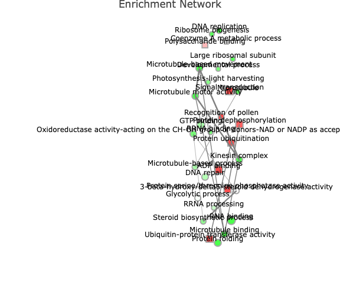

# Targeting Improved Cotton through Orbital Cultivation (TICTOC)

Dr Richard Barker, Dr Arkadipta Bakashi, Mr Lucas Baur, Dr Sarah Swanson, and Dr Simon Gilroy.&#x20;

Abstract: Introduction/Background: Roots play roles in a host of plant functions that are critical to cotton yields, stress resilience and its impact on the environment, through their activity in processes such as water uptake, nutrient usage, and soil carbon sequestration. Previously, Park et al., (2005) created cotton plants that over-express the vacuolar proton pumping pyrophosphatase (AVP1-OX). These plants show increased salt and drought resistance with more than a 20% increased fiber yield under stressful conditions that normally severely limit cotton productivity. These plants also develop a larger root system that can explore a wider and deeper volume of soil for water and nutrients. Such exploration patterns are inextricably linked to gravity, which directs the growth of the main and lateral roots via modulation of e.g., auxin signalling.&#x20;

Supported by CASIS UA-2018-276.

## Enhancing Agricultural Resilience: The TIC-TOC Mission and GMO AVP-OX Technology


&#x20;Summary video introducing the Gilroy Lab TIC TOC experiment that tested genetically engineered stress-resistant cotton plants response to the international space station


### Introduction

TIC-TOC (Targeting Improved Cotton Through Orbital Cultivation) is a project by the University of Wisconsin–Madison's Gilroy Life Science Lab that compares cotton grown in space to cotton grown on Earth. The lab's research focuses on how plants sense and respond to their environment, and how these signals regulate plant development. The lab uses advanced microscopy techniques, biochemistry, and molecular biology to address biological questions like how plants respond to spaceflight. The TIC-TOC mission, launched aboard the SpaceX Dragon during its 22nd Crew Resupply Mission to the International Space Station (ISS), represents a significant advancement in agricultural sciences and plant biology. This mission centers around a cutting-edge technology demonstration of the genetically modified organism (GMO) AVP-OX, aimed at uncovering new methodologies for improving plant resilience against two critical environmental stressors: drought and salinity.&#x20;

### Objective

The primary goal of this mission is to explore and understand the underlying mechanisms that could potentially enhance plant resistance to drought and salinity. This knowledge is crucial for evolving agricultural practices and ensuring global food security amidst changing climatic conditions.

### Research Approach

The Gilroy laboratory has been at the forefront of this research, focusing on the investigation of plant responses to environmental cues and developmental processes. The TIC-TOC project investigates how conventional and genetically modified cotton grow in microgravity. This innovative approach focuses on comparing the growth patterns of both wild type and AVP-OX cotton in space. The rationale behind this approach lies in the hypothesis that the absence of gravity would unmask genetic factors critical to cultivating resilient cotton variants on Earth. The ISS National Laboratory provided us with a unique opportunity to ask: (1) what are the drivers for cotton root system development and function in the absence of the confounding influence of gravity, and (2) does AVP1 overexpression lead to resistance to the stresses of the spaceflight environment.&#x20;

### This video summarizes the results as part of the  Space Agriculture Conference (2023).



**Result:** Analysis of root system architecture and growth kinetics indicate that the AVP1-OX lines grew larger roots when compared to the wild type in flight and to all of the ground controls, including the AVP1-OX lines themselves. Biochemical analyses of these plants also suggest they experienced reduced oxidative stress and maintained photosynthetic pigment levels.


### Conclusion

The advent of GMO AVP-OX technology marks a significant milestone in the field of agricultural innovation, geared towards the development of sturdier plants capable of thriving under the harsh conditions anticipated in future astro-agroecosystems. By utilizing RNAseq analysis, scientists are now able to unravel the cellular and molecular dynamics that enable these plants to withstand various stress factors, including mechanical damage, pathogens, and extreme weather events. This insight is crucial for understanding the resilience mechanisms at play, offering a clearer path toward enhancing plant growth, development, and yield in the face of adversity.

GMO AVP-OX technology heralds a new era in agriculture, promising to address some of the most pressing challenges like drought and soil salinity that currently threaten global food security. By pioneering plants that are better equipped to handle environmental stressors, this innovation has the potential to significantly boost agricultural productivity and sustainability worldwide. The initiative not only aims at mitigating the detrimental impacts of these stresses but also at revolutionizing the management of plant stress, providing a hopeful outlook for the future of global food production amidst escalating environmental challenges.

<figure><figcaption><p>TIC TOC mission patch.</p></figcaption></figure>


<figure><figcaption><p>NF_core RNAseq pipeline: <a href="https://github.com/nf-core/rnaseq">https://github.com/nf-core/rnaseq</a></p></figcaption></figure>

The count's file produced by the NF\_Core RNAseq analysis pipeline was then analyzed with these R codes to help us understand how Cotton plants and plants expressing AVP-ox respond to the space flight environment.&#x20;


[Please follow this link to a PDF summarizing the whole analysis.](https://github.com/dr-richard-barker/TICTOC/blob/main/TICTOC%20Cotton%20RNAseq%20DRB%20Summary\_%20summer%202022\_ASGSR.pdf)


[https://github.com/dr-richard-barker/TICTOC/blob/main/TICTOC%20Cotton%20RNAseq%20DRB%20Summary\_%20summer%202022\_ASGSR.pdf](https://github.com/dr-richard-barker/TICTOC/blob/main/TICTOC%20Cotton%20RNAseq%20DRB%20Summary\_%20summer%202022\_ASGSR.pdf)



### Below: Codes from the "TICTOC R Markdown v3" file was generated by Dr Richard Barker to provide insight into Cotton's response to space flight.

### 1. Read data

First we set up the working directory to where the files are saved. These files can be found in this github repo.&#x20;

```
setwd('/Users/drbhomeoffice/Downloads/TICTOC_3_factor_model')   # Needs to be changed  
```

R packages and iDEP core Functions.

```
if(file.exists('iDEP_core_functions.R'))
  source('iDEP_core_functions.R') else 
    source('https://raw.githubusercontent.com/iDEP-SDSU/idep/master/shinyapps/idep/iDEP_core_functions.R') 
```

```
## Warning in install.packages(...): installation of package 'runibic' had non-zero
## exit status
```

We are using the downloaded gene expression file where gene IDs has been converted to Ensembl gene IDs. T

```
inputFile <- 'Downloaded_Converted_Data.csv'  # Expression matrix
sampleInfoFile <- 'TICTOC_target_v5.csv' # Experiment design file 
geneInfoFile <- 'Cotton__ghirsutum_eg_gene_GeneInfo.csv' #Gene symbols, location etc. 
geneSetFile <- 'Cotton__ghirsutum_eg_gene.db'  # pathway database in SQL; can be GMT format 
STRING10_speciesFile <- 'https://raw.githubusercontent.com/iDEP-SDSU/idep/master/shinyapps/idep/STRING10_species.csv' 
```

Parameters for reading data

```
input_missingValue <- 'geneMedianInGroup'   #Missing values imputation method
input_dataFileFormat <- 1   #1- read counts, 2 FKPM/RPKM or DNA microarray
input_minCounts <- 0.5  #Min counts
input_NminSamples <- 1  #Minimum number of samples 
input_countsLogStart <- 4   #Pseudo count for log CPM
input_CountsTransform <- 3  #Methods for data transformation of counts. 1-EdgeR's logCPM 2-VST, 3-rlog 
```

```
readData.out <- readData(inputFile) 
```

```
## Warning in DESeqDataSet(se, design = design, ignoreRank): some variables in
## design formula are characters, converting to factors
```

```
library(knitr)   #  install if needed. for showing tables with kable 
kable( head(readData.out$data) )    # show the first few rows of data 
```

|                  | A68RootFlight | A68RootFlight1 | A68RootFlight2 | A68RootFlight3 | A68RootGround | A68RootGround1 | A68RootGround2 | A68RootGround3 | A68ShootFlight | A68ShootFlight1 | A68ShootFlight2 | A68ShootFlight3 | A68ShootGround | A68ShootGround1 | A68ShootGround2 | A68ShootGround3 | D130RootFlight | D130RootFlight1 | D130RootFlight2 | D130RootFlight3 | D130RootGround | D130RootGround1 | D130RootGround2 | D130RootGround3 | D130ShootFlight | D130ShootFlight1 | D130ShootFlight2 | D130ShootFlight3 | D130ShootGround | D130ShootGround1 | D130ShootGround2 | D130ShootGround3 | WTRootFlight | WTRootFlight1 | WTRootFlight2 | WTRootFlight3 | WTRootGround | WTRootGround1 | WTRootGround2 | WTRootGround3 | WTShootFlight | WTShootFlight1 | WTShootFlight2 | WTShootFlight3 | WTShootGround | WTShootGround1 | WTShootGround2 | WTShootGround3 |
| ---------------- | ------------- | -------------- | -------------- | -------------- | ------------- | -------------- | -------------- | -------------- | -------------- | --------------- | --------------- | --------------- | -------------- | --------------- | --------------- | --------------- | -------------- | --------------- | --------------- | --------------- | -------------- | --------------- | --------------- | --------------- | --------------- | ---------------- | ---------------- | ---------------- | --------------- | ---------------- | ---------------- | ---------------- | ------------ | ------------- | ------------- | ------------- | ------------ | ------------- | ------------- | ------------- | ------------- | -------------- | -------------- | -------------- | ------------- | -------------- | -------------- | -------------- |
| GOHIR.A04G039105 | 13.634682     | 12.758458      | 12.960225      | 13.463298      | 12.742291     | 13.292119      | 12.498714      | 12.645947      | 16.52831       | 16.92291        | 17.47056        | 16.95206        | 17.04671       | 16.34894        | 17.93003        | 17.48527        | 13.150011      | 13.045496       | 12.352965       | 12.928210       | 13.285763      | 12.993802       | 12.325954       | 13.531895       | 17.42704        | 17.42416         | 17.39902         | 16.43627         | 18.11121        | 17.49741         | 17.26551         | 17.29092         | 12.694453    | 13.321780     | 12.442504     | 13.314546     | 12.961234    | 12.877957     | 12.750915     | 13.048554     | 17.22535      | 17.09192       | 17.44060       | 16.93986       | 16.57511      | 17.24031       | 16.61856       | 16.91550       |
| GOHIR.1Z078501   | 11.518862     | 11.112517      | 11.707862      | 11.588271      | 10.483357     | 10.894389      | 10.357086      | 10.407960      | 14.64849       | 15.39367        | 15.58573        | 14.97006        | 15.41618       | 14.86421        | 15.75047        | 15.70340        | 11.420444      | 11.642341       | 10.793313       | 11.290878       | 10.892748      | 10.975964       | 10.054120       | 11.511363       | 15.55811        | 15.49619         | 15.74476         | 14.85792         | 16.25730        | 15.90044         | 15.63570         | 15.39926         | 10.823667    | 11.689591     | 11.334193     | 11.577756     | 11.080399    | 10.638597     | 10.702579     | 10.772925     | 13.71746      | 15.34915       | 15.44428       | 15.41155       | 15.83783      | 15.51878       | 14.88232       | 15.11356       |
| GOHIR.D06G053900 | 14.878803     | 15.093212      | 14.885349      | 14.858181      | 14.767790     | 14.676709      | 14.832845      | 14.274472      | 14.67954       | 14.66586        | 14.80640        | 14.60983        | 15.12699       | 14.87937        | 15.06388        | 15.30201        | 15.087367      | 15.190603       | 14.867747       | 14.643501       | 14.745877      | 14.573022       | 14.479369       | 15.151314       | 14.67745        | 14.58362         | 15.18286         | 14.40944         | 15.13797        | 15.16713         | 14.84991         | 15.45081         | 15.019590    | 14.888390     | 14.754578     | 14.887145     | 14.824638    | 14.702632     | 14.778814     | 14.636738     | 15.29427      | 14.62930       | 14.35350       | 14.52041       | 15.21548      | 15.22288       | 15.56396       | 15.54585       |
| GOHIR.D10G234000 | 6.188859      | 4.172852       | 3.647304       | 4.800828       | 5.152338      | 4.820082       | 5.508477       | 4.265765       | 14.94326       | 15.28464        | 14.56165        | 13.06029        | 14.69524       | 14.34236        | 15.65679        | 15.53915        | 4.944460       | 4.618055        | 4.470293        | 5.130398        | 5.529630       | 6.020457        | 4.654963        | 6.126543        | 14.90263        | 13.90516         | 14.63638         | 14.67551         | 15.96825        | 15.50151         | 15.26764         | 15.33284         | 3.893682     | 5.190760      | 3.173068      | 5.162571      | 3.944543     | 4.641883      | 5.922388      | 6.285947      | 14.53945      | 14.82237       | 15.30911       | 14.37597       | 14.39731      | 15.28010       | 15.17759       | 15.49376       |
| GOHIR.D07G229800 | 13.300747     | 13.789650      | 12.740293      | 13.011281      | 13.209627     | 12.706946      | 13.757271      | 13.720693      | 10.46036       | 11.99670        | 11.47402        | 11.28924        | 11.96631       | 11.91818        | 11.04302        | 11.46824        | 13.017612      | 12.255448       | 14.327929       | 13.503478       | 13.408115      | 13.793294       | 13.457550       | 13.625095       | 11.78292        | 10.99969         | 11.06758         | 10.87697         | 10.00751        | 11.80852         | 10.95325         | 11.42136         | 14.255679    | 12.406634     | 13.070186     | 13.059174     | 14.116479    | 13.373579     | 13.254336     | 14.169017     | 10.80831      | 10.96493       | 9.82251        | 10.45029       | 11.61730      | 11.58556       | 11.81137       | 11.61777       |
| GOHIR.A10G221700 | 4.216131      | 2.846017       | 3.317729       | 2.413137       | 2.780192      | 3.201010       | 3.716861       | 2.157596       | 14.59949       | 15.00590        | 13.81110        | 12.42347        | 14.30451       | 13.96907        | 15.36392        | 15.27729        | 2.504485       | 2.480601        | 2.191467        | 3.601488        | 4.213318       | 3.764766        | 3.733824        | 2.912381        | 14.41470        | 13.25574         | 13.98855         | 14.33476         | 15.75930        | 15.24897         | 15.09217         | 15.10696         | 2.240076     | 3.625201      | 2.354868      | 2.658545      | 3.360104     | 3.143764      | 4.490900      | 3.492852      | 13.66264      | 14.39655       | 15.10240       | 13.83723       | 13.64358      | 14.98933       | 14.80109       | 15.27811       |

```
readSampleInfo.out <- readSampleInfo(sampleInfoFile) 
```

```
## Warning in read.table(file = file, header = header, sep = sep, quote = quote, :
## incomplete final line found by readTableHeader on 'TICTOC_target_v5.csv'
```

```
kable( readSampleInfo.out )  
```

<table><thead><tr><th width="194"></th><th>Treatment</th><th>Genotype</th><th>Tissue</th></tr></thead><tbody><tr><td>A68RootFlight</td><td>Flight</td><td>A68</td><td>Root</td></tr><tr><td>A68RootFlight1</td><td>Flight</td><td>A68</td><td>Root</td></tr><tr><td>A68RootFlight2</td><td>Flight</td><td>A68</td><td>Root</td></tr><tr><td>A68RootFlight3</td><td>Flight</td><td>A68</td><td>Root</td></tr><tr><td>A68RootGround</td><td>Ground</td><td>A68</td><td>Root</td></tr><tr><td>A68RootGround1</td><td>Ground</td><td>A68</td><td>Root</td></tr><tr><td>A68RootGround2</td><td>Ground</td><td>A68</td><td>Root</td></tr><tr><td>A68RootGround3</td><td>Ground</td><td>A68</td><td>Root</td></tr><tr><td>A68ShootFlight</td><td>Flight</td><td>A68</td><td>Shoot</td></tr><tr><td>A68ShootFlight1</td><td>Flight</td><td>A68</td><td>Shoot</td></tr><tr><td>A68ShootFlight2</td><td>Flight</td><td>A68</td><td>Shoot</td></tr><tr><td>A68ShootFlight3</td><td>Flight</td><td>A68</td><td>Shoot</td></tr><tr><td>A68ShootGround</td><td>Ground</td><td>A68</td><td>Shoot</td></tr><tr><td>A68ShootGround1</td><td>Ground</td><td>A68</td><td>Shoot</td></tr><tr><td>A68ShootGround2</td><td>Ground</td><td>A68</td><td>Shoot</td></tr><tr><td>A68ShootGround3</td><td>Ground</td><td>A68</td><td>Shoot</td></tr><tr><td>D130RootFlight</td><td>Flight</td><td>D130</td><td>Root</td></tr><tr><td>D130RootFlight1</td><td>Flight</td><td>D130</td><td>Root</td></tr><tr><td>D130RootFlight2</td><td>Flight</td><td>D130</td><td>Root</td></tr><tr><td>D130RootFlight3</td><td>Flight</td><td>D130</td><td>Root</td></tr><tr><td>D130RootGround</td><td>Ground</td><td>D130</td><td>Root</td></tr><tr><td>D130RootGround1</td><td>Ground</td><td>D130</td><td>Root</td></tr><tr><td>D130RootGround2</td><td>Ground</td><td>D130</td><td>Root</td></tr><tr><td>D130RootGround3</td><td>Ground</td><td>D130</td><td>Root</td></tr><tr><td>D130ShootFlight</td><td>Flight</td><td>D130</td><td>Shoot</td></tr><tr><td>D130ShootFlight1</td><td>Flight</td><td>D130</td><td>Shoot</td></tr><tr><td>D130ShootFlight2</td><td>Flight</td><td>D130</td><td>Shoot</td></tr><tr><td>D130ShootFlight3</td><td>Flight</td><td>D130</td><td>Shoot</td></tr><tr><td>D130ShootGround</td><td>Ground</td><td>D130</td><td>Shoot</td></tr><tr><td>D130ShootGround1</td><td>Ground</td><td>D130</td><td>Shoot</td></tr><tr><td>D130ShootGround2</td><td>Ground</td><td>D130</td><td>Shoot</td></tr><tr><td>D130ShootGround3</td><td>Ground</td><td>D130</td><td>Shoot</td></tr><tr><td>WTRootFlight</td><td>Flight</td><td>WT</td><td>Root</td></tr><tr><td>WTRootFlight1</td><td>Flight</td><td>WT</td><td>Root</td></tr><tr><td>WTRootFlight2</td><td>Flight</td><td>WT</td><td>Root</td></tr><tr><td>WTRootFlight3</td><td>Flight</td><td>WT</td><td>Root</td></tr><tr><td>WTRootGround</td><td>Ground</td><td>WT</td><td>Root</td></tr><tr><td>WTRootGround1</td><td>Ground</td><td>WT</td><td>Root</td></tr><tr><td>WTRootGround2</td><td>Ground</td><td>WT</td><td>Root</td></tr><tr><td>WTRootGround3</td><td>Ground</td><td>WT</td><td>Root</td></tr><tr><td>WTShootFlight</td><td>Flight</td><td>WT</td><td>Shoot</td></tr><tr><td>WTShootFlight1</td><td>Flight</td><td>WT</td><td>Shoot</td></tr><tr><td>WTShootFlight2</td><td>Flight</td><td>WT</td><td>Shoot</td></tr><tr><td>WTShootFlight3</td><td>Flight</td><td>WT</td><td>Shoot</td></tr><tr><td>WTShootGround</td><td>Ground</td><td>WT</td><td>Shoot</td></tr><tr><td>WTShootGround1</td><td>Ground</td><td>WT</td><td>Shoot</td></tr><tr><td>WTShootGround2</td><td>Ground</td><td>WT</td><td>Shoot</td></tr><tr><td>WTShootGround3</td><td>Ground</td><td>WT</td><td>Shoot</td></tr></tbody></table>

```
input_selectOrg ="NEW" 
input_selectGO <- 'All' #Gene set category 
input_noIDConversion = TRUE  
allGeneInfo.out <- geneInfo(geneInfoFile) 
converted.out = NULL 
convertedData.out <- convertedData()     
nGenesFilter()  
```

```
## [1] "54267 genes in 48 samples. 54267  genes passed filter.\n Original gene IDs used."
```

```
convertedCounts.out <- convertedCounts()  # converted counts, just for compatibility 
```

### 2. Pre-process

```
# Read counts per library 
parDefault = par() 
par(mar=c(12,4,2,2)) 
# barplot of total read counts
x <- readData.out$rawCounts
groups = as.factor( detectGroups(colnames(x ) ) )
if(nlevels(groups)<=1 | nlevels(groups) >20 )  
  col1 = 'green'  else
    col1 = rainbow(nlevels(groups))[ groups ]               

barplot( colSums(x)/1e6, 
         col=col1,las=3, main="Total read counts (millions)")  
         
```

<figure><figcaption></figcaption></figure>

```
readCountsBias()  # detecting bias in sequencing depth 
```

```
## [1] "Warning! Sequencing depth bias detected. Total read counts are significantly different among sample groups (p= 7.67e-08 ) based on ANOVA.  Total read counts seem to be correlated with factor Tissue (p= 4.38e-13 ).  "
```

```
# Box plot 
x = readData.out$data 
boxplot(x, las = 2, col=col1,
        ylab='Transformed expression levels',
        main='Distribution of transformed data') 
```

<figure><figcaption></figcaption></figure>

```
#Density plot 
par(parDefault)
## Warning in par(parDefault): graphical parameter "cin" cannot be set
## Warning in par(parDefault): graphical parameter "cra" cannot be set
## Warning in par(parDefault): graphical parameter "csi" cannot be set
## Warning in par(parDefault): graphical parameter "cxy" cannot be set
## Warning in par(parDefault): graphical parameter "din" cannot be set
## Warning in par(parDefault): graphical parameter "page" cannot be set
```

```
densityPlot()       
```

<figure><figcaption></figcaption></figure>

```
# Scatter plot of the first two samples 
plot(x[,1:2],xlab=colnames(x)[1],ylab=colnames(x)[2], 
     main='Scatter plot of first two samples') 
```

<figure><figcaption></figcaption></figure>

```
####plot gene or gene family
input_selectOrg ="BestMatch" 
input_geneSearch <- 'HOXA1;e2f2;tp53'   #Gene ID for searching 
genePlot()  
```

### 3. Heatmap

```
# hierarchical clustering tree
x <- readData.out$data
maxGene <- apply(x,1,max)
# remove bottom 25% lowly expressed genes, which inflate the PPC
x <- x[which(maxGene > quantile(maxGene)[1] ) ,] 
plot(as.dendrogram(hclust2( dist2(t(x)))), ylab="1 - Pearson C.C.", type = "rectangle") 
```

<figure><figcaption></figcaption></figure>

```
#Correlation matrix
input_labelPCC <- TRUE  #Show correlation coefficient? 
correlationMatrix() 
```

<figure><figcaption></figcaption></figure>

```
# Parameters for heatmap
input_nGenes <- 100 #Top genes for heatmap
input_geneCentering <- TRUE #centering genes ?
input_sampleCentering <- TRUE   #Center by sample?
input_geneNormalize <- TRUE #Normalize by gene?
input_sampleNormalize <- TRUE   #Normalize by sample?
input_noSampleClustering <- FALSE   #Use original sample order
input_heatmapCutoff <- 4    #Remove outliers beyond number of SDs 
input_distFunctions <- 2    #which distant funciton to use
input_hclustFunctions <- 1  #Linkage type
input_heatColors1 <- 2  #Colors
input_selectFactorsHeatmap <- 'Sample_Name' #Sample coloring factors 
png('heatmap.png', width = 10, height = 15, units = 'in', res = 300) 
staticHeatmap() 
dev.off()  
```

```
## quartz_off_screen 
##                 2
```

<figure><figcaption></figcaption></figure>

```
heatmapPlotly() # interactive heatmap using Plotly 
```

### 4. K-means clustering

```
input_nGenesKNN <- 2000 #Number of genes fro k-Means
input_nClusters <- 4    #Number of clusters 
maxGeneClustering = 12000
input_kmeansNormalization <- 'geneMean' #Normalization
input_KmeansReRun <- 0  #Random seed 

distributionSD()  #Distribution of standard deviations 
```

<figure><figcaption></figcaption></figure>

```
KmeansNclusters()  #Number of clusters 
```

<figure><figcaption></figcaption></figure>

```
Kmeans.out = Kmeans()   #Running K-means 
KmeansHeatmap()   #Heatmap for k-Means 
```

<figure><figcaption></figcaption></figure>

```
#Read gene sets for enrichment analysis 
sqlite  <- dbDriver('SQLite')
input_selectGO3 <- 'GOBP'   #Gene set category
input_minSetSize <- 15  #Min gene set size
input_maxSetSize <- 2000    #Max gene set size 
GeneSets.out <-readGeneSets( geneSetFile,
                             convertedData.out, input_selectGO3,input_selectOrg,
                             c(input_minSetSize, input_maxSetSize)  )  
# Alternatively, users can use their own GMT files by
#GeneSets.out <- readGMTRobust('somefile.GMT')  
results <- KmeansGO()  #Enrichment analysis for k-Means clusters    
results$adj.Pval <- format( results$adj.Pval,digits=3 )
kable( results, row.names=FALSE) 
```


| Cluster | adj.Pval | Genes | Pathways                                  |
| ------- | -------- | ----- | ----------------------------------------- |
| A       | 2.54e-08 | 12    | Photosynthesis                            |
|         | 3.53e-03 | 5     | Nitrogen compound metabolic process       |
|         | 7.82e-03 | 14    | Proteolysis                               |
| B       | 1.21e-61 | 34    | Photosynthesis-light harvesting           |
|         | 5.23e-43 | 34    | Photosynthesis                            |
|         | 4.72e-04 | 7     | Glycolytic process                        |
| C       | 5.10e-14 | 29    | Transport                                 |
|         | 3.43e-09 | 10    | Response to biotic stimulus               |
|         | 5.10e-07 | 10    | Defense response                          |
|         | 9.82e-06 | 12    | Response to oxidative stress              |
| D       | 3.73e-24 | 114   | Translation                               |
|         | 1.43e-08 | 23    | Glycolytic process                        |
|         | 4.71e-06 | 13    | Proton transport                          |
|         | 4.96e-06 | 9     | Translational elongation                  |
|         | 1.33e-05 | 24    | Vesicle-mediated transport                |
|         | 4.41e-05 | 7     | S-adenosylmethionine biosynthetic process |
|         | 7.53e-05 | 16    | Microtubule-based process                 |
|         | 8.82e-05 | 27    | Protein folding                           |
|         | 8.82e-05 | 7     | Cellular amino acid biosynthetic process  |
|         | 5.33e-04 | 7     | ATP metabolic process                     |

```
input_seedTSNE <- 0 #Random seed for t-SNE
input_colorGenes <- TRUE    #Color genes in t-SNE plot? 
tSNEgenePlot()  #Plot genes using t-SNE 
```

<figure><figcaption></figcaption></figure>

### 5. PCA and beyond

```
input_selectFactors <- 'Tissue' #Factor coded by color
input_selectFactors2 <- 'Sample_Name'   #Factor coded by shape
input_tsneSeed2 <- 0    #Random seed for t-SNE 
#PCA, MDS and t-SNE plots
PCAplot()  
```

```
## Warning: The shape palette can deal with a maximum of 6 discrete values because
## more than 6 becomes difficult to discriminate; you have 12. Consider
## specifying shapes manually if you must have them.
```

```
## Warning: Removed 24 rows containing missing values (geom_point).
```

<figure><figcaption></figcaption></figure>

```
MDSplot() 
```

<figure><figcaption></figcaption></figure>

```
tSNEplot()  
```

<figure><figcaption></figcaption></figure>

```
#Read gene sets for pathway analysis using PGSEA on principal components
input_selectGO6 <- 'All'    #Gene set category 
GeneSets.out <-readGeneSets( geneSetFile,
                             convertedData.out, input_selectGO6,input_selectOrg,
                             c(input_minSetSize, input_maxSetSize)  )  
PCApathway() # Run PGSEA analysis 
```

<figure><figcaption></figcaption></figure>

```
cat( PCA2factor() )   #The correlation between PCs with factors 
```

```
## 
##  Correlation between Principal Components (PCs) with factors
## PC1 is correlated with Tissue (p=3.14e-47).
## PC2 is correlated with Treatment (p=9.39e-05).
## PC4 is correlated with Treatment (p=4.01e-04).
```

### 6. DEG1

```
input_CountsDEGMethod <- 3  #DESeq2= 3,limma-voom=2,limma-trend=1 
input_limmaPval <- 0.1  #FDR cutoff
input_limmaFC <- 2  #Fold-change cutoff
input_selectModelComprions <- c('Treatment: Flight vs. Ground','Treatment: Ground vs. Flight','Genotype: A68 vs. D130','Genotype: A68 vs. WT','Genotype: D130 vs. A68','Genotype: D130 vs. WT','Tissue: Root vs. Shoot','Tissue: Shoot vs. Root')   #Selected comparisons
input_selectFactorsModel <- c('Treatment','Genotype','Tissue')  #Selected comparisons
input_selectInteractions <- c('Treatment:Genotype','Treatment:Tissue','Genotype:Tissue')    #Selected comparisons
input_selectBlockFactorsModel <- NULL   #Selected comparisons
factorReferenceLevels.out <- c('Treatment:Ground','Genotype:WT','Tissue:Root') 

limma.out <- limma()
```

```
## Warning in DESeqDataSet(se, design = design, ignoreRank): some variables in
## design formula are characters, converting to factors
```

```
DEG.data.out <- DEG.data()
```

```
## Warning in merge.data.frame(genes, convertedData.out, by = "row.names"): column
## names 'A68-WT_for_Flight', 'A68-WT_for_Shoot', 'D130-WT_for_Flight', 'D130-
## WT_for_Shoot' are duplicated in the result
```

```
limma.out$comparisons 
```

```
##  [1] "Flight-Ground"                    "Ground-Flight"                   
##  [3] "A68-D130"                         "A68-WT"                          
##  [5] "D130-A68"                         "D130-WT"                         
##  [7] "Root-Shoot"                       "Shoot-Root"                      
##  [9] "I:Treatment_Flight.Genotype_A68"  "I:Treatment_Flight.Genotype_D130"
## [11] "I:Treatment_Flight.Tissue_Shoot"  "I:Genotype_A68.Tissue_Shoot"     
## [13] "I:Genotype_D130.Tissue_Shoot"     "Flight-Ground_for_A68"           
## [15] "Flight-Ground_for_D130"           "Flight-Ground_for_Shoot"         
## [17] "A68-WT_for_Flight"                "A68-WT_for_Flight"               
## [19] "A68-WT_for_Shoot"                 "A68-WT_for_Shoot"                
## [21] "D130-WT_for_Flight"               "D130-WT_for_Flight"              
## [23] "D130-WT_for_Shoot"                "D130-WT_for_Shoot"               
## [25] "Shoot-Root_for_Flight"            "Shoot-Root_for_A68"              
## [27] "Shoot-Root_for_D130"
```

```
input_selectComparisonsVenn <- c('Flight-Ground','A68-D130','A68-WT','D130-WT','Root-Shoot')    #Selected comparisons for Venn diagram
input_UpDownRegulated <- FALSE  #Split up and down regulated genes 
vennPlot() # Venn diagram 
```

<figure><figcaption></figcaption></figure>

```
sigGeneStats() # number of DEGs as figure 
```

<figure><figcaption></figcaption></figure>

```
sigGeneStatsTable() # number of DEGs as table 
```

```
##                                                       Comparisons    Up  Down
## Flight.Ground                                       Flight-Ground  5257  4038
## Ground.Flight                                       Ground-Flight  4038  5257
## A68.D130                                                 A68-D130     8    30
## A68.WT                                                     A68-WT     7    13
## D130.A68                                                 D130-A68    30     8
## D130.WT                                                   D130-WT    23     4
## Root.Shoot                                             Root-Shoot 12872 11623
## Shoot.Root                                             Shoot-Root 11623 12872
## I.Treatment_Flight.Genotype_A68   I:Treatment_Flight-Genotype_A68    32   353
## I.Treatment_Flight.Genotype_D130 I:Treatment_Flight-Genotype_D130   101   777
## I.Treatment_Flight.Tissue_Shoot   I:Treatment_Flight-Tissue_Shoot  4633  5614
## I.Genotype_A68.Tissue_Shoot           I:Genotype_A68-Tissue_Shoot     5     2
## I.Genotype_D130.Tissue_Shoot         I:Genotype_D130-Tissue_Shoot     3     6
## Flight.Ground_for_A68                       Flight-Ground_for_A68  4655  5896
## Flight.Ground_for_D130                     Flight-Ground_for_D130  3431  3451
## Flight.Ground_for_Shoot                   Flight-Ground_for_Shoot  1027  1391
## A68.WT_for_Flight                               A68-WT_for_Flight    70  1185
## A68.WT_for_Flight.1                             A68-WT_for_Flight    26   743
## A68.WT_for_Shoot                                 A68-WT_for_Shoot     8    10
## A68.WT_for_Shoot.1                               A68-WT_for_Shoot     4    19
## D130.WT_for_Flight                             D130-WT_for_Flight    60   327
## D130.WT_for_Flight.1                           D130-WT_for_Flight   113  1066
## D130.WT_for_Shoot                               D130-WT_for_Shoot    11     2
## D130.WT_for_Shoot.1                             D130-WT_for_Shoot     8     5
## Shoot.Root_for_Flight                       Shoot-Root_for_Flight 10558 11274
## Shoot.Root_for_A68                             Shoot-Root_for_A68 11333 12708
## Shoot.Root_for_D130                           Shoot-Root_for_D130 10839 13038
```

### 7. DEG2

```
input_selectContrast <- 'Flight-Ground' #Selected comparisons 
selectedHeatmap.data.out <- selectedHeatmap.data()
selectedHeatmap()   # heatmap for DEGs in selected comparison
```

<figure><figcaption></figcaption></figure>

```
# Save gene lists and data into files
write.csv( selectedHeatmap.data()$genes, 'heatmap.data.csv') 
write.csv(DEG.data(),'DEG.data.csv' )
```

```
## Warning in merge.data.frame(genes, convertedData.out, by = "row.names"): column
## names 'A68-WT_for_Flight', 'A68-WT_for_Shoot', 'D130-WT_for_Flight', 'D130-
## WT_for_Shoot' are duplicated in the result
```

```
write(AllGeneListsGMT() ,'AllGeneListsGMT.gmt')
```

```
input_selectGO2 <- 'All'    #Gene set category 
geneListData.out <- geneListData()  
volcanoPlot()  
```

<figure><figcaption></figcaption></figure>

```
scatterPlot()  
```

<figure><figcaption></figcaption></figure>

```
MAplot()  
```

<figure><figcaption></figcaption></figure>

```
geneListGOTable.out <- geneListGOTable()  
# Read pathway data again 
GeneSets.out <-readGeneSets( geneSetFile,
                             convertedData.out, input_selectGO2,input_selectOrg,
                             c(input_minSetSize, input_maxSetSize)  ) 
input_removeRedudantSets <- TRUE    #Remove highly redundant gene sets? 
results <- geneListGO()  #Enrichment analysis
results$adj.Pval <- format( results$adj.Pval,digits=3 )
kable( results, row.names=FALSE) 
```

| Direction      | adj.Pval | nGenes | Pathways                                                                                            |
| -------------- | -------- | ------ | --------------------------------------------------------------------------------------------------- |
| Down regulated | 2.7e-48  | 282    | Translation                                                                                         |
|                | 2.6e-47  | 272    | Ribosome                                                                                            |
|                | 2.6e-47  | 276    | Structural constituent of ribosome                                                                  |
|                | 3.2e-15  | 191    | Intracellular                                                                                       |
|                | 6.3e-03  | 9      | 5S rRNA binding                                                                                     |
|                | 1.0e-02  | 42     | Microtubule-based movement                                                                          |
|                | 1.0e-02  | 42     | Kinesin complex                                                                                     |
|                | 1.0e-02  | 42     | Microtubule motor activity                                                                          |
| Up regulated   | 2.0e-09  | 279    | Transcription factor activity-sequence-specific DNA binding                                         |
|                | 7.6e-09  | 106    | ADP binding                                                                                         |
|                | 1.3e-06  | 35     | Recognition of pollen                                                                               |
|                | 2.0e-04  | 12     | Coenzyme A metabolic process                                                                        |
|                | 2.0e-04  | 12     | Hydroxymethylglutaryl-CoA reductase (NADPH) activity                                                |
|                | 2.5e-04  | 134    | Oxidoreductase activity-acting on paired donors-with incorporation or reduction of molecular oxygen |
|                | 8.3e-04  | 155    | Sequence-specific DNA binding                                                                       |
|                | 1.5e-03  | 22     | Terpene synthase activity                                                                           |
|                | 5.1e-03  | 142    | Iron ion binding                                                                                    |
|                | 5.1e-03  | 29     | Polysaccharide binding                                                                              |

### 7. DEG2 .2 Genotype: D130 vs. WT

```
input_selectContrast <- 'D130-WT'   #Selected comparisons 
selectedHeatmap.data.out <- selectedHeatmap.data()
selectedHeatmap()   # heatmap for DEGs in selected comparison
```

<figure><figcaption></figcaption></figure>

```
# Save gene lists and data into files
write.csv( selectedHeatmap.data()$genes, 'heatmap.data.csv') 
write.csv(DEG.data(),'DEG.data.csv' )
```

```
## Warning in merge.data.frame(genes, convertedData.out, by = "row.names"): column
## names 'A68-WT_for_Flight', 'A68-WT_for_Shoot', 'D130-WT_for_Flight', 'D130-
## WT_for_Shoot' are duplicated in the result
```

```
write(AllGeneListsGMT() ,'AllGeneListsGMT.gmt')
```

```
input_selectGO2 <- 'All'    #Gene set category 
geneListData.out <- geneListData()  
volcanoPlot()  
```

<figure><figcaption></figcaption></figure>

```
scatterPlot()  
```

<figure><figcaption></figcaption></figure>

```
MAplot()  
```

<figure><figcaption></figcaption></figure>

&#x20;\#`{r, message=FALSE } #geneListGOTable.out <- geneListGOTable() ## Read pathway data again #GeneSets.out <-readGeneSets( geneSetFile, # convertedData.out, input_selectGO2,input_selectOrg, # c(input_minSetSize, input_maxSetSize) ) #input_removeRedudantSets <- TRUE #Remove highly redundant gene sets? #results <- geneListGO() #Enrichment analysis #results$adj.Pval <- format( results$adj.Pval,digits=3 ) #kable( results, row.names=FALSE) #` ## 7. DEG2 .3 Genotype: A68 vs. D130

```
input_selectContrast3 <- 'A68-D130' #Selected comparisons 
selectedHeatmap.data.out <- selectedHeatmap.data()
selectedHeatmap()   # heatmap for DEGs in selected comparison
```

<figure><figcaption></figcaption></figure>

```
# Save gene lists and data into files
write.csv( selectedHeatmap.data()$genes, 'heatmap.data.csv') 
write.csv(DEG.data(),'DEG.data.csv' )
```

```
## Warning in merge.data.frame(genes, convertedData.out, by = "row.names"): column
## names 'A68-WT_for_Flight', 'A68-WT_for_Shoot', 'D130-WT_for_Flight', 'D130-
## WT_for_Shoot' are duplicated in the result
```

```
write(AllGeneListsGMT() ,'AllGeneListsGMT.gmt')
```

```
input_selectGO2 <- 'All'    #Gene set category 
geneListData.out <- geneListData()  
volcanoPlot()  
```

<figure><figcaption></figcaption></figure>

```
scatterPlot()  
```

<figure><figcaption></figcaption></figure>

```
MAplot()  
```

<figure><figcaption></figcaption></figure>

&#x20;\#`{r, message=FALSE } #geneListGOTable.out <- geneListGOTable() ## Read pathway data again #GeneSets.out <-readGeneSets( geneSetFile, # convertedData.out, input_selectGO2,input_selectOrg, # c(input_minSetSize, input_maxSetSize) ) #input_removeRedudantSets <- TRUE #Remove highly redundant gene sets? #results <- geneListGO() #Enrichment analysis #results$adj.Pval <- format( results$adj.Pval,digits=3 ) #kable( results, row.names=FALSE) #`

### 8. Pathway analysis 1

```
input_selectContrast1 <- 'Flight-Ground'    #select Comparison 
#input_selectContrast1 = limma.out$comparisons[3] # manually set
input_selectGO <- 'All' #Gene set category 
#input_selectGO='custom' # if custom gmt file
input_minSetSize <- 15  #Min size for gene set
input_maxSetSize <- 2000    #Max size for gene set 
# Read pathway data again 
GeneSets.out <-readGeneSets( geneSetFile,
                             convertedData.out, input_selectGO,input_selectOrg,
                             c(input_minSetSize, input_maxSetSize)  ) 
input_pathwayPvalCutoff <- 0.2  #FDR cutoff
input_nPathwayShow <- 30    #Top pathways to show
input_absoluteFold <- FALSE #Use absolute values of fold-change?
input_GenePvalCutoff <- 1   #FDR to remove genes 

input_pathwayMethod = 1  # 1  GAGE
gagePathwayData.out <- gagePathwayData()  # pathway analysis using GAGE  

results <- gagePathwayData.out  #Enrichment analysis for k-Means clusters   
results$adj.Pval <- format( results$adj.Pval,digits=3 )
kable( results, row.names=FALSE) 
```

| Direction | GAGE analysis: Flight vs Ground                                                     | statistic | Genes | adj.Pval |
| --------- | ----------------------------------------------------------------------------------- | --------- | ----- | -------- |
| Down      | Microtubule binding                                                                 | -7.7175   | 205   | 2.9e-11  |
|           | Microtubule-based movement                                                          | -7.1905   | 178   | 2.8e-10  |
|           | Kinesin complex                                                                     | -7.1905   | 178   | 2.8e-10  |
|           | Microtubule motor activity                                                          | -7.1905   | 178   | 2.8e-10  |
|           | RNA binding                                                                         | -6.9148   | 469   | 4.0e-10  |
|           | DNA replication                                                                     | -5.9882   | 90    | 6.2e-07  |
|           | Protein folding                                                                     | -5.6311   | 231   | 1.1e-06  |
|           | Large ribosomal subunit                                                             | -4.7963   | 44    | 2.6e-04  |
|           | Ribosome biogenesis                                                                 | -4.7448   | 44    | 2.8e-04  |
|           | Microtubule                                                                         | -4.7108   | 78    | 1.6e-04  |
|           | RRNA binding                                                                        | -4.4645   | 36    | 8.1e-04  |
|           | Developmental process                                                               | -4.4298   | 35    | 6.8e-04  |
|           | Photosynthesis-light harvesting                                                     | -4.2408   | 48    | 9.5e-04  |
|           | Oxidoreductase activity-acting on the CH-OH group of donors-NAD or NADP as acceptor | -4.2076   | 163   | 6.8e-04  |
|           | Steroid biosynthetic process                                                        | -4.07     | 82    | 1.1e-03  |
|           | RRNA processing                                                                     | -4.0136   | 42    | 2.0e-03  |
|           | Microtubule-based process                                                           | -3.9531   | 93    | 1.5e-03  |
|           | GTP binding                                                                         | -3.8797   | 488   | 1.5e-03  |
|           | DNA repair                                                                          | -3.8606   | 178   | 1.7e-03  |
|           | 3-beta-hydroxy-delta5-steroid dehydrogenase activity                                | -3.7329   | 78    | 2.9e-03  |
|           | Glycolytic process                                                                  | -3.7293   | 105   | 2.8e-03  |
| Up        | ADP binding                                                                         | 10.0101   | 326   | 1.1e-19  |
|           | Ubiquitin-protein transferase activity                                              | 6.401     | 208   | 4.8e-08  |
|           | Protein ubiquitination                                                              | 6.144     | 182   | 1.6e-07  |
|           | Recognition of pollen                                                               | 6.0234    | 76    | 6.0e-07  |
|           | Signal transduction                                                                 | 5.8813    | 282   | 3.9e-07  |
|           | Protein serine/threonine phosphatase activity                                       | 4.7688    | 212   | 9.5e-05  |
|           | Protein dephosphorylation                                                           | 4.3147    | 267   | 6.1e-04  |
|           | Coenzyme A metabolic process                                                        | 4.2011    | 17    | 5.1e-03  |
|           | Polysaccharide binding                                                              | 3.9743    | 83    | 3.1e-03  |

```
pathwayListData.out = pathwayListData() 
enrichmentPlot(pathwayListData.out, 25  ) 
```

<figure><figcaption></figcaption></figure>

```
enrichmentNetwork(pathwayListData.out )  
```

<figure><figcaption></figcaption></figure>

```
## Warning: package 'igraph' was built under R version 4.0.5
```

```
enrichmentNetworkPlotly(pathwayListData.out) 
```

<figure><figcaption></figcaption></figure>

```
input_pathwayMethod = 3  # 1  fgsea 
fgseaPathwayData.out <- fgseaPathwayData() #Pathway analysis using fgsea 
```

<figure><figcaption></figcaption></figure>

```
## Warning in fgsea(pathways = gmt, stats = fold, minSize = input_minSetSize, :
## You are trying to run fgseaSimple. It is recommended to use fgseaMultilevel. To
## run fgseaMultilevel, you need to remove the nperm argument in the fgsea function
## call.
```

```
## Warning in preparePathwaysAndStats(pathways, stats, minSize, maxSize, gseaParam, : There are ties in the preranked stats (0% of the list).
## The order of those tied genes will be arbitrary, which may produce unexpected results.
```

```
results <- fgseaPathwayData.out  #Enrichment analysis for k-Means clusters  
results$adj.Pval <- format( results$adj.Pval,digits=3 )
kable( results, row.names=FALSE) 
```

| Direction | GSEA analysis: Flight vs Ground                                                                     | NES     | Genes | adj.Pval |
| --------- | --------------------------------------------------------------------------------------------------- | ------- | ----- | -------- |
| Down      | Structural constituent of ribosome                                                                  | -3.5389 | 831   | 1.6e-02  |
|           | Ribosome                                                                                            | -3.5334 | 814   | 1.6e-02  |
|           | Translation                                                                                         | -3.5273 | 847   | 1.8e-02  |
|           | Intracellular                                                                                       | -2.9788 | 778   | 1.5e-02  |
|           | Microtubule-based movement                                                                          | -2.6541 | 178   | 4.5e-03  |
|           | Kinesin complex                                                                                     | -2.6541 | 178   | 4.5e-03  |
|           | Microtubule motor activity                                                                          | -2.6541 | 178   | 4.5e-03  |
|           | Microtubule binding                                                                                 | -2.6461 | 205   | 4.8e-03  |
|           | DNA replication                                                                                     | -2.6188 | 90    | 3.8e-03  |
|           | Large ribosomal subunit                                                                             | -2.4559 | 44    | 3.8e-03  |
|           | Developmental process                                                                               | -2.4555 | 35    | 3.8e-03  |
|           | Ribosome biogenesis                                                                                 | -2.3586 | 44    | 3.8e-03  |
|           | Photosynthesis-light harvesting                                                                     | -2.3279 | 48    | 3.8e-03  |
|           | Microtubule                                                                                         | -2.3163 | 78    | 3.8e-03  |
|           | DNA helicase activity                                                                               | -2.2633 | 16    | 3.8e-03  |
|           | 5S rRNA binding                                                                                     | -2.2631 | 16    | 3.8e-03  |
|           | RRNA processing                                                                                     | -2.2192 | 42    | 3.8e-03  |
|           | RRNA binding                                                                                        | -2.2009 | 36    | 3.8e-03  |
|           | Steroid biosynthetic process                                                                        | -2.1624 | 82    | 3.8e-03  |
|           | Protein folding                                                                                     | -2.1429 | 231   | 5.1e-03  |
| Up        | ADP binding                                                                                         | 2.6467  | 326   | 3.7e-03  |
|           | Protein ubiquitination                                                                              | 2.4683  | 182   | 3.7e-03  |
|           | Recognition of pollen                                                                               | 2.4474  | 76    | 3.7e-03  |
|           | Ubiquitin-protein transferase activity                                                              | 2.4452  | 208   | 3.7e-03  |
|           | Terpene synthase activity                                                                           | 2.3996  | 52    | 3.7e-03  |
|           | Transcription factor activity-sequence-specific DNA binding                                         | 2.2765  | 1086  | 3.7e-03  |
|           | Lyase activity                                                                                      | 2.2518  | 69    | 3.7e-03  |
|           | Oxidoreductase activity-acting on paired donors-with incorporation or reduction of molecular oxygen | 2.1721  | 528   | 3.7e-03  |
|           | Signal transduction                                                                                 | 2.1492  | 282   | 3.7e-03  |
|           | Coenzyme A metabolic process                                                                        | 2.1383  | 17    | 3.7e-03  |

```
pathwayListData.out = pathwayListData() 
enrichmentPlot(pathwayListData.out, 25  ) 
```

<figure><figcaption></figcaption></figure>

```
enrichmentNetwork(pathwayListData.out )  
```

<figure><figcaption></figcaption></figure>

```
enrichmentNetworkPlotly(pathwayListData.out) 
```

<figure><figcaption></figcaption></figure>

<figure><figcaption></figcaption></figure>

```
PGSEAplot() # pathway analysis using PGSEA 
## Computing P values using ANOVA
```

<figure><figcaption></figcaption></figure>

### 8. Pathway analysis 2

```
input_selectContrast1 <- 'D130-WT'  #select Comparison 
#input_selectContrast1 = limma.out$comparisons[3] # manually set
input_selectGO <- 'All' #Gene set category 
#input_selectGO='custom' # if custom gmt file
input_minSetSize <- 15  #Min size for gene set
input_maxSetSize <- 2000    #Max size for gene set 
# Read pathway data again 
GeneSets.out <-readGeneSets( geneSetFile,
                             convertedData.out, input_selectGO,input_selectOrg,
                             c(input_minSetSize, input_maxSetSize)  ) 
input_pathwayPvalCutoff <- 0.2  #FDR cutoff
input_nPathwayShow <- 30    #Top pathways to show
input_absoluteFold <- FALSE #Use absolute values of fold-change?
input_GenePvalCutoff <- 1   #FDR to remove genes 

input_pathwayMethod = 1  # 1  GAGE
gagePathwayData.out <- gagePathwayData()  # pathway analysis using GAGE  

results <- gagePathwayData.out  #Enrichment analysis for k-Means clusters   
results$adj.Pval <- format( results$adj.Pval,digits=3 )
kable( results, row.names=FALSE) 
```

| Direction | GAGE analysis: D130 vs WT                                                           | statistic | Genes | adj.Pval |
| --------- | ----------------------------------------------------------------------------------- | --------- | ----- | -------- |
| Down      | Microtubule binding                                                                 | -6.1231   | 205   | 5.8e-07  |
|           | Microtubule-based movement                                                          | -5.6978   | 178   | 1.6e-06  |
|           | Kinesin complex                                                                     | -5.6978   | 178   | 1.6e-06  |
|           | Microtubule motor activity                                                          | -5.6978   | 178   | 1.6e-06  |
|           | DNA replication                                                                     | -4.7104   | 90    | 3.1e-04  |
|           | RNA binding                                                                         | -4.0344   | 469   | 2.3e-03  |
|           | Developmental process                                                               | -3.7998   | 35    | 1.0e-02  |
|           | Nucleosome                                                                          | -3.2039   | 74    | 4.5e-02  |
|           | Transcription-DNA-templated                                                         | -3.1785   | 287   | 4.4e-02  |
|           | DNA-directed RNA polymerase activity                                                | -3.1047   | 116   | 4.9e-02  |
|           | Ribosome biogenesis                                                                 | -3.0998   | 44    | 5.9e-02  |
|           | Regulation of cell cycle                                                            | -3.037    | 16    | 9.3e-02  |
|           | DNA-directed DNA polymerase activity                                                | -2.9906   | 25    | 9.3e-02  |
|           | Nucleosome assembly                                                                 | -2.8511   | 49    | 9.4e-02  |
|           | RNA processing                                                                      | -2.7275   | 99    | 1.1e-01  |
|           | RRNA processing                                                                     | -2.7177   | 42    | 1.2e-01  |
| Up        | Response to oxidative stress                                                        | 4.8396    | 215   | 3.2e-04  |
|           | Peroxidase activity                                                                 | 4.7537    | 193   | 3.2e-04  |
|           | Hydrolase activity-acting on ester bonds                                            | 4.5817    | 194   | 4.8e-04  |
|           | Photosynthesis                                                                      | 4.0598    | 126   | 3.7e-03  |
|           | ATP hydrolysis coupled proton transport                                             | 3.4486    | 80    | 3.9e-02  |
|           | Photosystem II                                                                      | 3.1583    | 70    | 7.3e-02  |
|           | Oxidoreductase activity-acting on NAD(P)H-oxygen as acceptor                        | 3.053     | 19    | 1.2e-01  |
|           | Transferase activity-transferring acyl groups other than amino-acyl groups          | 3.0043    | 178   | 9.3e-02  |
|           | Transporter activity                                                                | 2.8052    | 315   | 1.3e-01  |
|           | Vesicle-mediated transport                                                          | 2.7883    | 167   | 1.3e-01  |
|           | Transferase activity-transferring glycosyl groups                                   | 2.6948    | 176   | 1.5e-01  |
|           | Oxidoreductase activity-acting on the CH-OH group of donors-NAD or NADP as acceptor | 2.6086    | 163   | 1.8e-01  |
|           | Photosystem I                                                                       | 2.5493    | 38    | 1.9e-01  |
|           | Response to biotic stimulus                                                         | 2.5096    | 58    | 1.9e-01  |

```
pathwayListData.out = pathwayListData() 
enrichmentPlot(pathwayListData.out, 25  ) 
```

<figure><figcaption></figcaption></figure>

```
enrichmentNetwork(pathwayListData.out )  
```

<figure><figcaption></figcaption></figure>

```
enrichmentNetworkPlotly(pathwayListData.out) 
```

<figure><figcaption></figcaption></figure>

```
input_pathwayMethod = 3  # 1  fgsea 
fgseaPathwayData.out <- fgseaPathwayData() #Pathway analysis using fgsea 
```

```
## Warning in fgsea(pathways = gmt, stats = fold, minSize = input_minSetSize, :
## You are trying to run fgseaSimple. It is recommended to use fgseaMultilevel. To
## run fgseaMultilevel, you need to remove the nperm argument in the fgsea function
## call.
```

```
## Warning in preparePathwaysAndStats(pathways, stats, minSize, maxSize, gseaParam, : There are ties in the preranked stats (0% of the list).
## The order of those tied genes will be arbitrary, which may produce unexpected results.
```

```
results <- fgseaPathwayData.out  #Enrichment analysis for k-Means clusters  
results$adj.Pval <- format( results$adj.Pval,digits=3 )
kable( results, row.names=FALSE) 
```

| Direction | GSEA analysis: D130 vs WT                                                  | NES     | Genes | adj.Pval |
| --------- | -------------------------------------------------------------------------- | ------- | ----- | -------- |
| Down      | Microtubule binding                                                        | -2.3294 | 205   | 4.4e-03  |
|           | Microtubule-based movement                                                 | -2.2983 | 178   | 4.4e-03  |
|           | Kinesin complex                                                            | -2.2983 | 178   | 4.4e-03  |
|           | Microtubule motor activity                                                 | -2.2983 | 178   | 4.4e-03  |
|           | DNA replication                                                            | -2.262  | 90    | 4.4e-03  |
|           | Developmental process                                                      | -2.261  | 35    | 4.4e-03  |
|           | Regulation of cell cycle                                                   | -2.0954 | 16    | 4.4e-03  |
|           | Structural constituent of ribosome                                         | -1.9737 | 831   | 4.7e-03  |
|           | Translation                                                                | -1.9734 | 847   | 4.7e-03  |
|           | Ribosome                                                                   | -1.9613 | 814   | 4.7e-03  |
|           | Ribosome biogenesis                                                        | -1.9494 | 44    | 4.4e-03  |
|           | Nucleosome                                                                 | -1.9333 | 74    | 4.4e-03  |
|           | DNA-directed DNA polymerase activity                                       | -1.9234 | 25    | 4.4e-03  |
|           | Nucleus                                                                    | -1.9036 | 1153  | 4.7e-03  |
|           | RRNA processing                                                            | -1.8722 | 42    | 5.5e-03  |
|           | Nucleosome assembly                                                        | -1.8691 | 49    | 5.5e-03  |
| Up        | Hydrolase activity-acting on ester bonds                                   | 2.2236  | 194   | 4.4e-03  |
|           | Peroxidase activity                                                        | 2.1871  | 193   | 4.4e-03  |
|           | Response to oxidative stress                                               | 2.1465  | 215   | 4.4e-03  |
|           | Heme binding                                                               | 2.0168  | 734   | 4.4e-03  |
|           | Lipid biosynthetic process                                                 | 2.0165  | 34    | 4.4e-03  |
|           | Photosynthesis                                                             | 2.0145  | 126   | 4.4e-03  |
|           | ATP hydrolysis coupled proton transport                                    | 1.9936  | 80    | 4.4e-03  |
|           | Photosystem II                                                             | 1.9824  | 70    | 4.4e-03  |
|           | Transferase activity-transferring acyl groups other than amino-acyl groups | 1.942   | 178   | 4.4e-03  |
|           | Ionotropic glutamate receptor activity                                     | 1.9325  | 25    | 6.4e-03  |
|           | Photosystem I                                                              | 1.9179  | 38    | 6.4e-03  |
|           | Oxidoreductase activity-acting on NAD(P)H-oxygen as acceptor               | 1.8979  | 19    | 1.1e-02  |
|           | Diacylglycerol O-acyltransferase activity                                  | 1.8885  | 18    | 1.1e-02  |
|           | Plasma membrane                                                            | 1.8701  | 22    | 1.3e-02  |

```
pathwayListData.out = pathwayListData() 
enrichmentPlot(pathwayListData.out, 25  ) 
```

<figure><figcaption></figcaption></figure>

```
enrichmentNetwork(pathwayListData.out )  
```

<figure><figcaption></figcaption></figure>

### 8. Pathway analysis 3

```
enrichmentNetworkPlotly(pathwayListData.out) 
```

```
PGSEAplot() # pathway analysis using PGSEA 
```

```
## 
## Computing P values using ANOVA
```

```
input_selectContrast1 <- 'A68-D130' #select Comparison 
#input_selectContrast1 = limma.out$comparisons[3] # manually set
input_selectGO <- 'All' #Gene set category 
#input_selectGO='custom' # if custom gmt file
input_minSetSize <- 15  #Min size for gene set
input_maxSetSize <- 2000    #Max size for gene set 
# Read pathway data again 
GeneSets.out <-readGeneSets( geneSetFile,
                             convertedData.out, input_selectGO,input_selectOrg,
                             c(input_minSetSize, input_maxSetSize)  ) 
input_pathwayPvalCutoff <- 0.2  #FDR cutoff
input_nPathwayShow <- 30    #Top pathways to show
input_absoluteFold <- FALSE #Use absolute values of fold-change?
input_GenePvalCutoff <- 1   #FDR to remove genes 

input_pathwayMethod = 1  # 1  GAGE
gagePathwayData.out <- gagePathwayData()  # pathway analysis using GAGE  

results <- gagePathwayData.out  #Enrichment analysis for k-Means clusters   
results$adj.Pval <- format( results$adj.Pval,digits=3 )
kable( results, row.names=FALSE) 
```

| Direction | GAGE analysis: A68 vs D130                                                 | statistic | Genes | adj.Pval |
| --------- | -------------------------------------------------------------------------- | --------- | ----- | -------- |
| Down      | Photosynthesis                                                             | -6.6622   | 126   | 3.9e-08  |
|           | Photosystem I                                                              | -5.1343   | 38    | 5.3e-04  |
|           | Photosystem II                                                             | -4.4338   | 70    | 1.4e-03  |
|           | ADP binding                                                                | -4.0641   | 321   | 3.0e-03  |
|           | Photosystem II oxygen evolving complex                                     | -3.9617   | 42    | 4.8e-03  |
|           | Cellular glucan metabolic process                                          | -3.8804   | 63    | 4.8e-03  |
|           | Apoplast                                                                   | -3.8804   | 63    | 4.8e-03  |
|           | Xyloglucan:xyloglucosyl transferase activity                               | -3.8804   | 63    | 4.8e-03  |
|           | Transporter activity                                                       | -3.5841   | 313   | 9.2e-03  |
|           | Extrinsic component of membrane                                            | -3.5054   | 37    | 1.8e-02  |
|           | Photosystem I reaction center                                              | -3.446    | 20    | 3.7e-02  |
|           | Transferase activity-transferring hexosyl groups                           | -3.1089   | 211   | 3.8e-02  |
|           | Recognition of pollen                                                      | -3.0578   | 76    | 4.6e-02  |
|           | Protein serine/threonine phosphatase activity                              | -2.9539   | 209   | 5.3e-02  |
|           | Transferase activity-transferring acyl groups other than amino-acyl groups | -2.8833   | 178   | 6.3e-02  |
|           | Peroxidase activity                                                        | -2.8319   | 191   | 6.3e-02  |
| Up        | Microtubule binding                                                        | 5.8004    | 205   | 3.3e-06  |
|           | Microtubule-based movement                                                 | 5.5175    | 178   | 4.0e-06  |
|           | Kinesin complex                                                            | 5.5175    | 178   | 4.0e-06  |
|           | Microtubule motor activity                                                 | 5.5175    | 178   | 4.0e-06  |
|           | DNA replication                                                            | 5.407     | 90    | 1.4e-05  |
|           | RNA binding                                                                | 4.9775    | 467   | 3.0e-05  |
|           | Developmental process                                                      | 4.0311    | 35    | 4.6e-03  |
|           | DNA-directed RNA polymerase activity                                       | 3.7816    | 116   | 5.7e-03  |
|           | Ribosome biogenesis                                                        | 3.6746    | 44    | 1.2e-02  |
|           | Endoplasmic reticulum                                                      | 3.3901    | 107   | 1.9e-02  |
|           | Transcription-DNA-templated                                                | 3.311     | 285   | 2.0e-02  |
|           | DNA repair                                                                 | 3.0334    | 176   | 5.0e-02  |
|           | Intracellular protein transport                                            | 2.9607    | 274   | 5.6e-02  |
|           | RNA processing                                                             | 2.9589    | 99    | 5.6e-02  |

```
pathwayListData.out = pathwayListData() 
enrichmentPlot(pathwayListData.out, 25  ) 
```

<figure><figcaption></figcaption></figure>

```
enrichmentNetwork(pathwayListData.out )  
```

<figure><figcaption></figcaption></figure>

```
enrichmentNetworkPlotly(pathwayListData.out) 
```

<figure><figcaption></figcaption></figure>

```
input_pathwayMethod = 3  # 1  fgsea 
fgseaPathwayData.out <- fgseaPathwayData() #Pathway analysis using fgsea 
```

```
## Warning in fgsea(pathways = gmt, stats = fold, minSize = input_minSetSize, :
## You are trying to run fgseaSimple. It is recommended to use fgseaMultilevel. To
## run fgseaMultilevel, you need to remove the nperm argument in the fgsea function
## call.
```

```
results <- fgseaPathwayData.out  #Enrichment analysis for k-Means clusters  
results$adj.Pval <- format( results$adj.Pval,digits=3 )
kable( results, row.names=FALSE) 
```

| Direction | GSEA analysis: A68 vs D130                                                 | NES     | Genes | adj.Pval |
| --------- | -------------------------------------------------------------------------- | ------- | ----- | -------- |
| Down      | Photosynthesis                                                             | -2.4525 | 126   | 3.8e-03  |
|           | Photosystem I                                                              | -2.2795 | 38    | 3.8e-03  |
|           | Photosystem II                                                             | -2.1876 | 70    | 3.8e-03  |
|           | Cellular glucan metabolic process                                          | -2.1836 | 63    | 3.8e-03  |
|           | Apoplast                                                                   | -2.1836 | 63    | 3.8e-03  |
|           | Xyloglucan:xyloglucosyl transferase activity                               | -2.1836 | 63    | 3.8e-03  |
|           | Photosystem II oxygen evolving complex                                     | -2.1085 | 42    | 5.0e-03  |
|           | Polysaccharide catabolic process                                           | -2.0837 | 30    | 3.8e-03  |
|           | Beta-amylase activity                                                      | -2.0837 | 30    | 3.8e-03  |
|           | Lipid biosynthetic process                                                 | -2.0395 | 34    | 5.0e-03  |
|           | Extrinsic component of membrane                                            | -2.0365 | 37    | 3.8e-03  |
|           | 2 iron-2 sulfur cluster binding                                            | -1.9485 | 26    | 6.2e-03  |
|           | Transferase activity-transferring acyl groups other than amino-acyl groups | -1.9401 | 178   | 3.8e-03  |
|           | Recognition of pollen                                                      | -1.9392 | 76    | 3.8e-03  |
|           | Heme binding                                                               | -1.9022 | 730   | 3.8e-03  |
| Up        | Ribosome                                                                   | 2.6395  | 812   | 8.6e-03  |
|           | Translation                                                                | 2.6305  | 845   | 8.6e-03  |
|           | Structural constituent of ribosome                                         | 2.6145  | 829   | 8.6e-03  |
|           | DNA replication                                                            | 2.4602  | 90    | 4.9e-03  |
|           | Developmental process                                                      | 2.3295  | 35    | 4.6e-03  |
|           | Microtubule-based movement                                                 | 2.2128  | 178   | 5.0e-03  |
|           | Kinesin complex                                                            | 2.2128  | 178   | 5.0e-03  |
|           | Microtubule motor activity                                                 | 2.2128  | 178   | 5.0e-03  |
|           | Microtubule binding                                                        | 2.208   | 205   | 5.1e-03  |
|           | RRNA binding                                                               | 2.0875  | 36    | 4.6e-03  |
|           | Ribosome biogenesis                                                        | 2.0695  | 44    | 4.6e-03  |
|           | Intracellular                                                              | 2.0438  | 775   | 8.6e-03  |
|           | 5S rRNA binding                                                            | 2.0024  | 16    | 4.6e-03  |
|           | RRNA processing                                                            | 1.9639  | 42    | 6.2e-03  |
|           | Pseudouridine synthesis                                                    | 1.9441  | 43    | 6.2e-03  |

```
pathwayListData.out = pathwayListData() 
enrichmentPlot(pathwayListData.out, 25  ) 
```

<figure><figcaption></figcaption></figure>

```
enrichmentNetwork(pathwayListData.out )  
```

<figure><figcaption></figcaption></figure>

```
enrichmentNetworkPlotly(pathwayListData.out) 
```

<figure><figcaption></figcaption></figure>

```
PGSEAplot() # pathway analysis using PGSEA 
```

```
## 
## Computing P values using ANOVA
```

### 9. Chromosome 1

```
input_selectContrast2 <- 'Flight-Ground'    #select Comparison 
#input_selectContrast2 = limma.out$comparisons[3] # manually set
input_limmaPvalViz <- 0.1   #FDR to filter genes
input_limmaFCViz <- 2   #FDR to filter genes 
genomePlotly() # shows fold-changes on the genome 
```

```
## Warning in eval(quote(list(...)), env): NAs introduced by coercion
## Warning in genomePlotly(): NAs introduced by coercion
```

```
## Warning in max(chromosomesNumbers, na.rm = T): no non-missing arguments to max;
## returning -Inf
```

### 9. Chromosome 2

```
input_selectContrast2 <- 'D130-WT'  #select Comparison 
#input_selectContrast2 = limma.out$comparisons[3] # manually set
input_limmaPvalViz <- 0.1   #FDR to filter genes
input_limmaFCViz <- 2   #FDR to filter genes 
genomePlotly() # shows fold-changes on the genome 
```

```
## Warning in eval(quote(list(...)), env): NAs introduced by coercion
```

```
## Warning in genomePlotly(): NAs introduced by coercion
```

```
## Warning in max(chromosomesNumbers, na.rm = T): no non-missing arguments to max;
## returning -Inf
```

### 9. Chromosome 3

```
input_selectContrast2 <- 'A68-D130' #select Comparison 
#input_selectContrast2 = limma.out$comparisons[3] # manually set
input_limmaPvalViz <- 0.1   #FDR to filter genes
input_limmaFCViz <- 2   #FDR to filter genes 
genomePlotly() # shows fold-changes on the genome 
```

```
## Warning in eval(quote(list(...)), env): NAs introduced by coercion
## Warning in genomePlotly(): NAs introduced by coercion
```

```
## Warning in max(chromosomesNumbers, na.rm = T): no non-missing arguments to max;
## returning -Inf
```

### 10. Biclustering

```
input_nGenesBiclust <- 1000 #Top genes for biclustering
input_biclustMethod <- 'BCCC()' #Method: 'BCCC', 'QUBIC', 'runibic' ... 
biclustering.out = biclustering()  # run analysis
```

```
## Warning: package 'MASS' was built under R version 4.0.5
## Warning: package 'colorspace' was built under R version 4.0.5
```

```
input_selectBicluster <- 1  #select a cluster 
biclustHeatmap()   # heatmap for selected cluster 
```

<figure><figcaption></figcaption></figure>

```
input_selectGO4 <- 'All'    #Gene set category 
# Read pathway data again 
GeneSets.out <-readGeneSets( geneSetFile,
                             convertedData.out, input_selectGO4,input_selectOrg,
                             c(input_minSetSize, input_maxSetSize)  )  
results <- geneListBclustGO()  #Enrichment analysis for k-Means clusters    
results$adj.Pval <- format( results$adj.Pval,digits=3 )
kable( results, row.names=FALSE) 
```

| adj.Pval | Genes | Pathways                                     |
| -------- | ----- | -------------------------------------------- |
| 1.1e-09  | 17    | Unfolded protein binding                     |
| 9.5e-07  | 13    | Microtubule                                  |
| 2.9e-06  | 7     | Cellular amino acid biosynthetic process     |
| 4.3e-06  | 13    | Microtubule-based process                    |
| 1.9e-05  | 6     | Clathrin coat of trans-Golgi network vesicle |
| 1.9e-05  | 6     | Clathrin coat of coated pit                  |
| 2.4e-04  | 17    | Protein folding                              |
| 2.4e-04  | 13    | GTPase activity                              |
| 3.2e-04  | 11    | Glycolytic process                           |
| 3.2e-04  | 5     | S-adenosylmethionine biosynthetic process    |

### 10. Biclustering 2

```
input_nGenesBiclust <- 1000 #Top genes for biclustering
input_biclustMethod <- 'BCCC()' #Method: 'BCCC', 'QUBIC', 'runibic' ... 
biclustering.out = biclustering()  # run analysis

input_selectBicluster <- 2  #select a cluster 
biclustHeatmap()   # heatmap for selected cluster 
```

<figure><figcaption></figcaption></figure>

```
input_selectGO4 <- 'All'    #Gene set category 
# Read pathway data again 
GeneSets.out <-readGeneSets( geneSetFile,
                             convertedData.out, input_selectGO4,input_selectOrg,
                             c(input_minSetSize, input_maxSetSize)  )  
results <- geneListBclustGO()  #Enrichment analysis for k-Means clusters    
results$adj.Pval <- format( results$adj.Pval,digits=3 )
kable( results, row.names=FALSE) 
```

| adj.Pval | Genes | Pathways                                |
| -------- | ----- | --------------------------------------- |
| 6.8e-49  | 36    | Photosynthesis                          |
| 4.5e-37  | 23    | Photosynthesis-light harvesting         |
| 2.6e-33  | 20    | Photosystem I                           |
| 1.3e-20  | 12    | Photosystem I reaction center           |
| 7.2e-18  | 15    | Photosystem II                          |
| 3.1e-12  | 10    | Photosystem II oxygen evolving complex  |
| 2.3e-09  | 8     | Extrinsic component of membrane         |
| 1.5e-08  | 6     | Fructose-bisphosphate aldolase activity |
| 1.7e-07  | 32    | Membrane                                |
| 8.5e-06  | 8     | Glycolytic process                      |

### 10. Biclustering 3

```
input_nGenesBiclust <- 1000 #Top genes for biclustering
input_biclustMethod <- 'BCCC()' #Method: 'BCCC', 'QUBIC', 'runibic' ... 
biclustering.out = biclustering()  # run analysis

input_selectBicluster <- 3  #select a cluster 
biclustHeatmap()   # heatmap for selected cluster 
```

<figure><figcaption></figcaption></figure>

```
input_selectGO4 <- 'All'    #Gene set category 
# Read pathway data again 
GeneSets.out <-readGeneSets( geneSetFile,
                             convertedData.out, input_selectGO4,input_selectOrg,
                             c(input_minSetSize, input_maxSetSize)  )  
results <- geneListBclustGO()  #Enrichment analysis for k-Means clusters    
results$adj.Pval <- format( results$adj.Pval,digits=3 )
kable( results, row.names=FALSE) 
```

| adj.Pval | Genes | Pathways                    |
| -------- | ----- | --------------------------- |
| 2.3e-07  | 14    | Transport                   |
| 2.3e-07  | 7     | Response to biotic stimulus |
| 9.0e-07  | 11    | Transporter activity        |
| 3.8e-06  | 7     | Defense response            |
| 2.2e-03  | 4     | Terpene synthase activity   |
| 5.7e-03  | 4     | Lyase activity              |

### 11. Co-expression network (WGCNA)

```
input_mySoftPower <- 25 #SoftPower to cutoff
input_nGenesNetwork <- 1000 #Number of top genes
input_minModuleSize <- 20   #Module size minimum 
wgcna.out = wgcna()   # run WGCNA  
```

```
## Warning: executing %dopar% sequentially: no parallel backend registered
```

```
##    Power SFT.R.sq    slope truncated.R.sq mean.k. median.k. max.k.
## 1      1 0.752000  1.50000          0.859   579.0     645.0    737
## 2      2 0.457000  0.52000          0.788   416.0     472.0    614
## 3      3 0.150000  0.20100          0.847   325.0     361.0    534
## 4      4 0.000364  0.00883          0.671   267.0     282.0    479
## 5      5 0.062400 -0.11200          0.658   226.0     225.0    437
## 6      6 0.175000 -0.19900          0.630   196.0     182.0    403
## 7      7 0.275000 -0.26700          0.661   172.0     152.0    376
## 8      8 0.359000 -0.31700          0.620   154.0     127.0    355
## 9      9 0.396000 -0.35700          0.653   139.0     107.0    336
## 10    10 0.444000 -0.38600          0.732   126.0      90.8    320
## 11    12 0.534000 -0.44600          0.788   107.0      65.8    293
## 12    14 0.586000 -0.47200          0.808    92.0      50.4    271
## 13    16 0.601000 -0.51500          0.864    80.7      39.1    252
## 14    18 0.638000 -0.53400          0.910    71.5      30.7    237
## 15    20 0.611000 -0.55700          0.862    64.1      23.9    223
## TOM calculation: adjacency..
## ..will not use multithreading.
##  Fraction of slow calculations: 0.000000
## ..connectivity..
## ..matrix multiplication (system BLAS)..
## ..normalization..
## ..done.
```

```
softPower()  # soft power curve 
```

<figure><figcaption></figcaption></figure>

```
modulePlot()  # plot modules  
```

<figure><figcaption></figcaption></figure>

```
listWGCNA.Modules.out = listWGCNA.Modules() #modules
```

```
input_selectGO5 <- 'All'    #Gene set category 
# Read pathway data again 
GeneSets.out <-readGeneSets( geneSetFile,
                             convertedData.out, input_selectGO5,input_selectOrg,
                             c(input_minSetSize, input_maxSetSize)  ) 
input_selectWGCNA.Module <- '3. brown (198 genes)'  #Select a module
input_topGenesNetwork <- 10 #SoftPower to cutoff
input_edgeThreshold <- 0.4  #Number of top genes 
moduleNetwork() # show network of top genes in selected module
```

```
##  softConnectivity: FYI: connectivity of genes with less than 16 valid samples will be returned as NA.
##  ..calculating connectivities..
```

<figure><figcaption></figcaption></figure>

```
input_removeRedudantSets <- TRUE    #Remove redundant gene sets 
results <- networkModuleGO()  #Enrichment analysis of selected module
results$adj.Pval <- format( results$adj.Pval,digits=3 )
kable( results, row.names=FALSE) 
```

| adj.Pval | Genes | Pathways                                                                                     |
| -------- | ----- | -------------------------------------------------------------------------------------------- |
| 3.9e-05  | 4     | Cellular amino acid biosynthetic process                                                     |
| 1.4e-04  | 12    | Translation                                                                                  |
| 1.4e-04  | 12    | Ribosome                                                                                     |
| 1.4e-04  | 12    | Structural constituent of ribosome                                                           |
| 3.2e-04  | 5     | Unfolded protein binding                                                                     |
| 4.5e-04  | 3     | S-adenosylmethionine biosynthetic process                                                    |
| 4.5e-04  | 3     | Methionine adenosyltransferase activity                                                      |
| 1.3e-03  | 3     | ATP metabolic process                                                                        |
| 2.2e-03  | 3     | Proton-transporting two-sector ATPase complex-catalytic domain                               |
| 2.5e-03  | 3     | Hydrolase activity-acting on acid anhydrides-catalyzing transmembrane movement of substances |

**WGCNA GO2**

```
input_selectGO5 <- 'All'    #Gene set category 
# Read pathway data again 
GeneSets.out <-readGeneSets( geneSetFile,
                             convertedData.out, input_selectGO5,input_selectOrg,
                             c(input_minSetSize, input_maxSetSize)  ) 
input_selectWGCNA.Module <- '2. blue (260 genes)'   #Select a module
input_topGenesNetwork <- 10 #SoftPower to cutoff
input_edgeThreshold <- 0.4  #Number of top genes 
moduleNetwork() # show network of top genes in selected module
```

```
##  softConnectivity: FYI: connectivity of genes with less than 16 valid samples will be returned as NA.
##  ..calculating connectivities..
```

<figure><figcaption></figcaption></figure>

```
input_removeRedudantSets <- TRUE    #Remove redundant gene sets 
results <- networkModuleGO()  #Enrichment analysis of selected module
results$adj.Pval <- format( results$adj.Pval,digits=3 )
kable( results, row.names=FALSE) 
```

| adj.Pval | Genes | Pathways                           |
| -------- | ----- | ---------------------------------- |
| 7.3e-08  | 9     | Unfolded protein binding           |
| 1.2e-07  | 19    | Intracellular                      |
| 1.2e-06  | 18    | Ribosome                           |
| 1.2e-06  | 18    | Structural constituent of ribosome |
| 1.3e-06  | 18    | Translation                        |
| 3.6e-06  | 10    | Protein folding                    |
| 5.2e-03  | 5     | Glycolytic process                 |
